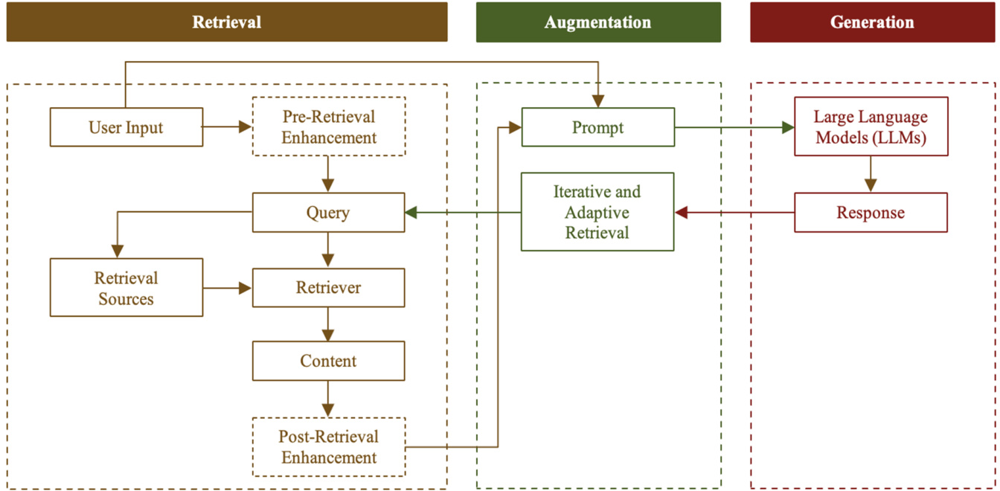
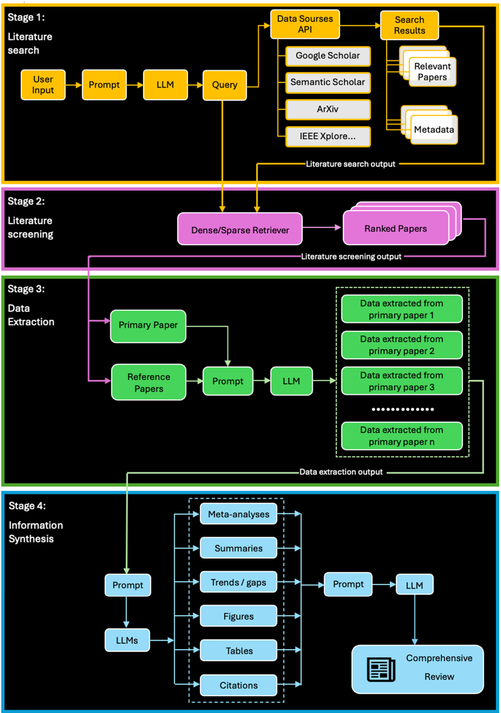

# Article Automating Systematic Literature Reviews with Retrieval-Augmented Generation: A Comprehensive Overview  

Binglan Han , Teo Susnjak \* and Anuradha Mathrani \*  

Citation:  Han, B.; Susnjak, T.; Mathrani, A. Automating Systematic Literature Reviews with RetrievalAugmented Generation: A Comprehensive Overview.  Appl. Sci. 2024 ,  14 , 9103. https://doi.org/ 10.3390/app14199103  

Academic Editor: Luis Javier Garcia Villalba  

Received: 9 September 2024   
Revised: 25 September 2024   
Accepted: 27 September 2024   
Published: 9 October 2024  

School of Mathematical and Computational Sciences, Massey University, Auckland 0632, New Zealand; b.han1@massey.ac.nz \*  Correspondence: t.susnjak@massey.ac.nz (T.S.); a.s.mathrani@massey.ac.nz (A.M.)  

Abstract:  This study examines Retrieval-Augmented Generation (RAG) in large language models (LLMs) and their significant application for undertaking systematic literature reviews (SLRs). RAG-based LLMs can potentially automate tasks like data extraction, summarization, and trend identification. However, while LLMs are exceptionally proficient in generating human-like text and interpreting complex linguistic nuances, their dependence on static, pre-trained knowledge can result in inaccuracies and hallucinations. RAG mitigates these limitations by integrating LLMs’ generative capabilities with the precision of real-time information retrieval. We review in detail the three key processes of the RAG framework—retrieval, augmentation, and generation. We then discuss applications of RAG-based LLMs to SLR automation and highlight future research topics, including integration of domain-specific LLMs, multimodal data processing and generation, and utilization of multiple retrieval sources. We propose a framework of RAG-based LLMs for automating SRLs, which covers four stages of SLR process: literature search, literature screening, data extraction, and information synthesis. Future research aims to optimize the interaction between LLM selection, training strategies, RAG techniques, and prompt engineering to implement the proposed framework, with particular emphasis on the retrieval of information from individual scientific papers and the integration of these data to produce outputs addressing various aspects such as current status, existing gaps, and emerging trends.  

Keywords:  retrieval-augmented generation; large language models; systematic literature review  

# 1. Introduction  

Rapidly developing Large Language Models (LLMs) like GPT-4 [ 1 ] and LLaMA [ 2 ] have transformed natural language processing (NLP) and artificial intelligence (AI) by generating human-like text and interpreting complex linguistic nuances across a wide range of fields. For example, LLMs have demonstrated rational thinking capabilities spanning drug discovery to personalized learning. However, such models are limited by the static knowledge they acquire during pre-training; this can lead to inaccuracies (especially in rapidly evolving fields). Inaccuracies often include plausible sounding but factually incorrect responses or “hallucinations” [ 3 , 4 ]. Moreover, these inaccuracies could be purposefully generated for malicious usage (e.g., promotion of certain drugs) by mixing authentic papers with fallacious papers to mislead the public [ 5 ].  

Retrieval-Augmented Generation (RAG) addresses these limitations by combining the generative power of LLMs with the precision of real-time information retrieval. RAG enhances LLM performance by grounding responses in dynamically updated and retrievable content to improve accuracy and reliability. This approach is crucial in fields like law, medicine, finance, and personalized care, which critically require accurate, up-to-date information. Additionally, RAG mitigates hallucinations by anchoring outputs in verifiable sources, enabling users to trace and validate the information provided [ 6 , 7 ]. A systematic literature review (SLR) methodically identifies, evaluates, and synthesizes existing research questions, systematically searching for relevant studies, screening and selecting pertinent  on a specific topic. It typically involves several key processes: defining research questions, systematically searching for relevant studies, screening and selecting pertinent studies, extracting data, and analyzing and synthesizing subsequent findings. RAG-based LLMs can facilitate and potentially automate these tasks to significantly improve efficiency and accuracy. This study provides a comprehensive overview of the primary methodologies associated with using RAG in LLMs. Furthermore, it examines the application of RAG-based models to systematic literature reviews (SLRs), identifying existing gaps and emerging trends in this domain. Finally, this paper proposes a novel framework for automating systematic literature reviews through the application of RAG-based LLMs. Our proposed framework showcases a comprehensive solution for the automation of the four key stages of the SLR process, namely, literature search, literature screening, data extraction, and information synthesis. It enhances both the efficiency and accuracy at each stage to provide This study therefore makes two significant contributions with the automation of sys-  

This study therefore makes two significant contributions with the automation of systematic literature reviews: The in-depth review of RAG-based LLMs and their applications to SLRs establishes  • The in-depth review of RAG-based LLMs and their applications to SLRs establishes a solid foundation for identifying existing research gaps and outlining future research    The proposed framework for RAG-based LLMs comprehensively addresses the en- • The proposed framework for RAG-based LLMs comprehensively addresses the entire SLR process, accommodating its iterative and incremental nature. This framework provides a robust starting point for enhancing and automating SLR tasks, thus contributing to the advancement of automation in this field.  

# 2. Overview of Retrieval-Augmented Generation  

The Retrieval-Augmented Generation (RAG) framework integrates retrieval-based and generative models by leveraging information extracted from external sources (typically databases) to improve the quality of generated outputs. The three core processes in the RAG framework—retrieval, augmentation, and generation—are illustrated in Figure  1 .  

  
Figure 1.  Main processes in an RAG framework.  

During the retrieval stage, a query is first constructed from the user’s input prompt that targets an LLM. The query is based on the content of the prompt, which is then used to search for most similar or relevant documents from external knowledge sources. A retriever then calculates the similarity between the user query and the returned results from the knowledge source in order to select the most pertinent documents. To optimize this process, pre-retrieval enhancements can be applied to refine the query, ensuring that more efficient and effective document retrieval is conducted [ 8 , 9 ]. Post-retrieval enhancements may also be used to increase the utility of the retrieved documents for the subsequent generation tasks [ 10 ].  

Once the most relevant results are identified and returned, the process of augmentation takes place. This step typically involves concatenating the retrieved documents from the knowledge source with the original user input prompt to form the final prompt that is passed to the generative language model [ 8 , 9 ]. This augmented prompt ensures that the LLM is provided with additional information that steers it towards generating a response that incorporates the relevant information from the external source. Augmentation can also be iterative or adaptive, where the generated response is used to extract more precise and contextually relevant content, thereby progressively refining the output [ 11 , 12 ].  

Following the retrieval and incorporation of the documents into the LLM’s input, the generation process combines the model’s learned knowledge with the specific content retrieved from external sources. The LLM’s attention layers focus on both the original input and the retrieved context, allowing the model to produce an output that integrates specific information from external documents [ 8 , 9 ]. This approach reduces the model’s reliance on its internal parameters and memorized knowledge, thereby decreasing the likelihood of generating factually incorrect or hallucinated information.  

The following sections provide detailed implementation insights into these three key processes.  

# 2.1. Retrieval  

The retriever constitutes a central element of the retrieval process. It assesses the relevance of documents within an external knowledge base to extract documents most pertinent to a user’s query. Critical aspects of this process include the type of retriever employed, retrieval sources, the granularity of retrieval, and enhancements applied before and after retrieval.  

# 2.1.1. Retriever Type  

The choice of retriever directly impacts the effectiveness, accuracy, and efficiency of retrieval. Several types of retrievers are commonly used in RAG systems depending on their characteristics and suitability for different tasks.  

# 1. Sparse Retrievers  

Sparse retrievers, such as BM25 [ 13 ] and TF-IDF [ 14 ], represent text as sparse vectors. They primarily rely on keyword matching to assess each document’s relevance to a user’s query. Specifically, such models evaluate relevance based on term frequency, within individual documents and across the entire corpus. Although these retrievers are simple, interpretable, and efficient for large-scale retrieval, they have limited capacity to capture semantic meaning beyond exact word matches. RAG models that utilize sparse retrievers— including FiD [ 15 ], FLARE [ 11 ], and IRCoT [ 16 ]—most commonly select BM25.  

# 2. Dense Retrievers  

Dense retrievers leverage pre-trained language models to transform both queries and documents into dense vector embeddings. Embeddings encapsulate the semantic meaning of text, enabling the retriever to identify contextually relevant documents even in the absence of exact keyword matches. Dense retrievers can successfully capture semantic similarity, thereby aiding in understanding nuanced and contextually related queries. However, they are computationally intensive and incur high development and maintenance costs.  

The Dense Passage Retriever (DPR) [ 17 ], for example, uses two independent, pretrained BERT networks as dense encoders: one network encodes each input query into a real-valued vector, while the other encodes each text passage into a vector of the same dimensions. These vectors’ inner product measures the similarity between each query and text passage. Such encoders are trained by maximizing inner products between vectors of queries and corresponding relevant passages. Bi-Encoder retrievers, such as DPR, have demonstrated robust performance as pre-trained retrievers and are widely adopted across RAG models like REALM [ 8 ], RAG [ 9 ], FiD [ 15 ], FiD-KD [ 18 ], EPR [ 19 ], RETRO [ 20 ], UDR [ 21 ], ITER-RETGEN [ 12 ], and REPLUG [ 22 ].  

Another notable dense retriever, the Contriever [ 23 ], employs a single BERT-based encoder to embed both queries and documents. This model is trained via contrastive learning, which aims to maximize the similarity between positive pairs (i.e., a query and a corresponding relevant passage) while minimizing the similarity between negative pairs (i.e., a query and an irrelevant passage). This approach reduces reliance on large-scale labelled datasets and makes the Contriever more adaptable to various tasks and domains. Additionally, its single-encoder design provides greater flexibility and has demonstrated success in multiple RAG models, including In-Context RALM [ 24 ], Atlas [ 25 , 26 ], and Self-RAG [ 27 ].  

# 3. Internet Search Engines  

In the context of RAG, internet search engines like Bing and Google can function as potent, dynamic retrievers that offer access to vast, up-to-date information across a broad spectrum of topics while obviating the need to maintain a separate search index. These search engines also provide high-quality ranking capabilities, refined through decades of optimization. As such, both closed-source LLMs (e.g., RAG frameworks OpenBook [ 26 ] and FLARE [ 11 ]) and trainable LLMs (e.g., SE-FiD [ 28 ]) integrate internet search engines.  

Comparatively, sparse retrievers are best for large-scale, straightforward tasks, dense retrievers excel in semantic tasks at a higher cost, and internet search engines provide a versatile, constantly updated source of information. Integrating these different retrievers enhances RAG models’ flexibility and effectiveness across various applications.  

# 2.1.2. Retrieval Sources  

Retrieval sources in RAG systems are diverse; they encompass structured, unstructured, and specialized data repositories for optimizing their generation process.  

Structured databases, like relational databases and knowledge graphs (e.g., SQL-based systems and Wikidata [ 29 ]) provide organized and logically grouped information. Complex queries are presented to well-structured relational data that are systematically determined to provide detailed functional reports. In contrast, unstructured text corpora are large collections of text, including academic papers (e.g., PubMed [ 30 ]), books, and news articles. They offer rich, diverse content across various domains. These corpora are essential for retrieving detailed, domain-specific information that can augment the depth and breadth of LLM responses. Additionally, domain-specific repositories—MEDLINE [ 31 ] for medical research and LexisNexis for legal documents—are tailored to different disciplines and provide crucial specialized knowledge to generate accurate, contextually appropriate responses in specialized domains. Furthermore, web content—including real-time data obtained via web scraping and search engines—give RAG systems access to the most current information available. This is very important for generating responses that require up-to-date knowledge or instantaneous context. Finally, pre-trained knowledge bases—including general-purpose repositories like Wikipedia [ 32 ] and datasets like Common Crawl [ 33 ]— offer broad, general knowledge applicable across a wide range of tasks. Specifically, RAG systems frequently use Wikipedia for its extensive factual, structured information, which is available in various versions that range from billion-token to trillion-token levels [ 34 ].  

Collectively, these retrieval sources equip RAG systems with relevant, current, and context-specific information. This in turn enables LLMs to generate accurate, reliable, and informed responses across diverse applications.  

# 2.1.3. Retrieval Granularity  

Retrieval granularity pertains to the unit of retrieval at which a corpus is indexed; in other words, it determines the level of detail at which information is retrieved from a knowledge base and subsequently processed by an LLM. Retrieval granularity spans from fine to coarse, at the token, sentence, chunk/passage, and document levels. Coarsegrained retrieval units (e.g., documents) can provide broader context but may introduce redundant content, potentially distracting LLMs in downstream tasks. Conversely, finegrained retrieval units, while offering more precise information, can increase the complexity of retrieval and storage that may compromise semantic integrity.  

Document-level retrieval functions well when a task requires comprehensive context, as exemplified by the REPLUG model [ 22 ]. On the other hand, chunk-level and passagelevel retrieval focuses on specific sections of text, which can balance context with relevance. Thus, it can assist with tasks demanding specific answers, while not overwhelming models with extraneous information. This approach is successfully employed in RAG models such as REALM [ 8 ], RAG [ 9 ], and Atlas [ 25 ]. Token-level retrieval, although less common, can be used for specialized tasks requiring exact matches or integration of out-of-domain data.  

# 2.1.4. Pre- and Post-Retrieval Enhancement  

Pre-retrieval enhancement encompasses strategies and techniques applied to an input query or retrieval system prior to a RAG system initiating its retrieval process. Pre-retrieval enhancement primarily aims to refine or enrich the original query, thereby ensuring efficient retrieval of the most relevant information. Key techniques in this domain include query expansion, query rewriting, and query augmentation.  

One query-expansion approach, Query2doc [ 35 ], generates pseudo-documents using LLMs with few-shot prompting. These pseudo-documents aid query disambiguation, thus enhancing performance of both sparse and dense retrievers. Indeed, experiments demonstrate improvements in BM25 performance ranging from 3% to 15%. Another technique, Rewrite-Retrieve-Read [ 36 ], employs query rewriting by prompting an LLM to generate a revised query that bridges the gap between user input and retrieval requirements; then, it uses a web search engine to retrieve context for the RAG system. Experimental results indicate that this approach can enhance RAG performance when black-box LLMs or trainable small language models act as query rewriters. Additionally, the BlendFilter framework [ 10 ] implements query augmentation by incorporating both external and internal knowledge sources; it filters retrieved information to eliminate irrelevant content before combining it with the original query to generate a final answer.  

Post-retrieval enhancement in RAG involves refining information retrieved from a knowledge base before a language model uses it to generate a response. Post-retrieval enhancement primarily endeavors to improve the relevance, coherence, and utility of retrieved documents, ensuring that they contribute meaningfully to the final output.  

Several methods illustrate this approach. For instance, the aforementioned BlendFilter framework [ 10 ] integrates both pre-retrieval query augmentation (for improved information retrieval) and post-retrieval knowledge filtering (to remove noise) for achieving comprehensive enhancement. Likewise, the Retrieve-Rerank-Generate (Re2G) method [ 37 ] enhances retrieval robustness by assembling documents retrieved from different retrievers (such as BM25 and Dense Passage Retrieval (DPR)) through a reranking operation. Additionally, the RECOMP method (Retrieve, Compress, Prepend) [ 38 ] compresses retrieved documents into textual summaries before in-context augmentation occurs during generation. This approach not only reduces computational cost but also alleviates the language model’s burden by filtering relevant information from lengthy retrieved documents.  

# 2.2. Generation  

Requirements of downstream tasks primarily determine the design of generators (specifically LLMs) for RAG. These requirements can include detailed text generation, accuracy, and contextual relevance. This section reviews the use of two types of generators: open-source LLMs and closed-source LLMs [ 39 ].  

# 2.2.1. Open-Source LLMs in RAG  

RAG systems widely employ open-source systems for their flexibility, transparency, and strong performance in handling various downstream tasks. Among the open-source LLMs employed in RAG systems, Encoder-Decoder models are most prevalent. These models process input and target sequences independently—using different sets of weights— and perform cross-attention to effectively link input tokens with target tokens.  

Prominent examples of Encoder-Decoder LLMs include T5 [ 40 ] and BART [ 41 ], which are extensively featured in RAG models such as RAG [ 11 ] and Re2G [ 37 ]. A notable variant of the standard Encoder-Decoder LLM is the Fusion-in-Decoder (FiD) model, which has been successfully implemented in various RAG frameworks [ 15 , 18 ]. In FiD models, each retrieved passage—along with its title—is concatenated with the query and processed independently by the encoder. The decoder then performs attention over concatenated representations of all retrieved passages. The encoder’s independent passage processing enables the model to scale effectively to many contexts, as it only performs self-attention over one context at a time [ 15 ].  

# 2.2.2. Closed-Source LLMs in RAG  

Closed-source LLMs in RAG systems are frequently selected for their advanced capabilities, high performance, and commercial support. RAG systems widely use models such as GPT-3 and GPT-4, which are accessible via proprietary APIs, because of their remarkable text-generation abilities and deep contextual understanding. For instance, LLMs from the GPT family are employed in RAG models such as EPR [ 9 ], RETRO [ 20 ], UDR [ 21 ], ITER-RETGEN [ 12 ], REPLUG [ 22 ], In-Context RALM [ 23 ], FLARE [ 11 ], and IRCoT [ 16 ]. However, because the internal structure of closed-source LLMs cannot be modified and their parameters cannot be updated, RAG models tend to focus more on enhancing retrieval and augmentation processes. This approach aims to optimize prompts provided to LLMs, thereby improving knowledge integration and the effectiveness of these systems’ instructions.  

# 2.3. Augmentation  

RAG models’ standard practice only involves single steps of retrieval, augmentation, and generation, which often cannot handle complex problems requiring multi-step reasoning and context retrieval. Studies have been conducted to optimize augmented input for generators via iterative and adaptive retrieval.  

# 2.3.1. Iterative Retrieval  

RAG-based LLMs’ iterative retrieval involves retrieving relevant information and generating responses in multiple cycles. Iterative retrieval is particularly effective in tasks that require detailed contextual understanding and precise information, as it allows a model to progressively refine its outputs by continually integrating more accurate and contextually relevant data.  

ITER-RETGEN [ 12 ] introduces an iterative methodology to enhance RAG systems’ performance by creating a synergistic loop between the retrieval and generation processes. Following initial retrieval and generation, a model refines its prompts based on its output, which then guides a new round of retrieval aligned with the refined query. This iterative cycle continues, progressively improving the relevance and quality of both retrieved information and generated responses. By employing this process, the model achieves greater accuracy in tasks requiring detailed contextual understanding and precise information.  

IRCoT [ 16 ] presents an advanced framework that integrates retrieval with chain-ofthought (CoT) reasoning, enabling models to effectively address knowledge-intensive, multi-step questions. A model initially retrieves a base set of paragraphs using a question as the query, and then iteratively interleaves retrieval steps with reasoning steps until termination criterion is met. During its retrieval-guided reasoning phase, the model generates another CoT sentence using the earlier mentioned question, previously collected paragraphs, and prior CoT sentences. In its CoT-guided retrieval phase, the model uses its last generated CoT sentence as a query to retrieve additional paragraphs, which are then incorporated into the reasoning process. Integrating retrieval with CoT reasoning significantly boosts the model’s ability to tackle complex tasks involving both deep knowledge and logical reasoning.  

ToC [ 42 ] constructs a tree of clarifications to address ambiguous questions. A model first retrieves relevant passages for an ambiguous query and then generates potential interpretations by producing clarification questions or responses for each branch of that tree. Using these passages, disambiguated questions are recursively generated via few-shot prompting, before being pruned as necessary. Finally, the model generates a comprehensive long-form answer addressing all disambiguated questions. This approach markedly improves the model’s ability to manage ambiguous queries, resulting in more accurate and contextually appropriate responses.  

# 2.3.2. Adaptive Retrieval  

Adaptive retrieval represents a dynamic approach. The RAG-based LLMs’ retrieval process is continuously tailored to specific needs of a task, as it evolves in response to the context provided by the model’s ongoing outputs. Adaptive retrieval primarily aims to optimize the relevance and utility of retrieved information, thereby ensuring that generated responses are correct and contextually appropriate.  

FLARE (Forward-Looking Active Retrieval Augmented Generation) [ 11 ] advances RAG systems by introducing a forward-looking, active retrieval mechanism. Beginning with user input and initial retrieval results, FLARE iteratively generates a provisional next sentence. If this sentence contains low-probability tokens, the system retrieves additional relevant documents, using the sentence as a query before regenerating yet another sentence. It continues this process until a task is complete. This forward-looking strategy enhances the system’s ability to maintain coherence and relevance throughout multi-step generation tasks, particularly in complex scenarios requiring multifaceted reasoning and strategic planning.  

SELF-RAG (Self-Learning Enhanced Retrieval-Augmented Generation) [ 27 ] advances RAG systems by incorporating a feedback-driven, self-learning mechanism. This process starts with standard retrieval and generation, where relevant documents are retrieved and used to produce an initial response. Following generation, the system evaluates its output and uses this feedback to refine subsequent retrieval strategies. Through iterative improvement, SELF-RAG adapts its retrieval process to retrieve increasingly relevant information, thereby continuously enhancing generated responses’ accuracy and contextual relevance. This self-learning capability makes the system progressively more effective over time, especially in dynamic or specialized environments.  

# 3. Applications of RAG-Based LLMs for Systematic Literature Reviews  

Each Systematic Literature Review (SLR) begins with a clear definition of its scope and objectives, followed by a meticulous search criteria and screening process to identify relevant articles that align with those objectives. Research questions that stem from the SLR’s objectives are formulated, as the reviewer identifies pertinent data or information from selected articles and further conducts data extraction from each selected article. These extracted data are then synthesized and analysed to produce a comprehensive literature review [ 43 ].  

Given their remarkable abilities in textual understanding and generation, Large Language Models (LLMs) have significant potential to assist throughout the entire SLR process. However, the inherent limitations of LLMs can impede their effective adoption in SLRs. These limitations include the generation of erroneous or fabricated content and the lack of traceability for the generated outputs. For example, several studies have shown that texts generated by ChatGPT from biomedical literature often contain plausible but fabricated content, with noticeable fictitious or erroneous references [ 44 – 46 ]. Another limitation is that the static knowledge stored in LLMs is inadequate for providing the up-to-date information required for conducting literature reviews. The integration of Retrieval-Augmented Generation (RAG) with LLMs can help mitigate these limitations by grounding LLMs’ reasoning and generation in verifiable and current research drawn from various data sources.  

# 3.1. Applications of RAG-Based LLMs Focused on SLRs  

There is limited research on the application of RAG-based LLMs in SLRs. However, a notable study [ 47 ] introduces an innovative framework for automating research synthesis using fine-tuned domain-specific LLMs. This framework presents a method to automatically generate fine-tuned datasets from an SLR corpus. Initially, it employs GPT-4 to create question-and-answer (Q&A) pairs at two levels: paper summaries and individual paragraphs. Q&A pairs are then generated from the aggregated answers of the individual papers, equipping an LLM with both insights from specific studies and synthesized knowledge across the entire SLR corpus. Such fine-tuned models, based on the Mistral architecture, show substantial promise in streamlining the SLR process.  

LitLLM [ 48 ] is another RAG-based LLM framework designed for screening and summarizing scientific literature. An LLM is utilized to decompose a user-provided abstract into a set of keywords, which are then used to retrieve relevant papers through the Semantic Scholar API. The LLM employs an instructional permutation generation approach to re-rank the retrieved papers based on their relevance to the user’s abstract and the abstracts of the papers. Finally, the LLM uses the re-ranked papers as augmented context to generate summaries. This study utilized GPT-3.5-turbo and GPT-4 models accessed via the OpenAI API.  

RefAI [ 49 ] is a RAG-based LLM tool developed for biomedical literature recommendations and summarization. Similarly, the GPT-4 model is employed to extract keywords from user queries, which are then used to retrieve paper metadata (including title, abstract, authors, publication year, journal, and DOI) through the PubMed API. A multivariate ranking algorithm ranks the literature based on the similarity between the query and paper abstracts, journal impact factor, citation count, and publication year. The similarity is computed using vector embeddings of user queries and paper abstracts, converted via sentence-transformers. Subsequently, the GPT-4 model generates literature summaries based on user queries and paper metadata. The relevance and quality of the literature recommendations, as well as the accuracy, comprehensiveness, and reference integration of the literature summarizations, are evaluated by a panel of biomedical professionals. These evaluations exhibit superior performance compared to baseline evaluations using GPT-4, Google Gemini, and ScholarAI.  

In summary, although all three studies utilize Retrieval-Augmented Generation (RAG)- based Large Language Models (LLMs) to enhance the Systematic Literature Review (SLR) process, they exhibit distinct methodologies and focal areas. The first study [ 47 ] prioritizes the creation of fine-tuned LLM datasets for research synthesis. In contrast, LitLLM [ 48 ] concentrates on refining literature retrieval and summarization through keyword extraction and a re-ranking approach. Meanwhile, RefAI [ 49 ] offers a specialized tool tailored for biomedical literature recommendations, employing a comprehensive ranking system. Collectively, these studies illustrate the diverse potential of RAG-based LLMs in automating aspects of the literature review process. However, it is important to note that these studies are conducted on relatively small datasets or within limited scopes. Furthermore, the outputs generated by the frameworks discussed in these studies are typically brief responses to specific questions or they give relatively generalized summaries, which do not equate to a thorough critique that is conducted on selected articles. This limitation underscores the necessity to develop a more robust framework that fully leverages the powerful and flexible capabilities of RAG-based LLMs to support and automate key SLR tasks. Such a framework should be trained and rigorously evaluated using large datasets across various domains to ensure its effectiveness and reliability.  

# 3.2. Applications of RAG-Based LLMs Adaptable for SLRs  

Despite little research specifically focused on RAG-based LLMs’ applications to SLRs, their demonstrated capabilities with various NLP tasks, such as question answering (QA) (including open-domain, abstractive, and extractive QA) [ 9 ], fact verification [ 12 ], and text summarization [ 50 ], showcase their potential to assist with and potentially automate SLR tasks. We now review RAG-based LLMs’ example applications in this context.  

RAG-based LLMs can extract data from scientific documents by employing QA techniques to identify and extricate key elements (e.g., experimental results, methodologies, and significant findings). For example, MEDRAG [ 51 ], a RAG toolkit specifically designed for medical QA, has markedly enhanced six different LLMs’ performance: it elevated GPT-3.5 to GPT-4-level capabilities with up to 18% improvement across a variety of medical QA tasks. Similarly, Almanac [ 52 ]—a RAG-based model for clinical medicine—leverages web browsers to extract contextual articles before employing a dense retriever to select their most relevant text segments. It then utilizes GPT-3 to generate medical guidelines and treatment recommendations. An evaluation by a panel of physicians stated that these results outperformed those generated by GPT-3.  

Furthermore, RAG-based LLMs can produce concise summaries of individual research papers and collections of articles using text summarization techniques, thereby allowing researchers to swiftly grasp essential findings from extensive bodies of literature. For instance, SciDaSynth [ 53 ] uses a RAG-based GPT-4 model to retrieve relevant text snippets from scientific papers, subsequently generating data tables and summaries from the extracted information. Similarly, CCS Explorer [ 54 ]—a RAG-based framework automating clinical cohort studies—uses articles extracted from PubMed to perform sentence relevance prediction, extractive summarization, and detection of key entities (e.g., patients, outcomes, and interventions).  

For citation recommendations, RAG-based LLMs generate queries from specific pieces of text, retrieve relevant documents, and then use those documents to produce appropriate citations. For example, REASONS [ 55 ] (REtrieval and Automated citationS Of scieNtific Sentences) is a benchmark designed to evaluate LLMs’ abilities to generate accurate citations based on context; RAG models tested on this benchmark outperformed ChatGPT-4. In addition, RAG-based LLMs can help identify research trends over time by analyzing and retrieving relevant literature, allowing researchers to track different fields’ evolving interests and findings. A RAG-based LLaMA2 model, for instance, has been employed to identify emerging trends in various technologies (like cryptocurrency, reinforcement learning, and quantum machine learning) from extensive datasets of publications and patents; its predictions have been validated against the Gartner Hype Cycle [ 56 ].  

RAG-based LLMs have demonstrated considerable effectiveness in performing key tasks associated with SLRs, such as extracting critical data from scientific documents, generating concise summaries of individual papers and collections, providing accurate citation recommendations, and identifying emerging research trends. Illustrative examples, including MEDRAG, Almanac, SciDaSynth, CCS Explorer, and REASONS, highlight the versatility and capability of RAG-based models to effectively handle various SLR-related tasks. Therefore, the integration of RAG-based LLMs into the SLR process represents a promising avenue for advancing a more automated, efficient, and insightful approach to scholarly research synthesis and analysis.  

# 3.3. Datasets for Model Training and Evaluation  

Several datasets have been developed for training and evaluating LLMs in tasks related to SLRs. For instance, Multi-XScience [ 57 ] is a large-scale dataset designed for multi-document summarization using scientific articles. ACLSum [ 58 ] is an expert-curated dataset tailored for multi-aspect summarization of scientific papers, covering three aspects: challenges, approaches, and outcomes. Similarly, MASSW [ 59 ] provides a comprehensive dataset for summarizing multiple aspects of scientific workflows, extracting five core aspects—context, key idea, method, outcome, and project impact—from scientific publications. CHIME [ 60 ] presents a hierarchical dataset that organizes scientific studies into tree structures, where upper nodes represent research topical categories and leaf nodes correspond to individual studies.  

Given the diverse nature of SLR tasks, which may require distinct datasets for model training and evaluation, there is a notable gap in datasets tailored for specific SLR tasks beyond general scientific article summarization. The need for new datasets is particularly evident for tasks involving detailed analyses, such as meta-analysis or trend identification. A promising approach, as adopted in a previous study [ 47 ], involves creating datasets from reference papers within existing literature reviews. The annotations necessary for training can be extracted directly from the contents of these reviews, facilitating tasks such as data synthesis and trend analysis.  

In summary, while current datasets provide a solid foundation for developing LLMs for SLR-related tasks, there remains a significant need for more specialized datasets that address the varied and complex requirements of SLRs.  

# 4. Discussion  

While RAG has become a mainstream method for executing NLP tasks (including those well-suited for SLRs), RAG-based LLMs have not been widely applied in literature reviews. Significant gaps are seen to exist between current research efforts and the proficient application of these models. These gaps call for the need for further exploration and development in their applicability to this area. These gaps are discussed next.  

# 4.1. Use of Domain-Specific LLMs  

Most existing RAG systems use generalist foundation models like BERT and GPT-3. Even when these models are augmented with specialized documents, they often cannot fully capture or understand the technical language and industry-specific jargon necessary to address complex problems. However, domain-specific LLMs—such as SciBERT [ 61 ] and ChemGPT [ 62 ]—are pre-trained on data particularly relevant to fields like law, medicine, and finance. Such specialized training enables them to generate more accurate, relevant, and nuanced content in response to domain-specific queries. By incorporating RAG, these models can access up-to-date, precise information from external databases and knowledge sources, further enhancing the accuracy of their responses. As such, researchers should further investigate RAG-based domain-specific LLMs’ application in gaining more insightful literature reviews.  

# 4.2. Multimodal Context for Augmentation and Multimodal Output  

Academic papers frequently include multimodal data such as tables, figures, and images in addition to textual information. Furthermore, a significant portion of contemporary scientific information is now presented as multimedia (e.g., in videos and 3D models). Multimodal large language models (MLLMs) [ 63 ] are designed to integrate and process information across multiple modalities like text, vision, audio, video, and 3D models. RAGbased MLLMs can efficiently analyze and synthesize these diverse data types, providing a more holistic understanding of research materials and enabling more comprehensive, nuanced analysis of scientific literature. Additionally, RAG-based MLLMs could help generate figures and tables that summarize data extracted from academic papers. Therefore, another promising research avenue lies in RAG-based MLLMs’ application in conducting richer literature reviews.  

# 4.3. Multiple Retrieval Sources  

Current studies regarding RAG-based LLMs predominantly address retrieval from single sources. However, scientific information is often distributed across multiple platforms, including unstructured text corpora, knowledge graphs, domain-specific repositories, and web content. By using multiple retrieval sources, RAG-based LLMs can draw from a broader, more diverse data pool to ensure that literature reviews are both exhaustive and comprehensive. Likewise, by accessing multiple sources, these models can include niche studies and emerging research that may not be available in mainstream databases. Therefore, scholars should further explore RAG-based LLMs with multiple retrieval sources in the context of literature reviews.  

While RAG-based LLMs hold potential for enhancing NLP tasks relevant to systematic literature reviews (SLRs), their application in literature reviews is still limited. Domain-specific LLMs, multimodal contexts, and multiple retrieval sources represent three promising areas for further exploration. Domain-specific models like SciBERT and ChemGPT improve relevance in specialized fields. Multimodal LLMs provide a more comprehensive analysis by integrating text with visual and multimedia data. Additionally, using multiple retrieval sources will ensure a more exhaustive and inclusive literature review process.  

# 5. A Framework of RAG-Based LLMs for SLRs  

Current research on the application of LLMs to SLRs primarily focuses on tasks such as literature recommendation and summarization. However, SLRs encompass a broader range of tasks where LLMs can provide significant assistance or even full automation. A comprehensive framework is therefore necessary to encompass the entire SLR process, recognizing that SLRs are typically incremental. This incremental nature means that research questions, scope, literature search and screening strategies, data extraction, and information synthesis can all be revised, refined, or expanded in response to new ideas, insights, and innovations as these emerge throughout the review process.  

To address this, we have proposed a framework that employs RAG-based LLMs to enhance and automate the various stages of SLRs. As illustrated in Figure  2 , the SLR process is divided into four distinct stages: literature search, literature screening, data extraction, and information synthesis.  

• Stage 1: Literature Search  

For the literature search stage, the framework incorporates strategies from previous studies [ 48 ]. An LLM generates queries based on user input, formatted according to the requirements of different data sources. These queries are then used to retrieve relevant articles and their metadata (e.g., title, author, abstract, keywords, and publication date) from data sources. The LLM can function as a query rewriter, not only for generating queries specific to each data source but also in modifying them by incorporating synonyms or related terms. By training on diverse datasets, contextually relevant synonyms are extracted to further expand queries and ensure more completeness and precision in the search results. Additionally, query accuracy and coverage can be improved with external factual and domain-specific corpora integration into the LLM through fine-tuning and prompt augmentation [ 10 , 36 ].  

As noted earlier, it is essential to include a wide range of data sources during this stage to ensure that the literature review remains thorough, comprehensive, and current. LLMs can be employed to automate and optimize the process of data source identification. These models can be fine-tuned to consider specific user queries or additional requirements such as the subject areas of interest, the languages in which the literature is published, and the geographic focus of the studies. Multilingual capabilities can be incorporated, enabling the model to retrieve literature from non-English sources. This approach ensures that the literature search is not only comprehensive but also tailored to meet specific academic or research goals.  

  
Figure 2.  A framework of RAG-based LLMs for SLRs.  

# • Stage 2: Literature Screening  

During the literature screening stage, an LLM-based dense or parse retriever re-ranks the retrieved articles to identify the most relevant ones based on their similarity to the user query [ 13 , 17 , 23 ]. With the diverse data sources being included in the search, the extracted documents may vary significantly in terms of quality, methodologies, presentation, and other characteristics. It is therefore important to select relevant documents according to the research objective. For example, the reviews in the fast-evolving fields such as AI should include not only the latest research developments in both academic and industry, but also ensure that more emphasis is placed on academic rigor, ensuring that proper consideration is given to peer reviewed and high quality articles. Therefore, the ranking algorithms should also incorporate additional factors, such as journal impact factors, citation counts, metadata, authors’ reputation, and types of articles, similar to the methods employed in other studies [ 49 ].  

# • Stage 3: Data Extraction  

The data extraction phase involves extracting specific data from primary research articles while leveraging their cited references as contextual background. The level of detail in the retrieved data can vary; for example, it can range from a broad description of an experimental setup to the specifics of a single experimental step. Depending on the nature and characteristics of the data to be extracted, either subtractive or abstractive methods may be employed [ 38 ]. In addition to enriching prompts with contextual background, domainspecific pre-trained models, such as SciBERT [ 61 ] and ChemGPT [ 62 ], can be utilized for reviews within their respective fields. To leverage large general-purpose models like GPT4 [ 1 ] and LLaMA [ 2 ], domain-specific corpora may be employed to fine-tune these models for data extraction tasks. Furthermore, to facilitate the extraction of information from multimodal data sources—such as tables and images in the retrieved articles—multimodal language models can be incorporated into this process [ 63 ].  

# • Stage 4: Information Synthesis  

Following data extraction, the synthesis phase integrates the extracted data from multiple articles to produce the desired output. Multiple LLMs, including multimodal LLMs, may be deployed to generate various outputs, including summaries, meta-analyses, trend analyses, or visual representations such as figures and tables, all of which provide a comprehensive overview of the compiled data [ 53 , 54 , 56 ]. A crucial function of information synthesis is to facilitate comparative analysis of data from different studies in a transparent and traceable manner, thus providing insights into critical aspects of a specific topic, such as its current status, existing gaps, emerging trends, and future research directions. Notably, the information synthesis phase can proceed without a distinct data extraction step, as the LLMs can directly utilize all selected papers to address specific user queries. Finally, the outputs of these synthesis processes may be combined by another LLM to produce a holistic review.  

To enhance efficiency and minimize computational demands, metadata from articles can substitute for full-text content during both data extraction and information synthesis processes. This framework is strategically designed to enable iterative and adaptive augmentation, wherein outputs from any stage can dynamically refine the inputs for preceding or subsequent stages through effective prompt engineering. Given the incremental nature of systematic literature reviews (SLRs), users should be able to rerun tasks at any stage, leveraging outputs from previous runs to enhance current inputs. While the applications of LLMs for document search and ranking are extensively studied [ 64 ], there is a need to focus more on data extraction from scientific papers and information synthesis to generate outputs that encompass various aspects through comparative analysis. To implement the framework of RAG-based LLMs for SLRs, the following steps must be undertaken for each SLR task: selecting an appropriate LLM, identifying an optimal training strategy, adopting suitable RAG techniques, refining prompt engineering to enhance prompt effectiveness, and selecting or creating datasets for model training and evaluation.  

Future Work  

The proposed framework presents technical challenges and current research gaps in the implementation of RAG-based LLMs for SLRs, where we identify several areas of future work to pursue. Different types of LLMs, including generalist, domain-specific, and multimodal models, will need to be evaluated alongside appropriate training strategies. Various combinations of academic articles and metadata will be tested to enhance LLM outputs using different prompt engineering techniques. The ultimate goal is to identify the optimal combinations of LLM types, RAG techniques, and prompt engineering strategies to effectively automate SLR tasks within the proposed framework.  

Further research will also address strategies for designing a complete framework that integrates RAG-based LLMs across all stages of the SLR process, from data retrieval to synthesis and output generation, ensuring an end-to-end automation of the literature review process. Future studies will need to undertake and investigation into how RAGbased LLMs can improve data retrieval at varying levels of granularity from individual scientific papers. This will allow the system to adapt to different research questions and meet the specific needs of each systematic review. Finally, research is required to investigate how RAG-based LLMs can more effectively synthesise and integrate retrieved data to produce a range of outputs such as summaries, meta-analyses, and trend analyses. The outputs would need to be presented in diverse formats, including text, tables, and figures, to meet the needs of different audiences and purposes and this will potentially require a study into various forms of LLM fine-tuning for the specific downstream tasks.  

# 6. Conclusions  

The Retrieval-Augmented Generation (RAG) framework comprises three fundamental processes: retrieval, augmentation, and generation. The effectiveness of the retrieval process is contingent upon various factors, including the type of retriever employed, the choice of information sources, the granularity of retrieval, and any enhancements applied either before or after retrieval. Generation can employ either Open-source Large Language Models (LLMs) that provide flexibility and allow for task-specific customization or closedsource LLMs that are often preferred for their advanced capabilities and the availability of commercial support. For augmentation, the iterative and adaptive nature of the retrieval process, characterized by multiple cycles, incrementally refines outputs by incorporating more contextually relevant data.  

RAG-based LLMs have significantly improved accuracy, relevance, and contextual comprehension by combining real-time information retrieval with generative functions. These enhancements position RAG-based LLMs as promising candidates for automating various tasks associated with systematic literature reviews. Automated tasks, such as data extraction, summarization, research synthesis, and trend identification, have the potential to inform the scientific community about emerging fields of study more effectively. However, this application area is still under-explored within the research community. Critical areas that warrant further investigation include the integration of domain-specific LLMs, the processing and generation of multimodal data, and the utilization of multiple retrieval sources.  

To address these needs, a framework employing RAG-based LLMs for SLRs is proposed. Our framework encompasses the four stages of the SLR process: literature search, literature screening, data extraction, and information synthesis. Future research should aim to optimize the synergy between LLM selection, training strategies, RAG techniques, and prompt engineering to implement the proposed framework, with a particular focus on the retrieval of information from individual scientific papers and the integration of retrieved data to generate outputs on diverse aspects such as current status, existing gaps, and emerging trends.  

Author Contributions:  Conceptualization, B.H. and T.S.; methodology, B.H.; software, B.H.; validation, B.H., T.S. and A.M.; formal analysis, B.H.; investigation, B.H.; resources, B.H.; data curation, B.H.; writing—original draft preparation, B.H.; writing—review and editing, B.H., T.S. and A.M.; visualization, B.H.; supervision, T.S. and A.M.; project administration, B.H. All authors have read and agreed to the published version of the manuscript.  

Funding:  This research received no external funding.  

Institutional Review Board Statement:  Not applicable.  

Informed Consent Statement:  Not applicable.  

Data Availability Statement:  Data is contained within the article.  

Acknowledgments:  This manuscript employed OpenAI’s GPT-4 to strengthen the sentence structure and accelerate the writing speed. All intellectual property (IP) in this document is exclusively owned by the authors. GPT-4 has not contributed to any of the original ideas, insights, or intellectual content presented in this manuscript.  

Conflicts of Interest:  The authors declare no conflicts of interest.  

# References  

1. OpenAI; Achiam, J.; Adler, S.; Agarwal, S.; Ahmad, L.; Akkaya, I.; Aleman, F.L.; Almeida, D.; Altenschmidt, J.; Altman, S.; et al. GPT-4 Technical Report.  arXiv  2023 , arXiv:2303.08774.   
2.Touvron, H.; Martin, L.; Stone, K.; Albert, P.; Almahairi, A.; Babaei, Y.; Bashlykov, N.; Batra, S.; Bhargava, P.; Bhosale, S.; et al.Llama 2: Open Foundation and Fine-Tuned Chat Models.  arXiv  2023 , arXiv:2307.09288.   
3.Zhang, Y.; Li, Y.; Cui, L.; Cai, D.; Liu, L.; Fu, T.; Huang, X.; Zhao, E.; Zhang, Y.; Chen, Y.; et al. Siren’s Song in the AI Ocean: A Surveyon Hallucination in Large Language Models.  arXiv  2023 , arXiv:2309.01219. Available online:  https://arxiv.org/abs/2309.01219v2 (accessed on 30 August 2024).   
4. Kandpal, N.; Deng, H.; Roberts, A.; Wallace, E.; Raffel, C. Large Language Models Struggle to Learn Long-Tail Knowledge.  arXiv 2023 , arXiv:2211.08411.   
5. Yang, J.; Xu, H.; Mirzoyan, S.; Chen, T.; Liu, Z.; Liu, Z.; Ju, W.; Liu, L.; Xiao, Z.; Zhang, M.; et al. Poisoning Medical Knowledge Using Large Language Models.  Nat. Mach. Intell.  2024 . [ CrossRef ]   
6. Salemi, A.; Zamani, H. Evaluating Retrieval Quality in Retrieval-Augmented Generation. In Proceedings of the 47th International ACM SIGIR Conference on Research and Development in Information Retrieval, Washington, DC, USA, 14–18 July 2024; ACM: Washington, DC, USA, 2024; pp. 2395–2400.   
7. B é chard, P.; Ayala, O.M. Reducing Hallucination in Structured Outputs via Retrieval-Augmented Generation.  arXiv  2024 , arXiv:2404.08189.   
8. Guu, K.; Lee, K.; Tung, Z.; Pasupat, P.; Chang, M.-W. REALM: Retrieval-Augmented Language Model Pre-Training.  arXiv  2020 , arXiv:2002.08909.   
9.Lewis, P.; Perez, E.; Piktus, A.; Petroni, F.; Karpukhin, V.; Goyal, N.; Küttler, H.; Lewis, M.; Yih, W.; Rocktäschel, T.; et al.Retrieval-Augmented Generation for Knowledge-Intensive NLP Tasks.  arXiv  2020 , arXiv:2005.11401.   
10. Wang, H.; Li, R.; Jiang, H.; Tian, J.; Wang, Z.; Luo, C.; Tang, X.; Cheng, M.; Zhao, T.; Gao, J. BlendFilter: Advancing RetrievalAugmented Large Language Models via Query Generation Blending and Knowledge Filtering.  arXiv  2024 , arXiv:2402.11129.   
11. Jiang, Z.; Xu, F.F.; Gao, L.; Sun, Z.; Liu, Q.; Dwivedi-Yu, J.; Yang, Y.; Callan, J.; Neubig, G. Active Retrieval Augmented Generation. arXiv  2023 , arXiv:2305.06983.   
12. Shao, Z.; Gong, Y.; Shen, Y.; Huang, M.; Duan, N.; Chen, W. Enhancing Retrieval-Augmented Large Language Models with Iterative Retrieval-Generation Synergy.  arXiv  2023 , arXiv:2305.15294.   
13. Robertson, S.; Zaragoza, H. The Probabilistic Relevance Framework: BM25 and Beyond.  Found. Trends® Inf. Retr.  2009 ,  3 , 333–389. [ CrossRef ]   
14. Spärck Jones, K. A Statistical Interpretation of Term Specificity and Its Application in Retrieval.  J. Doc.  2004 ,  60 , 493–502. [ CrossRef ]   
15. Izacard, G.; Grave, E. Leveraging Passage Retrieval with Generative Models for Open Domain Question Answering. In Proceedings of the 16th Conference of the European Chapter of the Association for Computational Linguistics: Main Volume, Association for Computational Linguistics, Online, 19–23 April 2021.   
16. Trivedi, H.; Balasubramanian, N.; Khot, T.; Sabharwal, A. Interleaving Retrieval with Chain-of-Thought Reasoning for KnowledgeIntensive Multi-Step Questions. In Proceedings of the 61st Annual Meeting of the Association for Computational Linguistics Volume 1: Long Papers, Toronto, ON, Canada, 9–14 July 2023.   
17.Karpukhin, V.; O˘guz, B.; Min, S.; Lewis, P.; Wu, L.; Edunov, S.; Chen, D.; Yih, W. Dense Passage Retrieval for Open-DomainQuestion Answering.  arXiv  2020 , arXiv:2004.04906.   
18. Izacard, G.; Grave, E. Distilling Knowledge from Reader to Retriever for Question Answering. 2022.  arXiv  2020 , arXiv:2012.04584.   
19. Rubin, O.; Herzig, J.; Berant, J. Learning to Retrieve Prompts for In-Context Learning. In Proceedings of the 2022 Conference of the North American Chapter of the Association for Computational Linguistics: Human Language Technologies, Seattle, WA, USA, 10–15 July 2022.   
20. Borgeaud, S.; Mensch, A.; Hoffmann, J.; Cai, T.; Rutherford, E.; Millican, K.; van den Driessche, G.; Lespiau, J.-B.; Damoc, B.; Clark, A.; et al. Improving Language Models by Retrieving from Trillions of Tokens. In Proceedings of the International Conference on Machine Learning, Baltimore, MD, USA, 17–23 July 2022.   
21. Li, X.; Lv, K.; Yan, H.; Lin, T.; Zhu, W.; Ni, Y.; Xie, G.; Wang, X.; Qiu, X. Unified Demonstration Retriever for In-Context Learning. arXiv  2023 , arXiv:2305.04320.   
22. Shi, W.; Min, S.; Yasunaga, M.; Seo, M.; James, R.; Lewis, M.; Zettlemoyer, L.; Yih, W. REPLUG: Retrieval-Augmented Black-Box Language Models.  arXiv  2023 , arXiv:2301.12652.   
23. Izacard, G.; Caron, M.; Hosseini, L.; Riedel, S.; Bojanowski, P.; Joulin, A.; Grave, E. Unsupervised Dense Information Retrieval with Contrastive Learning.  arXiv  2021 , arXiv:2112.09118.   
24. Ram, O.; Levine, Y.; Dalmedigos, I.; Muhlgay, D.; Shashua, A.; Leyton-Brown, K.; Shoham, Y. In-Context Retrieval-Augmented Language Models.  Trans. Assoc. Comput. Linguist.  2023 ,  11 , 1316–1331. [ CrossRef ]   
25. Izacard, G.; Lewis, P.; Lomeli, M.; Hosseini, L.; Petroni, F.; Schick, T.; Dwivedi-Yu, J.; Joulin, A.; Riedel, S.; Grave, E. Atlas: Few-Shot Learning with Retrieval Augmented Language Models.  arXiv  2022 , arXiv:2208.03299.   
26. Lazaridou, A.; Gribovskaya, E.; Stokowiec, W.; Grigorev, N. Internet-Augmented Language Models through Few-Shot Prompting for Open-Domain Question Answering.  arXiv  2022 , arXiv:2203.05115.   
27. Asai, A.; Wu, Z.; Wang, Y.; Sil, A.; Hajishirzi, H. Self-RAG: Learning to Retrieve, Generate, and Critique through Self-Reflection. arXiv  2023 , arXiv:2310.11511.   
28. Komeili, M.; Shuster, K.; Weston, J. Internet-Augmented Dialogue Generation.  arXiv  2021 , arXiv:2107.07566.   
29. Wikidata. Available online:  https://www.wikidata.org/wiki/Wikidata:Main_Page  (accessed on 30 August 2024).   
30. PubMed. Available online:  https://pubmed.ncbi.nlm.nih.gov/  (accessed on 30 August 2024).   
31. MEDLINE Overview. Available online:  https://www.nlm.nih.gov/medline/medline_overview.html  (accessed on 30 August 2024).   
32. Index of /Enwiki/. Available online:  https://dumps.wikimedia.org/enwiki/  (accessed on 30 August 2024).   
33. Common Crawl—Open Repository of Web Crawl Data. Available online:  https://commoncrawl.org/  (accessed on 30 August 2024).   
34. Lee, K.; Chang, M.-W.; Toutanova, K. Latent Retrieval for Weakly Supervised Open Domain Question Answering.  arXiv  2019 , arXiv:1906.00300.   
35. Wang, L.; Yang, N.; Wei, F. Query2doc: Query Expansion with Large Language Models.  arXiv  2023 , arXiv:2303.07678.   
36. Ma, X.; Gong, Y.; He, P.; Zhao, H.; Duan, N. Query Rewriting for Retrieval-Augmented Large Language Models.  arXiv  2023 , arXiv:2305.14283.   
37. Glass, M.; Rossiello, G.; Chowdhury, M.F.M.; Naik, A.R.; Cai, P.; Gliozzo, A. Re2G: Retrieve, Rerank, Generate.  arXiv  2022 , arXiv:2207.06300.   
38. Xu, F.; Shi, W.; Choi, E. RECOMP: Improving Retrieval-Augmented LMs with Compression and Selective Augmentation.  arXiv 2023 , arXiv:2310.04408.   
39.Zhao, W.X.; Zhou, K.; Li, J.; Tang, T.; Wang, X.; Hou, Y.; Min, Y.; Zhang, B.; Zhang, J.; Dong, Z.; et al. A Survey of Large LanguageModels.  arXiv  2023 , arXiv:2303.18223.   
40. Devlin, J.; Chang, M.-W.; Lee, K.; Toutanova, K. BERT: Pre-Training of Deep Bidirectional Transformers for Language Understanding.  arXiv  2019 , arXiv:1810.04805.   
41. Raffel, C.; Shazeer, N.; Roberts, A.; Lee, K.; Narang, S.; Matena, M.; Zhou, Y.; Li, W.; Liu, P.J. Exploring the Limits of Transfer Learning with a Unified Text-to-Text Transformer.  arXiv  2023 , arXiv:1910.10683.   
42. Kim, G.; Kim, S.; Jeon, B.; Park, J.; Kang, J. Tree of Clarifications: Answering Ambiguous Questions with Retrieval-Augmented Large Language Models.  arXiv  2023 , arXiv:2310.14696.   
43. Okoli, C. A Guide to Conducting a Standalone Systematic Literature Review.  Commun. Assoc. Inf. Syst.  2015 ,  37 , hal-01574600. [ CrossRef ]   
44. Jin, Q.; Leaman, R.; Lu, Z. Retrieve, Summarize, and Verify: How Will ChatGPT Affect Information Seeking from the Medical Literature?  J. Am. Soc. Nephrol.  2023 ,  34 , 1302–1304. [ CrossRef ] [ PubMed ]   
45. Alkaissi, H.; McFarlane, S.I. Artificial Hallucinations in ChatGPT: Implications in Scientific Writing.  Cureus  2023 ,  15 , e35179. [ CrossRef ] [ PubMed ]   
46. Sharun, K.; Banu, S.A.; Pawde, A.M.; Kumar, R.; Akash, S.; Dhama, K.; Pal, A. ChatGPT and Artificial Hallucinations in Stem Cell Research: Assessing the Accuracy of Generated References—A Preliminary Study.  Ann. Med. Surg.  2023 ,  85 , 5275–5278. [ CrossRef ]   
47. Susnjak, T.; Hwang, P.; Reyes, N.H.; Barczak, A.L.C.; McIntosh, T.R.; Ranathunga, S. Automating Research Synthesis with Domain-Specific Large Language Model Fine-Tuning.  arXiv  2024 , arXiv:2404.08680.   
48. Agarwal, S.; Laradji, I.H.; Charlin, L.; Pal, C. LitLLM: A Toolkit for Scientific Literature Review.  arXiv  2024 , arXiv:2402.01788.   
49. Li, Y.; Zhao, J.; Li, M.; Dang, Y.; Yu, E.; Li, J.; Sun, Z.; Hussein, U.; Wen, J.; Abdelhameed, A.M.; et al. RefAI: A GPT-Powered Retrieval-Augmented Generative Tool for Biomedical Literature Recommendation and Summarization.  J. Am. Med. Inform. Assoc. 2024 ,  31 , 2030–2039. [ CrossRef ]   
50. Liu, S.; Wu, J.; Bao, J.; Wang, W.; Hovakimyan, N.; Healey, C.G. Towards a Robust Retrieval-Based Summarization System.  arXiv 2024 , arXiv:2403.19889.   
51. Xiong, G.; Jin, Q.; Lu, Z.; Zhang, A. Benchmarking Retrieval-Augmented Generation for Medicine.  arXiv  2024 , arXiv:2402.13178.   
52. Zakka, C.; Chaurasia, A.; Shad, R.; Dalal, A.R.; Kim, J.L.; Moor, M.; Alexander, K.; Ashley, E.; Boyd, J.; Boyd, K.; et al. Almanac: Retrieval-Augmented Language Models for Clinical Medicine.  Res. Sq.  2023 . [ CrossRef ] [ PubMed ]   
53. Wang, X.; Huey, S.L.; Sheng, R.; Mehta, S.; Wang, F. SciDaSynth: Interactive Structured Knowledge Extraction and Synthesis from Scientific Literature with Large Language Model.  arXiv  2024 , arXiv:2404.13765.   
54. Al-Hussaini, I.; An, D.N.; Lee, A.J.; Bi, S.; Mitchell, C.S. CCS Explorer: Relevance Prediction, Extractive Summarization, and Named Entity Recognition from Clinical Cohort Studies. In Proceedings of the 2022 IEEE International Conference on Big Data (Big Data), Osaka, Japan, 17–20 December 2022; pp. 5173–5181.   
55. Tilwani, D.; Saxena, Y.; Mohammadi, A.; Raff, E.; Sheth, A.; Parthasarathy, S.; Gaur, M. REASONS: A Benchmark for REtrieval and Automated citationS of scieNtific Sentences Using Public and Proprietary LLMs.  arXiv  2024 , arXiv:2405.02228.   
56. Kumar, D.; Weissenberger-Eibl, M. Artificial Intelligence Driven Trend Forecasting: Integrating BERT Topic Modelling and Generative Artificial Intelligence for Semantic Insights. In Proceedings of the R&D Management Conference 2024, Stockholm, Sweden, 17–19 June 2024. [ CrossRef ]   
57. Lu, Y.; Dong, Y.; Charlin, L. Multi-XScience: A Large-Scale Dataset for Extreme Multi-Document Summarization of Scientific Articles. In Proceedings of the 2020 Conference on Empirical Methods in Natural Language Processing (EMNLP), Online, 16–20 November 2020; Association for Computational Linguistics: Stroudsburg, PA, USA, 2020; pp. 8068–8074.   
58. Takeshita, S.; Green, T.; Reinig, I.; Eckert, K.; Ponzetto, S.P. ACLSum: A New Dataset for Aspect-Based Summarization of Scientific Publications.  arXiv  2024 , arXiv:2403.05303.   
59.Zhang, X.; Xie, Y.; Huang, J.; Ma, J.; Pan, Z.; Liu, Q.; Xiong, Z.; Ergen, T.; Shim, D.; Lee, H.; et al. MASSW: A New Dataset andBenchmark Tasks for AI-Assisted Scientific Workflows.  arXiv  2024 , arXiv:2406.06357.   
60. Hsu, C.-C.; Bransom, E.; Sparks, J.; Kuehl, B.; Tan, C.; Wadden, D.; Wang, L.L.; Naik, A. CHIME: LLM-Assisted Hierarchical Organization of Scientific Studies for Literature Review Support.  arXiv  2024 , arXiv:2407.16148.   
61. Beltagy, I.; Lo, K.; Cohan, A. SciBERT: A Pretrained Language Model for Scientific Text.  arXiv  2019 , arXiv:1903.10676.   
62. Frey, N.C.; Soklaski, R.; Axelrod, S.; Samsi, S.; G ó mez-Bombarelli, R.; Coley, C.W.; Gadepally, V. Neural Scaling of Deep Chemical Models.  Nat. Mach. Intell.  2023 ,  5 , 1297–1305. [ CrossRef ]   
63.Bai, T.; Liang, H.; Wan, B.; Xu, Y.; Li, X.; Li, S.; Yang, L.; Li, B.; Wang, Y.; Cui, B.; et al. A Survey of Multimodal Large LanguageModel from A Data-Centric Perspective.  arXiv  2024 , arXiv:2405.16640.   
64.Zhu, Y.; Yuan, H.; Wang, S.; Liu, J.; Liu, W.; Deng, C.; Chen, H.; Dou, Z.; Wen, J.-R. Large Language Models for InformationRetrieval: A Survey.  arXiv  2023 , arXiv:2308.07107.  

Disclaimer/Publisher’s Note:  The statements, opinions and data contained in all publications are solely those of the individual author(s) and contributor(s) and not of MDPI and/or the editor(s). MDPI and/or the editor(s) disclaim responsibility for any injury to people or property resulting from any ideas, methods, instructions or products referred to in the content.  