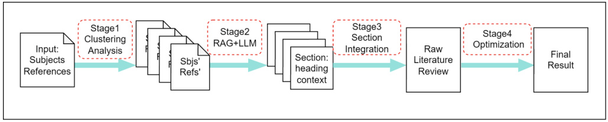
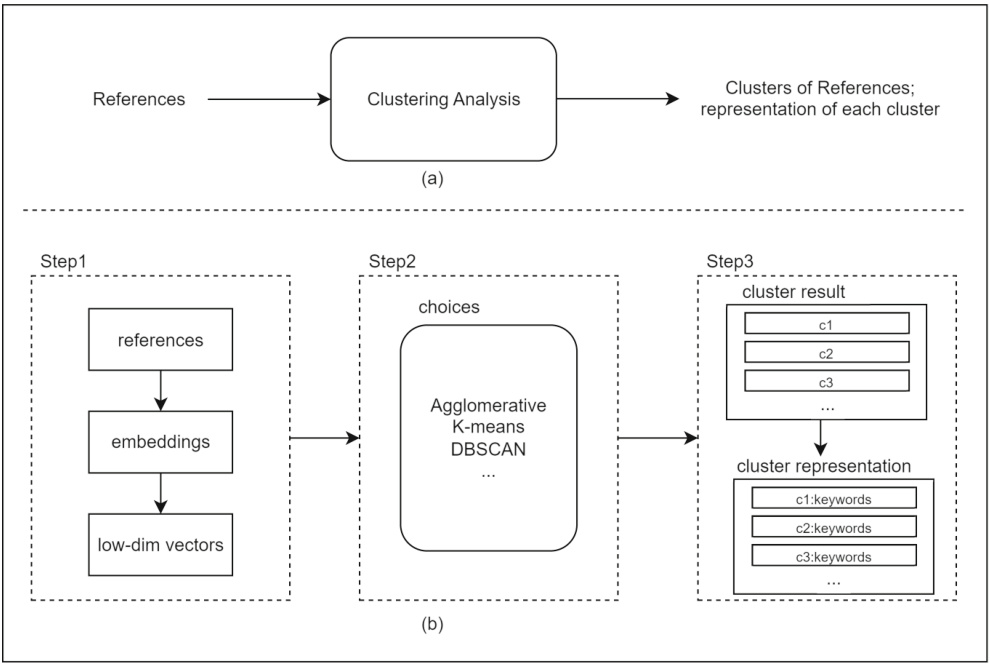
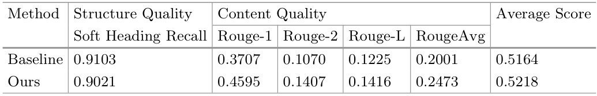
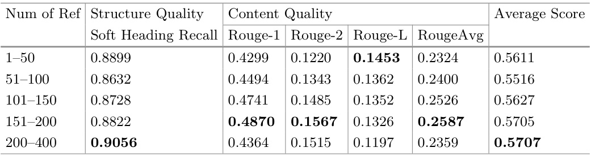

# Cluster-Based Effective Generation of AI-Driven Literature Surveys  

Zongyue Li, Xiaofei Lu ( B ) , Jing Chen, Haishan Wang, Xu Wang, Qinghui Shi, Dejun Xue, Yanhong Bi, and Zixuan Huang  

CNKI Large Model and Future Technology R&D Department,Tongfang Knowledge Network Technology Co., Ltd., Beijing, China { lzy14922,lxf5511,cj11678,whs7417,wx9018,shiqinghui, xuedejun,byh11630,hzx15069 } @cnki.net  

Abstract.  Large language models (LLMs) have revolutionized natural language processing (NLP) tasks, yet they struggle with handling long text inputs due to token limitations. This paper introduces a novel method for creating AI-driven literature surveys by integrating clustering techniques with a modified TF-IDF formula (c-TF-IDF). Our approach organizes documents into clusters, enabling the production of comprehensive and concise literature surveys. This method not only overcomes token limitations but also improves the relevance and coverage of the generated surveys. Experimental results indicate that our approach significantly outperforms traditional LLM methods in both coverage and informativeness.  

Keywords:  Clustering analysis  ·  Retrieval-augmented generation  · AI-driven scientific research  

# 1 Introduction  

In scientific research, literature surveys are essential for summarizing and synthesizing existing knowledge, identifying research gaps, and guiding future studies. With the rapid increase of scientific publications, researchers face the challenge of efficiently managing and integrating extensive volumes of information. Artificial Intelligence (AI), particularly off-the-shelf large language models(LLMs), such as GPT-3 [ 1 ], ChatGPT and GPT-4 [ 2 ], have shown great potential in automating the generation of literature surveys, thereby alleviating the burden on researchers’ time and resources. Nonetheless, these models do have their own limitations.  

One of the major challenges in using LLMs for generating literature surveys is their tendency to produce hallucinations, creating information that is not grounded in the source material. This issue was notably observed with the Galactica system [ 3 ], which exhibited excessive hallucinations in literature survey tasks, ultimately leading to its discontinuation. Additionally, LLMs often face token limitations, restricting the amount of input they can process at once, which can hinder their performance and result in incomplete summaries.  

Recent advancements, notably the Retrieval-Augmented Generation (RAG) approach [ 4 ], have addressed some of these issues by integrating external knowledge sources [ 5 ]. While RAG can mitigate hallucinations and enhance factual accuracy, it also poses challenges in efficiently selecting and recalling relevant content without overwhelming the model with excessive tokens [ 6 ]. Therefore, there is a need for innovative solutions to handle large sets of references and generate structured and coherent outlines for literature surveys.  

To tackle these issues, this paper proposes a structured, clustering-based method aimed at enhancing the accuracy and efficiency of AI-driven literature surveys generation. Our approach, illustrated in Fig.  1  , consists of four key stages:  

1. Clustering Analysis: Embedding and clustering references based on specific subjects to organize the content into manageable sections.   
2. RAG with LLM: Employing Retrieval-Augmented Generation (RAG) alongside large language models (LLMs) to formulate headings, subheadings and contextualize each section.   
3. Section Integration: Compiling the individually generated sections into an initial literature survey to create a comprehensive document that addresses various aspects of the research topic.   
4. LLM Optimization: Iteratively refining the initial survey using LLMs to generate abstracts, conclusions and titles, ensuring clarity, coherence, and logical flow.  

  
Fig. 1.  Workflow of the proposed clustering-based method for AI-generated literature surveys.  

In summary, the main contributions of the paper are as follows:  

1. Novel Framework Proposal: We introduce a new framework that uses clustering techniques to manage and organize references in AI-generated literature surveys.  

2. Effectiveness Evaluation: We demonstrate the effectiveness of this clustering method through participation in the Scientific Literature Survey Generation competition (NLPCC 2024 shared task 6) [ 7 ]. Our approach achieved superior scores in metrics such as soft heading recall and ROUGE, surpassing those of other teams and demonstrating its effectiveness in overcoming token limitations and enhancing overall content management.  

3. Practical Application: We examine the potential applications of this method across various scientific fields and emphasize its practical significance for advancing future research.  

These contributions collectively enhance the structure and coherence of AIdriven literature surveys, addressing token limitations and improving overall content management.  

# 2 Related Work  

The integration of AI-driven tools in scientific research has demonstrated significant potential [ 8 ]. For instance, in the financial field, these tools have been utilized for idea generation, literature review and data identification [ 9 ]. Recently, two notable contributions to the field of literature survey generations are the STORM system [ 10 ] and the LitLLM toolkit [ 11 ].  

STORM System.  STORM (Synthesis of Topic Outlines through Retrieval and Multi-perspective Question Asking) is a writing system introduced by Shao et al. in 2024. In the pre-writing stage, it aims to generate Wikipedia-like articles by discovering diverse perspectives on a given topic through simulated conversations (question-asking process) based on trusted internet sources, primarily Wikipedia articles. The system curates the information to create detailed article outlines. However, STORM has limitations in generating comprehensive long-form articles, such as the transfer of source bias and the over-association of unrelated facts. Furthermore, it faces challenges in ensuring the accuracy and coherence of the synthesized information, especially when dealing with topics that require deep and nuanced understanding.  

LitLLM Toolkit.  In 2024, Agarwal et al. introduced a toolkit designed to automate the literature review process using a Retrieval Augmented Generation (RAG) approach. This toolkit leverages Large Language Models (LLMs) to extract keywords from user-provided abstracts. These keywords are then used to query academic search engines such as Google Scholar, Microsoft Academic Graph, and Semantic Scholar. The retrieved papers are subsequently re-ranked based on their relevance, and the LLMs generate the related work section by integrating these papers with the initial abstract. While LitLLM shows promise in reducing the time and effort required for literature reviews, it has notable limitations. Primarily, the toolkit is designed to generate abstracts or short reviews rather than detailed outlines or full-text literature surveys. Additionally, the reliance on keyword-based retrieval can result in missing contextually relevant papers, and the generated content might still suffer from issues of factual accuracy due to the inherent limitations of LLMs.  

# 3 Method  

This section outlines the methodology used to generate structured clusters of references and create representations for each cluster. In detail, we conduct the clustering analysis of references through a multi-step process that leverages embedding techniques, dimensionality reduction, clustering algorithms, and cluster-based TF-IDF (Term Frequency-Inverse Document Frequency) methodologies. Our approach comprises three main steps: data preprocessing, clustering, and representation creation for each cluster. Figure  2  shows the overview of this method.  

  
Fig. 2.  Overview of the clustering analysis method. (a) The input and output: references are clustered and represented. (b) The detailed three-step process: Step 1. References are converted into embeddings and reduced to low-dimensional vectors. Step 2. Various clustering algorithms are applied to the vectors. Step 3. Clustering results are used to generate representative keywords for each cluster.  

# 3.1 Data Preprocessing: Embedding, Dimensionality Reduction  

Embedding.  We use Sentence-BERT (SBERT) [ 12 ], a modification of the pretrained BERT model [ 13 ], to embed reference texts and calculate semantic similarity for clustering. SBERT utilizes Siamese and triplet networks during fine-tuning to produce semantically meaningful sentence embeddings, which can be efficiently compared using cosine similarity. SBERT is fine-tuned to generate fixed-size sentence embeddings that effectively capture semantic meaning, reducing the time required for matching similar pairs while maintaining BERTs accuracy.  

Dimensionality Reduction.  After generating the reference text embeddings, we need to address the challenge of high-dimensional data, which can hinder the performance of clustering algorithms. To optimize the data structure, we employ UMAP (Uniform Manifold Approximation and Projection) [ 14 ] as a dimensionality reduction method. UMAP, based on principles from Riemannian geometry and algebraic topology, approximates the data manifold by constructing a fuzzy topological representation of the data’s local neighborhood structure. It then optimizes the layout of this representation in a lower-dimensional space, effectively preserving both local and global data structures. This approach ensures that relationships within the embeddings are preserved, thereby maintaining the integrity of the data representation.  

# 3.2 Clustering Algorithms  

With the reduced-dimensionality embeddings, we proceed to cluster the reference data. Various clustering algorithms are available for this purpose, including hierarchical, partitional, and density-based methods [ 15 , 16 ]. Each method has its advantages and limitations, which we illustrate using representative examples:  

Hierarchical Clustering.  Agglomerative clustering [ 16 ] generates a dendrogram, capturing the hierarchical structure of the data and facilitating a nuanced understanding of nested clusters.  

Partitional Clustering.  K-means clustering [ 17 ] is effective for creating flat clusters and is computationally efficient, making it well-suited for large datasets. It also allows for easy interpretation and visualization of cluster centroids.  

Density-Based Clustering.  DBSCAN [ 18 ], a density-based approach, identifies clusters of varying shapes and sizes and detects outliers, ensuring that references are not erroneously assigned to inappropriate clusters. Furthermore, its robustness to parameter selection enhances its applicability across diverse datasets.  

In summary, leveraging these diverse clustering methods allows for a comprehensive analysis of the reference data. Each method contributes unique strengths, ensuring a more accurate and detailed understanding of the data structure and leading to reliable and insightful conclusions in our research.  

# 3.3 Representation Creation for Each Cluster  

Creating representations for each reference cluster serves two primary purposes: evaluating the effectiveness of the clustering process and generating candidate keywords for each cluster to enhance subsequent input into the large language model (LLM). This process involves tokenizing the reference text within each cluster and calculating term frequencies using a modified TF-IDF approach. Term frequency-inverse document frequency (TF-IDF) is a widely used term weighting scheme in information retrieval systems [ 19 ]. TF-IDF is a numerical statistic that scores words in a text based on their importance within a document relative to the entire corpus. This method has been extensively studied for keyword extraction and word relevance determination.  

The classical TF-IDF formula is given by:  

where TF( t, d ) is term frequency of term  t  in document  d . N is the total number of documents. this context, a term that appears frequently in a document but rarely in others  |{ d  ∈ D  :  t  ∈ d }|  is the number of documents containing term  t . In will have a high TF-IDF score.  

To better suit our clustering needs, we have optimized and modified this formula to account for inter-cluster differences, resulting in a cluster-based TFIDF (c-TF-IDF). The modified formula is:  

where TF( t, c ) is the term frequency of term  t  in cluster  c .  A  is the average number of terms per cluster. TF( t, C ) is the frequency of term  t  across all clusters C .  

This adjusted TF-IDF representation, known as c-TF-IDF, captures the distinctiveness of documents within a cluster compared to those in other clusters. By applying c-TF-IDF, we identify keywords that best represent each cluster. These keywords can then be used to generate more accurate and meaningful results when utilized by the LLM.  

# 4 Experiments  

In this section, we evaluate our proposed method for generating scientific research survey papers, aiming to assess its effectiveness and compare it to a baseline approach. We detail the experimental settings, evaluation tasks and metrics, baseline methods, and implementation details in Sect. 4.1. Section 4.2 presents our results under different numbers of references, compared with the baseline method provided by the organizer [ 7 ]. Section 4.3 discusses ablation studies using random grouping to validate our approach. In Sect. 4.4, we discuss the limitations of our method.  

# 4.1 Experimental Settings  

Datasets.  We utilize a dataset of approximately 700 English scientific research survey papers provided by Kexin Technology. This dataset is divided into three subsets: a training set (400 papers), a validation set (100 papers), and a testing set (200 papers). Each sample in the training and validation sets includes the title, article ID, subject, abstract, references, and reference content. In contrast, the testing set comprises only the subject, references, and reference content. Our experiments primarily focus on the testing data. After the competition ends, the organizer provided us with the original content of the testing data, ensuring the reliability and objectivity of our experiments.  

Evaluation Tasks and Metrics.  The evaluation of our method relies on automatic metrics to assess both the structure quality and content quality:  

– Structure Quality: Assessed using Soft Heading Recall [ 10 ], which measures the quality of the survey outline structure. This metrics evaluates the alignment of generated headings, ensuring that organizational flow of the survey paper is maintained.   
– Content Quality: Measured using ROUGE-1, ROUGE-2, and ROUGE-L scores [ 20 ], which evaluate the content of the generated survey. These metrics assess the overlap of unigrams, bigrams, and longest common sub-sequences between the generated and original texts.  

Both content and structure evaluations are weighted equally, each accounting for 50% of the total evaluation. To calculate the final score, we first average the ROUGE-1, ROUGE-2 and ROUGE-L score, and then calculate the average of this averaged ROUGE score and the Soft Heading Recall.  

Baselines.  The baseline method provided by the organizer follows these steps, and we compared our method with it in the experiment results:  

1. Generate a primary outline using the subject and all reference titles.   
2. Create sub-outlines using the subject, reference titles, and the primary outline, and allocate references to each sub-outline.   
3. Generate abstracts and summaries using the subject, reference titles, and the complete outline.   
4. For each section, generate the main content using the subject, relevant references (titles and abstracts), and the complete outline.   
5. Combine the generated content into a complete survey paper.  

Implementation Details.  Our implementation utilizes the bge-large-env1.5 model for text embedding. For dimensionality reduction, we employ the UMAP model with the following parameters: the number of neighbors is set to 15, controlling the size of the local neighborhood used for manifold approximation, and the number of components is set to 5, specifying the target dimensionality of the embedded space.  

For clustering, we experiment with three methods: Agglomerative Clustering, K-means and DBSCAN. To ensure diversity in our experiments, we randomly select one of these methods for each paper run. The parameters for DBSCAN are set as follows: the minimum cluster size is 5, and the metric is Euclidean. When using K-means or Agglomerative Clustering, the number of clusters is chosen randomly within a range from 5 to the number of references divided by 10. After clustering, we compute the representation of each reference cluster using the c-tf-idf method.  

Additionally, we employ the LLM API provided by Moonshot Corporation to perform text generation tasks. Specifically, we utilize the “moonshot-v1-32k”  

model 1 , which is configured with a temperature of 0.6, a maximum token limit of 8192, and a top p value of 0.95. This setup balances creativity and precision, ensuring high-quality outputs suitable for various tasks. To tailor the model’s responses for different generation tasks—such as creating headings, sections, abstracts, and titles—we design prompts using a structured format. The format typically includes components such as “question”, “note”, “structure”, and “guideline”. For example, “question” defines the specific generation task, while “note” highlights any important considerations. This approach allows us to adapt the prompts to meet specific task requirements, ensuring that the content is contextually appropriate and adheres to academic standards.  

# 4.2 Main Results  

As shown in Table  1 , we evaluated our method against the baseline provided by the organizer on the 200 testing dataset. Our method achieved a Soft Heading recall of 0.9021, slightly lower than the baseline’s 0.9103. However, in the terms of content quality, our method significantly outperforms the baseline, with higher ROUGE score (ROUGE-1, ROUGE-2 and ROUGE-L). Specifically, the average ROUGE score of our method is 0.2473, which is higher than the baseline’s 0.2001, indicating better overall content quality. The average of all metrics shows our method scoring 0.5218, higher than the baseline’s 0.5164, demonstrating a balanced improvement in both structure and content quality.  

Table 1.  Comparison of Our Method with the Baseline on the 200 Testing Set, including Soft Heading Recall and ROUGE scores.   

  

Furthermore, we compared the performance of our method across different numbers of references, as shown in Table  2 . The results are categorized into five groups based on the number of references used: 1–50, 51–100, 101–150, 151–200, and 200–400. Our method achieved the lowest Soft Heading Recall score in the 51–100 references group, but its performance generally improves with an increasing number of references. Notably, we achieved the highest Soft Heading Recall score of 0.9056 in the 200–400 references group, indicating that our clustering-based approach effectively utilizes larger datasets to generate more coherent and high-quality survey papers.  

Table 2.  Performance Analysis of Our Method by Number of References Used.   

  

# 4.3 Ablation Study  

To evaluate the robustness of our clustering-based method, we conducted an ablation study by randomly selecting 50 papers from the testing dataset. In this study, we compared our clustering approach with a random grouping method. To ensure a fair comparison, we prepared two sets of 50 papers, each with the same number of clusters as used by our method. One set was grouped using our clustering approach, while the other set’s references were randomly shuffled and divided into clusters.  

The results of this comparison are detailed in Table  3 . Although the differences in scores are not substantial, our method consistently outperforms the random grouping method across all metrics. This suggests that our approach, which leverages a deep understanding of the content and context of the references for clustering analysis, provides superior structural coherence and content quality.  

Table 3.  Comparison of Random Grouping Method and Clustering-Based Method   

  

# 4.4 Discussion and Limitation  

We conducted experiments to validate the performance and applicability of our cluster-based approach for generating AI-driven literature surveys. The experiments aimed to assess how effectively our method organizes references and provide valuable insights.  

Our method exceeded the baseline score in Table  1 , demonstrating the effectiveness of our approach. Notably, Table  2  highlights that our clustering method is especially advantageous when applied to a larger number of references, indicating that clustering strategies benefit from the enhanced context offered by a more extensive reference pool. However, a critical issue is how to adjust and optimize the cluster size according to the volume of references in order to effectively organize a moderate number of references. Determining the optimal number of clusters remains a key challenge, which could potentially be addressed by investigating adaptive clustering algorithms or integrating user feedback.  

Table  3  presents the ablation study results, underscoring the value of clustering in understanding semantic relationships among references, which leads to more coherent and relevant survey section. Nevertheless, it is important to note that we only tested a fixed set of 50 papers, which may not fully capture the diversity and variability of reference in practice. This limited sample size may have restricted the full potential of our clustering analysis performance.  

# 5 Conclusion  

In this work, we propose a novel clustering-based approach to organize and generate scientific literature surveys, significantly enhancing structural coherence and content quality. Experiments show that our method consistently outperforms the provided baseline, particularly in handling large-scale references, by effectively capturing semantic relationships among them. This approach yields more cohesive and pertinent survey sections.  

Future research should focus on refining adaptive clustering techniques and evaluating their performance across diverse datasets. Furthermore, exploring more efficient clustering algorithms and leveraging distributed computing resources could address scalability concerns, ensuring the method remains effective as the number of references increases.  

This study highlights the potential of clustering-based methods in automating the organization of scientific literature, providing a promising direction for future advancements in this field.  

Acknowledgements.  We are grateful to the anonymous reviewers for their insightful comments and suggestions. We also acknowledge the support provided by Kexin Technology and Deakin University.  

# References  

1. Brown, T., Mann, B., Ryder, N., Subbiah, M., Kaplan, J.D., Dhariwal, P., Neelakantan, A., Shyam, P., Sastry, G., Askell, A., et al.: Language models are few-shot learners. Adv. Neural. Inf. Process. Syst.  33 , 1877–1901 (2020)   
2. Achiam, J., et al.: GPT-4 technical report. arXiv preprint  arXiv:2303.08774  (2023)   
3. Taylor, R., et al.: Galactica: a large language model for science. arXiv preprint arXiv:2211.09085 (2022)  
4. Lewis, P., et al. Retrieval-augmented generation for knowledge-intensive NLP tasks: Adv. Neural. Inf. Process. Syst.  33 , 9459–9474 (2020) 5. Shuster, K., Poff, S., Chen, M., Kiela, D., Weston, J.: Retrieval augmentation reduces hallucination in conversation. arXiv preprint  arXiv:2104.07567  (2021) 6. Levy, M., Jacoby, A., Goldberg, Y.: Same task, more tokens: the impact of input length on the reasoning performance of large language models. arXiv preprint arXiv:2402.14848  (2024) 7. Yangjie, T., et al.: Overview of the nlpcc2024 shared task6: scientific literature survey generation (2024) 8. Van Dis, E.A., Bollen, J., Zuidema, W., Van Rooij, R., Bockting, C.L.: ChatGPT: five priorities for research. Nature  614 (7947), 224–226 (2023) 9. Dowling, M., Lucey, B.: ChatGPT for (finance) research: the Bananarama conjecture. Financ. Res. Lett.  53 , 103662 (2023)   
10. Shao, Y., Jiang, Y., Kanell, T.A., Xu, P., Khattab, O., Lam, M.S.: Assisting in writing Wikipedia-like articles from scratch with large language models. arXiv preprint  arXiv:2402.14207  (2024)   
11. Agarwal, S., Laradji, I.H., Charlin, L., Pal, C.: LitLLM: a toolkit for scientificliterature review. arXiv preprint  arXiv:2402.01788  (2024)   
12. Reimers, N., Gurevych, I.: Sentence-BERT: sentence embeddings using siamese BERT-networks. arXiv preprint  arXiv:1908.10084  (2019)   
13. Devlin, J., Chang, M.W., Lee, K., Toutanova, K.: BERT: pre-training of deep bidirectional transformers for language understanding. arXiv preprint arXiv:1810.04805  (2018)   
14. McInnes, L., Healy, J., Melville, J.: UMAP: uniform manifold approximation and projection for dimension reduction. arxiv 2018. arXiv preprint  arXiv:1802.03426 10  (1802)   
15. Sajana, T., Rani, C.S., Narayana, K.: A survey on clustering techniques for big data mining. Indian J. Sci. Technol.  9 (3), 1–12 (2016)   
16. Berkhin, P.: A survey of clustering data mining techniques. In: Grouping multidi- mensional data: Recent advances in clustering, pp. 25–71. Springer (2006).  https:// doi.org/10.1007/3-540-28349-8 2   
17. MacQueen, J., et al.: Some methods for classification and analysis of multivariate observations. In: Proceedings of the Fifth Berkeley Symposium on Mathematical Statistics and Probability, vol. 1, pp. 281–297. Oakland, CA, USA (1967)   
18. Ester, M., Kriegel, H.P., Sander, J., Xu, X., et al.: A density-based algorithm for discovering clusters in large spatial databases with noise. In: kdd, vol. 96, pp. 226–231 (1996)   
19. Jalilifard, A., Carid´ a, V.F., Mansano, A.F., Cristo, R.S., da Fonseca, F.P.C.: Semantic sensitive TF-IDF to determine word relevance in documents. In: Advances in Computing and Network Communications: Proceedings of CoCoNet 2020, Vol.2, pp. 327–337. Springer (2021).  https://doi.org/10.1007/978-981-33- 6987-0 27   
20. Lin, C.Y.: Rouge: a package for automatic evaluation of summaries. In: Text sum- marization branches out, pp. 74–81 (2004)  