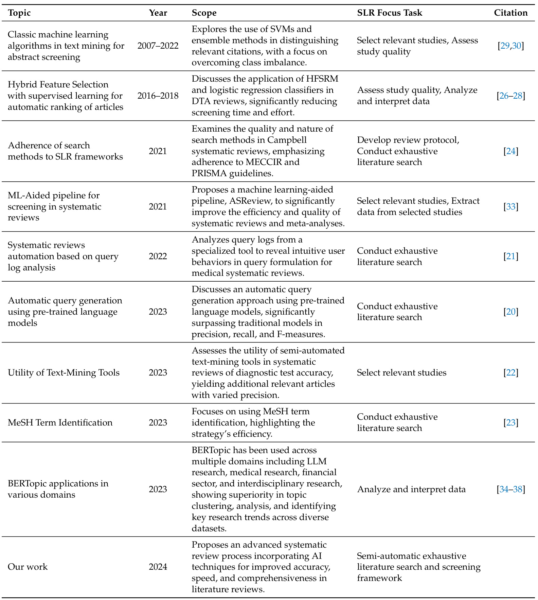
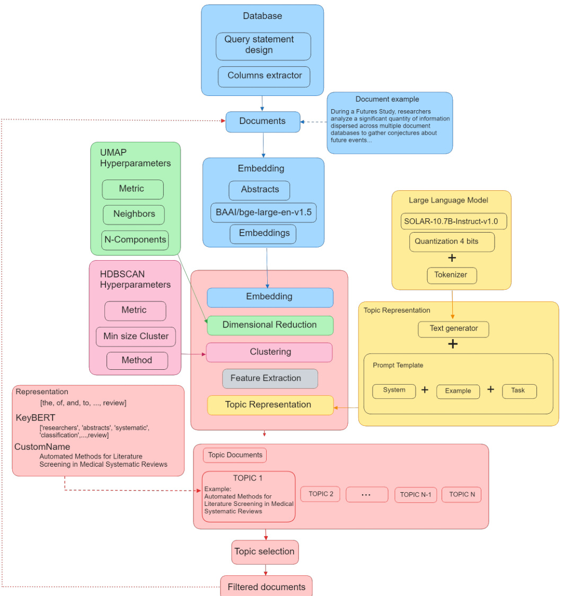
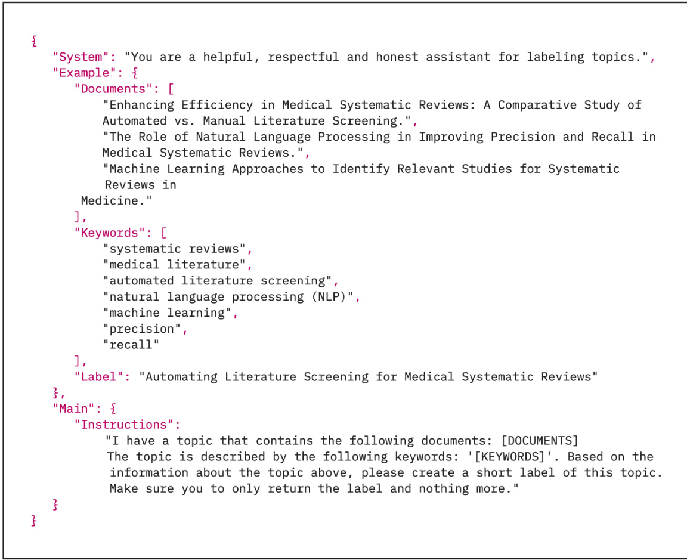
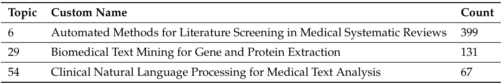
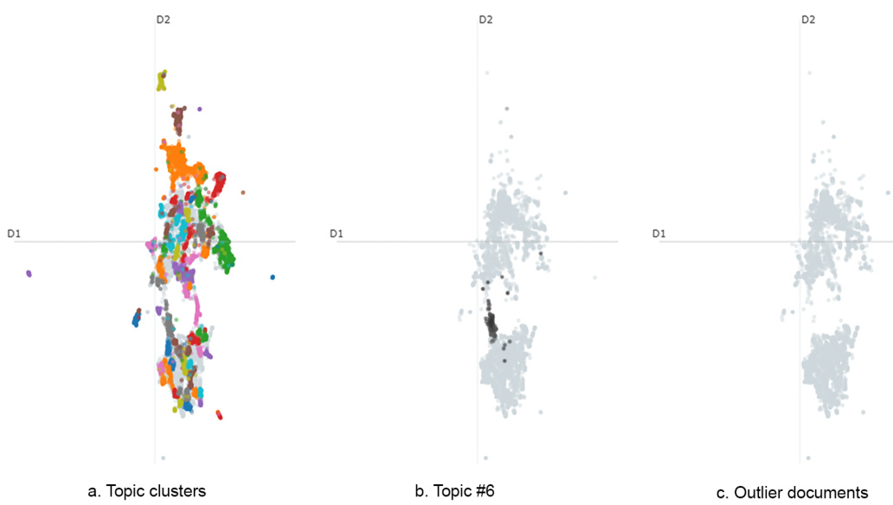
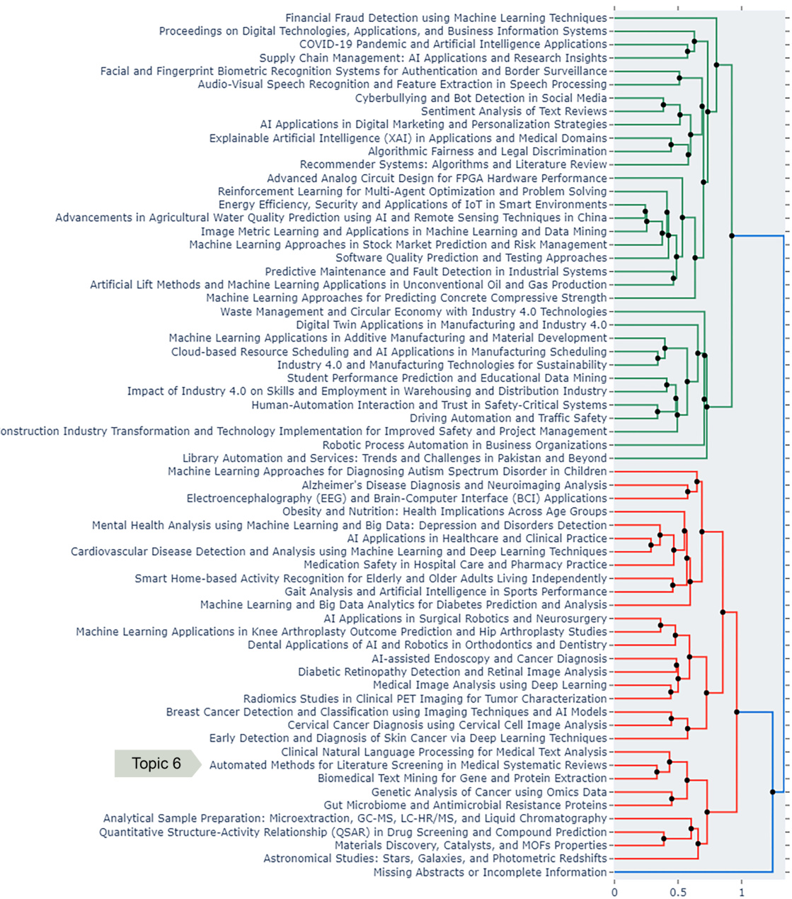
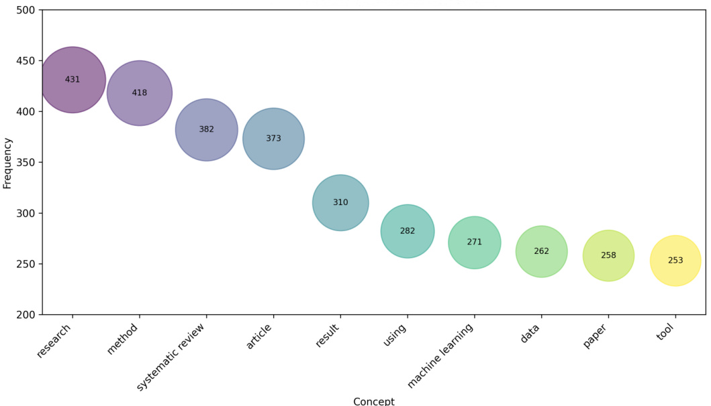
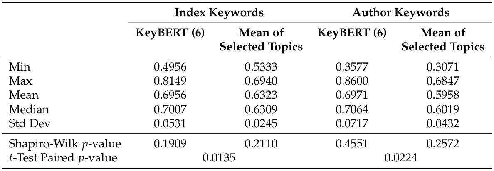
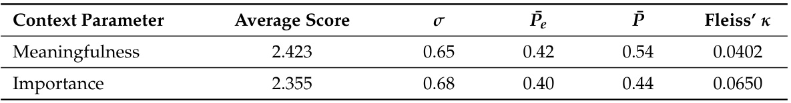

# Article Leveraging LLMs for Efficient Topic Reviews  

Bady Gana   \* , Andrés Leiva-Araos   \* , Héctor Allende-Cid   and José García   5  

Citation:  Gana, B.; Leiva-Araos, A.; Allende-Cid, H.; García, J. Leveraging LLMs for Efficient Topic Reviews. Appl. Sci.  2024 ,  14 , 7675. https:// doi.org/10.3390/app14177675  

Academic Editor: Alessandro Di Nuovo  

Received: 7 August 2024   
Revised: 21 August 2024   
Accepted: 28 August 2024   
Published: 30 August 2024  

1 Escuela de Ingeniería Informática, Pontificia Universidad Católica de Valparaíso, Avenida Brasil 2241, Valparaíso 2362807, Chile   
2 Instituto de Data Science, Facultad de Ingeniería, Universidad del Desarrollo, Av. La Plaza 680, Las Condes, Santiago 7610615, Chile   
3 Knowledge Discovery, Fraunhofer-Institut für Intelligente Analyse- und Informationssysteme (IAIS), Schloss Birlinghoven 1, 53757 Sankt Augustin, Germany; hector.allende-cid@iais.fraunhofer.de   
4 Lamarr Institute for Machine Learning and Artificial Intelligence, 53115 Dortmund, Germany   
5 Escuela de Ingeniería en Construcción y Transporte, Pontificia Universidad Católica de Valparaíso, Av. Brasil 2147, Valparaíso 2340000, Chile; jose.garcia@pucv.cl   
\* Correspondence: bady.gana@pucv.cl (B.G.); andresleiva@udd.cl (A.L.-A.)  

Abstract:  This paper presents the topic review (TR), a novel semi-automatic framework designed to enhance the efficiency and accuracy of literature reviews. By leveraging the capabilities of large language models (LLMs), TR addresses the inefficiencies and error-proneness of traditional review methods, especially in rapidly evolving fields. The framework significantly improves literature review processes by integrating advanced text mining and machine learning techniques. Through a case study approach, TR offers a step-by-step methodology that begins with query generation and refinement, followed by semi-automated text mining to identify relevant articles. LLMs are then employed to extract and categorize key themes and concepts, facilitating an in-depth literature analysis. This approach demonstrates the transformative potential of natural language processing in literature reviews. With an average similarity of 69.56% between generated and indexed keywords, TR effectively manages the growing volume of scientific publications, providing researchers with robust strategies for complex text synthesis and advancing knowledge in various domains. An expert analysis highlights a positive Fleiss’ Kappa score, underscoring the significance and interpretability of the results.  

Keywords:  NLP; LLM; knowledge management; transformer-based topic models  

# 1. Introduction  

Recent advances in literature review processes have increasingly integrated machine learning (ML) and text-mining tools to enhance the efficiency and effectiveness of systematic reviews [ 1 ]. These developments include significant improvements in query generation, information extraction, and refinement techniques, which aid in identifying relevant articles and developing efficient search strategies [ 2 ]. Furthermore, automated text classification, including traditional ML methods and zero-shot classification techniques, has improved accuracy, precision, and recall in systematic review screening, reducing human error and workload [ 3 , 4 ]. The integration of ML and natural language processing (NLP) has further advanced literature review processes, facilitating a more efficient synthesis of scholarly literature while addressing the challenges of interpreting complex academic jargon and nuanced expressions critical for high-quality data extraction [ 5 – 8 ]. However, these advances also highlight the challenges of understanding the contextual and semantic intricacies of scholarly articles, which are essential to accurately evaluate and synthesize research findings [ 9 – 11 ].  

To address these issues, the integration of large language models (LLMs) and topic analysis algorithms shows promising potential [ 9 , 10 ]. LLMs, with their advanced capabilities in understanding and generating human-like text, can greatly enhance the identification and classification of key themes and concepts within large volumes of literature [ 11 , 12 ]. This not only aids in overcoming the semantic complexities but also assists in distilling vast amounts of data into coherent and relevant information streams. Topic analysis, in conjunction with LLMs, can further refine the process by clustering related research works [ 13 ], thereby streamlining the literature review process and enhancing its representativeness.  

The integration of LLMs and advanced tools like neural topic modeling with a classbased TF-IDF procedure (BERTopic) into the scientific literature review process represents a significant paradigm shift from traditional methods [ 14 , 15 ]. Despite the advancements achieved with techniques such as probabilistic latent semantic analysis (PLSA) and latent dirichlet allocation (LDA) [ 16 , 17 ], LLMs and BERTopic offer unprecedented capabilities in understanding and analyzing complex contexts and semantic nuances in large volumes of text. This approach surpasses the limitations of methods that do not consider semantics and context [ 18 , 19 ], paving the way for more efficient, in-depth, and nuanced literature reviews. In this context, we propose a novel semi-automatic bibliographic review method that leverages the power of LLMs and transformer-based topic models to analyze and synthesize scientific literature. This approach not only promises to enhance the coverage of systematic reviews but also addresses the challenges of managing the ever-increasing volume of scientific publications, particularly in rapidly evolving fields such as medicine, cybersecurity, and the construction industry, among other technical areas.  

Building on the advanced capabilities of LLMs and transformer-based topic models, this article introduces a new framework for conducting scientific literature reviews, a significant leap from traditional review methodologies. This innovative approach is designed to address the growing complexities and voluminous nature of contemporary research publications. The key contributions of this article are as follows:  

• A novel framework for semi-automatic literature review processes is proposed, utilizing the synergistic potential of LLMs and BERTopic. This framework is tailored to enhance the depth and breadth of literature analyses, ensuring comprehensive coverage across scholarly databases.   
• A single case study within this framework is developed and presented. This case study encompasses a specific domain demonstrating the applicability and robustness of the proposed method.   
• Specific metrics to assess the quality of the identified topics have been defined, contributing to the validation and continuous improvement of the framework and literature review process.   
• Through surveys and statistical tests such as Fleiss’ Kappa, the case study has been rigorously evaluated by subject-matter experts. This expert validation, along with the statistical analysis, underscores the effectiveness of the framework in extracting relevant and profound insights from extensive scientific literature.  

The integration of these elements marks a significant stride in modernizing literature review processes, offering a scalable solution to the challenges posed by the exponential growth of scientific information.  

The rest of the paper is organized as follows: Section  2  presents an overview of ML and text-mining techniques applied to systematic literature review processes. The proposed framework and the developed experiments are detailed in Section  3 . Insights from the selected bibliometric analysis, along with the statistical evaluations by experts, are disclosed in Section  4 . Finally, Section  5  discusses the main conclusions and potential future directions.  

# 2. Literature Review  

In the context of ML applications in the literature review process, there is a growing integration of ML and text-mining tools to enhance the efficiency and efficacy of systematic reviews. In recent years, the authors emphasize advancements in query generation and refinement techniques.  

Ref. [ 20 ] discusses an automatic query generation approach using pre-trained language models, significantly surpassing traditional models in precision, recall, and F-measures, and sometimes even manual queries. In parallel, ref. [ 21 ] analyzes query logs from a specialized tool, revealing intuitive user behaviors in query formulation for medical systematic reviews. Similarly, another research trend illustrates the effectiveness of semi-automated text-mining tools in identifying relevant articles and developing efficient search strategies. Ref. [ 22 ] assesses the utility of such tools in a systematic review of diagnostic test accuracy, yielding additional relevant articles but with varied precision. Complementarily, in [ 23 ], the authors focus on using text-mining software for medical subject headings (MeSH) term identification, effectively adding new tools to the Systematic Review Toolbox and highlighting the strategy’s efficiency. Moreover, ref. [ 24 ] examines the quality and nature of search methods in Campbell systematic reviews, emphasizing the importance of adhering to Methodological Expectations of Campbell Collaboration Intervention Reviews (MECCIR) and Preferred Reporting Items for Systematic Reviews and Meta-Analyses (PRISMA) [ 25 ] guidelines for comprehensive and reproducible searches. These studies collectively reflect a paradigm shift towards leveraging ML and text mining for optimizing literature review processes in systematic reviews.  

In recent years, Automated Text Classification (ATC) in systematic review has had a significant step toward more efficient, accurate, and less labor-intensive research methodologies. Traditional ML and zero-shot classification methods have shown promise, achieving competitive accuracy, precision, and recall across various datasets, thereby reducing human error and workload in abstract screening [ 3 ]. A paradigm shift towards semi-automated screening is observed, where decision support tools integrate multiple ML algorithms and feature selection techniques, demonstrating high effectiveness in areas like internet-based randomized controlled trials [ 4 ]. Hybrid feature selection rule measures (HFSRM) and logistic regression classifiers have been effectively applied in HIV literature and diagnostic test accuracy (DTA) reviews, significantly reducing screening time and effort [ 26 – 28 ]. Support vector machines (SVMs) and ensemble methods, trained interactively by reviewers, have been instrumental in distinguishing relevant from irrelevant citations, though class imbalance remains a challenge [ 29 , 30 ]. The efficiency of ATC is further exemplified in food safety systematic reviews, where combinations of ML algorithms reduced the volume of articles for expert review while maintaining relevance [ 29 ]. Moreover, advancements in NLP have facilitated prioritizing title and abstract screening, significantly reducing workload and bias in literature reviews [ 31 , 32 ]. In [ 33 ], the authors propose a ML-aided pipeline, ASReview, to significantly improve the efficiency and quality of systematic reviews and meta-analyses. This tool, designed to address the inefficiencies of manual screening, leverages active learning to systematically and accurately filter relevant studies from vast amounts of scientific literature.  

In terms of citation classification and research evaluation, several studies collectively contribute to a deeper understanding and advancement in citation classification and research evaluation, leveraging ML and NLP techniques for more efficient and comprehensive analysis of scholarly literature. Ref. [ 5 ] discusses the development of computer models using ML to predict long-term citation counts, addressing the limitation of traditional citation count methods, which cannot evaluate articles at publication time due to the cumulative nature of citations. Ref. [ 6 ] presents a classification approach for deep learning models in citation recommendation, emphasizing the need for a systematic study of these models’ strengths, weaknesses, and evaluation metrics. Ref. [ 7 ] introduces the ‘theory-as-discourse’ approach for review article writing, utilizing ML for manuscript selection, thereby enhancing review article representativeness. Ref. [ 7 ] discusses the use of a hybrid document classification method termed “supervised clustering”, which combines the benefits of supervised and unsupervised learning for effective document retrieval. Ref. [ 8 ] focuses on a meta-analysis of citation classification, exploring ML and NLP methods for analyzing linguistic features in citation context, highlighting the importance of identifying citation types for research evaluation.  

The burgeoning field of automated literature review and scientific article analysis represents a significant stride in efficiently managing the ever-increasing volume of scientific literature. This advancement is underscored by [ 9 ], highlighting the challenge posed by the data deluge in the world wide web era and the consequential growth in scientific literature. It emphasizes the shift from manual to automated literature review processes, underscoring the necessity for computational techniques to handle the extensive data efficiently. Ref. [ 10 ] further elaborates on this, pointing out the transformative role of AI in revolutionizing traditional research practices, particularly in literature review processes in information systems research. The discussion extends to the need for AI in automating laborious aspects of literature review, echoing [ 9 ] emphasis on the increasing indispensability of automated methods.  

In a similar vein, ref. [ 11 ] delves into the challenges presented by the volume and complexity of scientific literature, advocating for systematic, replicable, and rigorous literature reviews augmented by computational techniques. This aligns with the [ 12 ] perspective, which proposes a general framework to automate systematic literature reviews by employing AI tools, thereby addressing the creative and technical aspects of the process. Even though the analyzed literature is very recent, due to the rapid development of new techniques, certain artifacts integrating various computational techniques for semiautomated literature review models, like in [ 13 ], appear obsolete as of today.  

The recent surge in transformer-based topic models, such as BERTopic, has significantly expanded research horizons, broadening the scope of investigation to encompass a diverse array of disciplines. In [ 34 ], the authors employed the BERTopic algorithm to conduct a comprehensive analysis of the data; the analysis revealed four main clusters of topics in LLM research: “language and NLP”, “education and teaching”, “clinical and medical applications”, and “speech and recognition techniques”. In medical research, BERTopic’s utility was evident in bone regeneration studies, where it identified 372 research topics, highlighting the growing importance of areas like 3D printing and extracellular vesicles. This application underlines BERTopic’s capability to set up automated screening routines, tracking progress in innovative medical fields [ 35 ]. In the financial sector, BERTopic has been employed for news impact analysis, significantly improving news selection for finance researchers by analyzing 38,240 news articles. This approach, compared against models like latent dirichlet allocation (LDA) and Top2Vec, demonstrated BERTopic’s superiority in data interpretation and minimal preprocessing requirements, enhancing the feasibility and usability of the news impact analysis process [ 36 ]. Additionally, BERTopic’s robustness in topic modeling was further proven through its application in identifying and analyzing interdisciplinary topics in Library & information science (LIS). By extracting, filtering, and analyzing topics based on disciplinary diversity and cohesion, BERTopic facilitated the exploration of interdisciplinary research’s evolutionary path, indicating that growth in LIS primarily occurs in interdisciplinary topics [ 37 ]. In [ 38 ], the authors investigate the efficacy of BERTopic for text clustering, comparing it with LDA and Top2Vec on Weibo and Twitter data, finding BERTopic superior in topic separation and understanding of text data structure, with at least 34.2% better performance in Chinese and English clustering. In Table  1 , we can observe a comparison of the contributions of previous studies with our work.  

Collectively, establish a clear trajectory towards the increasing integration of AI and computational methods in the literature review process, reflecting a paradigm shift necessitated by the digital age’s data challenges.  

To the best of our knowledge, from the reviewed literature, we observe a significant effort in the application of techniques for the development of bibliographic reviews and linguistic summaries to uncover hidden patterns in data. This trend is not only a response to the sheer volume of data but also an evolution towards more sophisticated, efficient, and accurate scientific literature analysis methods. Our work in enhancing the efficiency of systematic literature review processes through artificial intelligence stands as a significant contribution to the field. While current efforts facilitate human effort and do not fully replace it, our approach notably advances the accuracy, speed, and comprehensiveness of literature reviews. This not only underscores the potential of AI in academic research but also paves the way for more sophisticated, AI-driven methodologies in future literature review processes.  

Table 1.  Comparison of Related Work.   

  

# 3. Framework  

The purpose of this section is to explain the details of the framework. The section is divided into four parts. The core components of the framework, which will be detailed in Section  3.1 , the parameters and configuration of the framework set forth in Section  3.2 , followed by the metrics used to evaluate the obtained results, discussed in Section  3.3 , and finally, the proposed experiment to validate the effectiveness of the proposal, presented in Section  3.4 .  

# 3.1. Core Components  

In this section, the core components of the proposed framework are detailed. Figure  1 displays the framework’s flowchart. Initially, the abstracts from each document are processed by the framework. This framework is comprised of five principal components, each designed to optimize specific aspects of the literature review process.  

  
Figure 1.  Framework flow diagram. This diagram shows the pipeline from document extraction to finding the filtered topics, optionally repeating the process for them.  

The framework begins by embedding abstracts using the FlagEmbedding model BGElarge-en-v1.5 [ 39 ], transforming documents into dense vectors for various tasks such as retrieval, classification, and clustering (Section  3.1.1 ). Following this, UMAP is applied for dimensionality reduction to manage high-dimensional data complexity while preserving crucial structures (Section  3.1.2 ). Clustering is then performed using HDBSCAN to identify coherent topics, minimizing noise, and grouping relevant documents (Section  3.1.3 ). Feature extraction is enhanced by a class-based TF-IDF (c-TF-IDF) [ 14 ], which improves thematic relevance and distinctiveness (Section  3.1.4 ). Finally, the integration of BERTopic with the SOLAR-10.7B model [ 40 ] refines topic representation, providing a comprehensive analysis for NLP tasks (Section  3.1.5 ). This approach optimizes performance and significantly enhances the quality of thematic representation in literature reviews.  

This cohesive approach ensures that the proposed framework not only optimizes performance but also significantly enhances the quality and depth of thematic representation in literature reviews.  

# 3.1.1. Embedding  

Bge-large-en-v1.5 is a transformer-based model developed by the Beijing Academy of Artificial Intelligence (BAAI) specifically for generating embeddings that capture the semantic content of text. The model is designed to efficiently process large-scale text data by leveraging its architecture to capture long-range dependencies within the text. This makes bge-large-en-v1.5 particularly effective in understanding the contextual relationships between words, which is essential for a wide range of NLP applications.  

The effectiveness of bge-large-en-v1.5 is attributed not only to its optimized architecture and extensive training on a large dataset but also to its specific design, which efficiently processes large-scale text data. Bge-large-en-v1.5 employs a transformer-based architecture, which is known for its ability to capture long-range dependencies in text, making it particularly effective at understanding the contextual relationships between words. This model achieves a balance between efficiency and representation quality, making it well-suited for NLP applications that require both high accuracy and processing speed.  

One of the key strengths of bge-large-en-v1.5 is its ability to generate dense, lowdimensional embeddings that capture the semantic relationships between words with high precision. Unlike traditional word embeddings such as Word2Vec [ 41 ] or GloVe [ 42 ], which rely on fixed-dimensional word vectors, bge-large-en-v1.5’s transformer-based approach allows for dynamic, context-sensitive embeddings. This results in more accurate thematic representations, especially in complex texts where the meaning of a word can vary depending on its context.  

Additionally, bge-large-en-v1.5’s adaptability across different usage contexts is evidenced by its robust performance in various evaluation tasks. In the English Massive Text Embedding Benchmark (MTEB) benchmark [ 43 ], bge-large-en-v1.5 outperforms significantly larger models like GPT Sentence Embeddings for Semantic Search (SGPT) Bloom [ 44 ], which has 7.1 billion parameters. This is achieved by optimizing the architecture to reduce computational overhead while maximizing representational fidelity. The model’s ability to maintain high performance with fewer parameters compared to larger models highlights its efficiency, making it an ideal choice for embedding within the proposed framework.  

The transformer architecture used by bge-large-en-v1.5 also offers advantages over traditional methods, such as better handling of polysemy (multiple meanings of a word) and improved capture of word order and syntactic structure. These characteristics are critical for tasks that involve nuanced language understanding, further justifying the selection of bge-large-en-v1.5 for this framework.  

# 3.1.2. Dimensional Reduction  

Dimensionality reduction is a critical step in the proposed framework, aimed at simplifying high-dimensional embeddings to facilitate efficient clustering and further analysis. The framework utilizes Uniform Manifold Approximation and Projection (UMAP) [ 45 ] as the default technique due to its effectiveness in preserving both local and global structures within reduced dimensions. UMAP excels at maintaining the integrity of these structures, which is essential for ensuring accurate clustering of topics, as it helps retain the nuanced relationships between data points that might be lost with other dimensionality reduction techniques.  

UMAP operates by constructing a high-dimensional graph representation of the data and then optimizing a low-dimensional graph that is as structurally similar as possible to the original. This method allows UMAP to capture both local data point relationships (i.e., how close data points are to their neighbors) and global data structures (i.e., how clusters of data are related to one another). This dual capability makes UMAP particularly effective for applications where understanding the global and local relationships within data is crucial, such as topic modeling in large text corpora.  

One of UMAP’s key characteristics is its computational efficiency, particularly when embedding in dimensions higher than two. Unlike t-distributed stochastic neighbor embedding (t-SNE) [ 46 ], which requires global normalization and the use of spatial trees that scale poorly with dimensionality, UMAP avoids these computational bottlenecks. UMAP’s optimization process is significantly faster, making it more scalable for large datasets and suitable for real-time applications. This efficiency is not only beneficial for visualization purposes but is also critical for machine learning tasks such as clustering or anomaly detection, where high-dimensional data needs to be managed effectively without compromising on the quality of the resulting embeddings.  

Additionally, UMAP’s flexibility allows it to adapt to various data structures better than other techniques like LargeVis [ 47 ], especially on non-local scales where it excels. This makes UMAP a versatile tool in the framework, capable of providing high-quality, lowdimensional representations that are crucial for subsequent clustering and analysis tasks. The framework further enhances its adaptability by allowing the incorporation of other dimensionality reduction techniques to meet the specific needs of different analyses. This flexibility ensures that the framework can handle a wide range of datasets and analytical requirements.  

# 3.1.3. Clustering  

Hierarchical Density-Based Spatial Clustering of Applications with Noise (HDBSCAN) [ 48 ] is a clustering algorithm that extends the capabilities of DBSCAN by introducing a hierarchical approach. Unlike traditional clustering algorithms that require a predefined number of clusters, HDBSCAN is able to discover clusters of varying densities, which makes it particularly effective in dealing with real-world data where cluster densities can vary significantly.  

HDBSCAN works by first constructing a minimum spanning tree of the distanceweighted graph, which represents the data points. It then performs a process known as “condensed clustering”, where the tree is pruned to remove edges that represent noise, and the remaining tree structure reveals the clusters. This method allows HDBSCAN to model noise explicitly as outliers, meaning that points that do not clearly belong to any cluster are not forced into a cluster. This approach significantly improves the quality of the clustering by ensuring that only coherent, high-density regions of data are grouped together, which is crucial for accurate topic representation in NLP tasks.  

One of the key advantages of HDBSCAN is its ability to produce a soft clustering output, where each data point is assigned a probability of belonging to a cluster. This soft clustering approach is particularly useful in situations where data points may be ambiguously located between clusters, as it provides a more nuanced understanding of the data structure compared to hard clustering methods like k-means. Additionally, HDBSCAN automatically determines the number of clusters based on the data, removing the need for the user to specify this parameter, which can be challenging in complex datasets.  

HDBSCAN is employed in the proposed framework primarily due to its efficiency in identifying structures of varying densities, which is vital for obtaining accurate topic representations from the reduced embeddings produced by UMAP. The combination of UMAP and HDBSCAN allows for the discovery of meaningful clusters in high-dimensional data, where traditional clustering methods might struggle. This is particularly important in NLP tasks, where the semantic relationships between topics can vary in complexity and density.  

The framework also maintains flexibility by allowing the integration of other clustering models as needed. This modularity ensures that the framework can adapt to new developments in clustering techniques, keeping it aligned with the latest trends in NLP and data science.  

In studies conducted by [ 15 , 49 ], it was shown that reducing the dimensionality of high-dimensional embeddings with UMAP can enhance the performance of clustering algorithms like k-means and HDBSCAN, both in terms of accuracy and runtime. The combination of UMAP for dimensionality reduction and HDBSCAN for clustering has been proven effective across various NLP tasks, as demonstrated in several studies. For instance, ref. [ 50 ] highlighted the application of machine learning in improving water infrastructure integrity and quality, where UMAP was used to enhance the performance of clustering techniques. Additionally, in [ 51 ], HDBSCAN was used alongside UMAP to cluster short social media texts represented by FastText [ 52 ] and bidirectional encoder representations from transformers (BERT) embeddings, revealing trending topics within communities. Similarly, ref. [ 53 ] applied this approach to identify arguments in realworld datasets, while [ 54 ] used it to analyze tweets related to COVID-19 vaccines. Lastly, ref. [ 55 ] leveraged the UMAP-HDBSCAN combination for topic modeling in agricultural instructional sentences.  

This robust combination of UMAP and HDBSCAN within the framework ensures that the clustering process is both efficient and effective, yielding high-quality topic representations essential for advanced NLP tasks.  

# 3.1.4. Feature Extraction  

To achieve an accurate representation of topics, the traditional term frequency-inverse document frequency (TF-IDF) method is adjusted to a class-based version, known as cTF-IDF. This approach enhances the traditional TF-IDF by considering the uniqueness of documents within a group compared to others, resulting in a more refined and meaningful representation of topics.  

The c-TF-IDF approach, as implemented in BERTopic, modifies the classic TF-IDF technique to operate at the cluster level rather than on individual documents. In this method, each cluster is treated as a single document by concatenating all the documents within that cluster. The term frequency within this aggregated cluster (or “class”) is calculated in relation to the entire set of clusters with the goal of identifying terms that are particularly distinctive within each cluster. The inverse frequency is then adjusted by calculating the logarithm of the average number of words per class divided by the frequency of the term across all classes.  

This adjustment allows c-TF-IDF to emphasize terms that are unique to specific clusters, rather than those that are common across the entire dataset. By focusing on the differences between clusters, c-TF-IDF effectively identifies keywords that define the thematic essence of each cluster, which might be diluted or overlooked by traditional TF-IDF methods that operate on individual documents.  

One of the significant advantages of c-TF-IDF over the traditional TF-IDF is its ability to provide a clearer thematic structure within large text datasets. Traditional TF-IDF can struggle with sparse data when applied to large document collections, often leading to the identification of terms that are too generic or not representative of the specific themes within clusters. In contrast, c-TF-IDF ensures that the identified terms are directly related to the distinctive content of each cluster, thus improving the relevance and specificity of the topics generated.  

By leveraging c-TF-IDF, BERTopic facilitates a deeper and more accurate understanding of the thematic structure in large text datasets. This approach not only improves the quality and relevance of the identified topics but also enhances the interpretability of the results, making it easier to understand the underlying patterns in the data.  

# 3.1.5. Topic Representation  

This proposed framework, by combining the modularity of BERTopic with the advanced capabilities of SOLAR-10.7B-Instruct-v1.0, establishes itself as a versatile and scalable tool for literature analysis. Its design not only simplifies and streamlines the literature review process but also ensures that the conclusions drawn accurately and deeply reflect the evolving landscape of knowledge. With this approach, we aim to provide researchers and academics with a more efficient and effective methodology for synthesizing and analyzing large volumes of textual information. The architecture of SOLAR-10.7B-Instruct-v1.0, designed for superior performance across a variety of NLP tasks, facilitates the adaptability and effectiveness of the framework in diverse literature review applications.  

SOLAR 10.7B-Instruct, a large language model with 10.7 billion parameters, is noted for its exceptional performance on a variety of NLP tasks. This model uses an innovative approach called depth up-scaling (DUS), which allows LLMs to scale efficiently while maintaining their simplicity and effectiveness. A variant of SOLAR 10.7B, known as SOLAR 10.7B-Instruct, has been specifically tuned to follow complex instructions, outperforming models such as Mixtral-8x7B-Instruct [ 40 ]. The inclusion of SOLAR 10.7B in BERTopic significantly improves the representation of topics by leveraging its ability to interpret and follow complex instructions, which is especially useful for selecting representative documents based on their similarity to c-TF-IDF representations of topics. SOLAR 10.7B’s efficiency in handling a large number of documents and its ability to select those that are sufficiently diverse further strengthen its application in BERTopic.  

# 3.2. Parameter Settings and Configurations  

The parameter settings and configurations are crucial to ensure efficiency and accuracy in handling large models and performing complex NLP tasks. In the proposed approach for literature analysis using the Hugging Face Transformers library, several components are carefully configured to tailor the pipeline to the specific needs of each researcher.  

The configuration starts with the extraction of the documents to be analyzed from a query, which will be transformed because of the embedding model.  

Then the model quantization must be defined, using the bitsandbytes library for 4-bit quantization, which is essential for handling large models with improved GPU memory efficiency at low computational cost [ 56 ].  

Key parameters include load in 4bit to enable quantization, bnb 4bit quant type as nf4 for a normalized float 4 quantization type, bnb 4bit use double quant for a double quantization, and bnb 4bit compute dtype set to bfloat16. In text generation, a GenerationConfig object is set following the guidelines of the transformers library. Do sample is activated, a temperature of 0.1 is set to control variability in the responses and a repetition penalty of 1.1 is set to reduce repetitions. The max new tokens limit is set to 50, achieving a balance between length and coherence of the generated text [ 57 ].  

The template prompt (see Figure  2 ) serves as a structured model for generating instructions aimed at labeling topics. It is divided into three main components: the personality of the system generating the prompts, an example prompt illustrating how to craft a specific labeling task, and a general template for creating prompts. The system’s personality is depicted as a helpful, respectful, and honest assistant. The example prompt provides a detailed scenario, including sample documents and keywords related to a topic, and instructs the user to generate a concise label for the topic based on the provided information. Meanwhile, the main template offers placeholders for documents and keywords, maintaining consistency in the labeling process by prompting users to create short labels for the topics. Through this structured approach, the prompt facilitates the generation of clear and consistent instructions for topic labeling tasks.  

The SentenceTransformer model is used to convert texts into embeddings, specifically choosing the “BAAI/bge-large-en-v1.5” version. This allows an accurate and efficient numerical representation of the abstracts. In dimensionality reduction and clustering, UMAP is implemented with parameters such as n neighbors 10, n components 6, and metric cosine. For clustering, HDBSCAN is used, where the minimum cluster size is dynamic, allowing the researcher to adjust it according to the specific needs of the study. This flexibility is key to handling various dataset sizes and clustering levels.  

  
Figure 2.  Template prompt: System + Example + Main. Based on [ 57 ].  

Representation models such as KeyBERTInspired, Maximal Marginal Relevance with 0.3 diversity, and TextGeneration with SOLAR 10.7B are integrated to improve the quality and relevance of the identified themes. Each with specific configurations that allow fine adaptability of the analysis. Finally, the BERTopic configuration includes adjustable submodels and hyperparameters such as top  n  words. This, together with the ability to train and transform the model with different sets of abstracts and embeddings, ensures that researchers can custom calibrate the pipeline, adapting it to the diverse requirements of their research projects.  

# 3.3. Metrics  

In the context of text analysis for the generation of clustered topics, it is essential to have metrics that evaluate the similarity between the indexed key terms. This is because these keywords are essential for the understanding and thematic organization of the documents. The comparison between the indexed keywords, for example, those coming from the documents and those generated by tools such as KeyBERT, allows to evaluate the quality of the clustered topic generation process provides a quantitative measure of the similarity between the sets of keywords, thus helping to determine the effectiveness of the topic generation process.  

Similarity based on indexed keywords: In this study, the cosine-based similarity technique using BERT embeddings is employed to compare the relationship between Scopus indexed keywords and keywords generated by the KeyBERT tool [ 58 ]. This technique relies on the vector representation of texts, where each word is converted into a numerical vector in a high-dimensional space. The similarity between two texts is calculated by evaluating the angle between the vectors representing these texts. The closer the angle is to zero, the higher the similarity between the texts. This approach allows for a quantitative and accurate comparison of keywords, facilitating the evaluation of the quality of the clustered topic generation process. Additionally, statistical tests are conducted to determine the significance of the observed similarity results, using a  p -value threshold to assess whether the results are statistically significant at a 95% confidence level.  

Thematic coherence analysis: In our study, we assess the relevance of clustered themes derived from the TR process, utilizing a survey administered to seven expert raters. The evaluation focuses on two key parameters: meaningfulness and importance; both  Appl. Sci. evaluated as high, medium, and low. Meaningfulness pertains to the extent to which 12 of 24 the AI-generated custom names for each topic cluster accurately and significantly represent concepts within the fields of SLR, ML, and NLP, reflecting the depth and relevance of these topics in the broader area of knowledge. Importance evaluates fixed number of raters when assigning categorical ratings to a number of items. It is expressed as: critical value within the area of knowledge research. To quantify the agreement among raters regarding these evaluations, we employ the Fleiss’ statistical measure for assessing the reliability of agreement between a fixed number P P  κ  score. Fleiss’ Kappa ( κ ) is a of raters when assigning categorical ratings to a number of items. It is expressed as: 1 P  

perfect agreement and a where P  is the proportion of times that raters agree (observed agreement proportion)  less than or equal to 0 suggesting no agreement beyond chance. and P e  is the hypothetical probability of chance agreement. Using Fleiss’ Kappa, 3.4. Experiment one can determine if the agreement level is better than chance, with a cating perfect agreement and a  κ  less than or equal to 0 suggesting no agreement  κ  of 1 indiIn this section, we describe the application of the configured pipeline to perform a  

# 3.4. Experiment  

topic, we designed a precise query to extract relevant papers from the Scopus database. The query was carefully constructed using a combination of keywords related to the literature  

Our experiment started with the formulation of a specific research topic. From this topic, we designed a precise query to extract relevant papers from the Scopus database. The query was carefully constructed using a combination of keywords related to the literature review and automation.  

Table 2. In this case, they are items from the following scopus query (See Figure  3 ) results in 19,643 documents.  

Q1: ( literature AND review OR slr OR overview OR survey OR insights OR screening ) AND ( semi-automated OR semi-automation OR automation ) OR ( machine AND learning OR deep AND learning )  

Figure 3.  Scopus Query Statement.  

The query is built to capture relevant documents for literature review and the automaThe query is built to capture relevant documents for literature review and the automation process. Key terms such as "literature review", "SLR" (Systematic Literature Review), tion process. Key terms such as “literature review”, “SLR”, (Systematic Literature Review), "overview," "survey," "insights," and "literature screening" are used to identify studies re“overview”, “survey”, “insights”, and “literature screening” are used to identify studies lated to literature review. Additionally, terms like "semi-automated," "semi-automation," and "automation" are included to search for research addressing partial or total automation of the review process. Terms related to ML, such as "machine learning" and "deep learning," are also incorporated to broaden the search scope and capture works utilizing ML techniques in the context of literature review. The combination of these terms in the query aims to ensure the comprehensiveness and relevance of the retrieved documents to support support the ongoing research.  

Our experiment applied TR to Scopus documents to conduct a literature review on knowledge management. We aimed to evaluate the framework’s effectiveness in synthesizing and analyzing a large number of academic papers. Specifically, we assessed its ability to perform a comprehensive and systematic review, determine the precision and coherence of issues identified, analyze the efficiency of information extraction and insight generation, validate its adaptability to various knowledge domains and research topics, and identify potential areas for improvement in future research and applications.  

The parameter used to configure HDBSCAN is minimum cluster size; in this case, it has been set to 50 in this experiment, which means that any group identified by the algorithm that has less than 50 data points will not be considered as a valid cluster.  

Hardware  

An Nvidia A100 GPU (40GB) was utilized for data processing and executing the analysis algorithms on Google Colaboratory. The use of this GPU allowed for significant acceleration in the calculations required for the application of the literature analysis framework, thereby contributing to enhancing the efficiency and speed of the process.  

# 4. Results and Discussion  

In this section, we present the outcomes of experiment 3.4, which focused on assessing the performance of the configured framework for literature review and clustered topic analysis. The section is structured into two parts: Results in Section  4.1  and Discussion in Section  4.2 .  

# 4.1. Results and Analysis  

The results of our analysis are organized into three sections. First, Visualization Section  4.1.1  provides graphical representations of the data, aiding in the visualization of trends, patterns, and relationships within the analyzed information. Second, Metrics Section  4.1.2  present quantitative measures, offering numerical insights into various aspects of the analysis. Finally, Expert Analysis, as referred to in Section  4.1.3 , offers interpretation and insights from domain experts, providing nuanced perspectives and qualitative evaluations based on deep domain knowledge.  

Our focus was on assessing the effectiveness of the proposed framework for literature review and clustered topic analysis. We began by formulating a specific research topic and designing a precise query (see Section  3.4 ) to extract relevant papers from the Scopus database, resulting in 19,643 documents. The experiment then applied the framework to conduct a literature review on knowledge management within the context of the literature review. Our objectives included evaluating the framework’s ability to conduct a comprehensive and systematic review, assessing the precision and coherence of identified topics, and analyzing the efficiency in extracting relevant information.  

# 4.1.1. Visualization  

In this section, we focus on presenting a variety of visualizations that shed light on the findings of our study regarding the effectiveness of a configured framework for literature review and clustered topic analysis. The query we employed (See Section  3.4 ) was specifically designed to capture relevant documents for literature review and the automation process. We delve into an exploratory analysis of these findings, delving into the depths of the framework output to reveal hidden insights and facilitate a nuanced interpretation of the data. From the 19,643 documents, two categories emerge: the 65 topics identified as clusters and, on the other hand, the category of “outliers”, comprising 5848 document that are not deemed individually sufficient to form a cluster. Hence, the numerical disparity underscores that 13,793 documents are appropriately grouped.  

From the 65 correctly grouped knowledge clusters, the aim of the experiment is to identify the topics most relevant to the initial query, which primarily focuses on literature review, literature screening, and associated automation processes. To achieve this, we need to identify them from the output topics of the framework. Since this is a semi-automatic step, it involves evaluating the topics that best align with the focus of the researcher based on their initial query. In this way, the following topics (see Table  2 ) can be identified.  

Table 2.  Top Topics Identified in the Study.   

  

The proximity of these topics suggests a convergence in the field of text processing applied to medicine and biomedicine. This could indicate an active area of research where new techniques are being explored and developed to automate and enhance the analysis of medical documents. For this reason, it is ideal to explore visualizations that allow the selection of the most suitable topic according to the initial query.  

From the 2D dimensionality reduction representation using UMAP, the spatial distribution of documents can be observed. The following visualization (see Figure  4 a) provided an organized structure for exploring and understanding the thematic diversity of the retrieved documents.  

  
Figure 4.  Clusters output (D1 and D2 representing the dimensions reduced by 2D-UMAP. These dimensions, D1 and D2, are the axes that best preserve the topological structure of the data.), ( a ) All the clusters, ( b ) Topic 6, and ( c ) The outliers documents.  

Significantly, we selected topic 6 (see Figure  4 b), titled “Automated Methods for Literature Screening in Medical Systematic Reviews”. For our investigation, Topic 6 aligns closely with the objectives of our experiment (see Section  3.4 ), which aimed to assess the framework’s ability to conduct a comprehensive and systematic review of literature related to literature review practices, including automation processes. By focusing on a specific topic within the broader context of literature review and automation, we can draw meaningful conclusions about the framework’s adaptability across different knowledge domains. Additionally, we remarked Topic -1 as outlier documents (see Figure  4 c), this topic involves the documents that did not manage to form a cluster, thus deviating significantly from the rest of the topics.  

To effectively analyze Topic 6, a visualization such as the hierarchical cluster visualization (see Figure  5 ) is essential. This visualization plays a crucial role in our analysis by providing a hierarchical representation of the relationships between topics.  

It allows us to explore how closely related topics are organized within the hierarchy, shedding light on their inter-cluster distances. Topic 6 appears to exhibit a close relationship with Topic 29, focusing on “Biomedical Text Mining for Gene and Protein Extraction”. This observation is discerned through their proximity in the hierarchical cluster, indicating potential thematic similarities or shared characteristics despite their distinct subject matters.  

  
Figure 5.  Topic hierarchy. The proximity of documents in the hierarchy is directly related to the similarity of the vectors representing them. The colors represent hierarchical clusters. Interpreting this diagram allows for more solid conclusions than those that can be obtained from the visualization provided in Figure  4 a.  

The framework demonstrates several significant advantages that underscore its utility and effectiveness in the realm of literature review and clustered topic analysis. This is exemplified in the Bubble Cloud (see Figure  6 ), which presents a representation showcasing the most frequent words in Topic 6. This visualization effectively illustrates how the proposed framework adeptly captures the knowledge landscape within this specific domain.  

This visualization lies in its ability to highlight key themes inherent to the query. Each bubble contains terms closely associated with the systematic review process, such as “systematic review”, “machine learning”, and related concepts like “method”, “article”, and “research”. By encapsulating these essential elements within the bubble cloud, the visualization provides a briefly yet comprehensive overview of the thematic focus within Topic 6.  

  
Figure 6.  Bubble Cloud of most frequent words in topic 6. This visualization presents the frequency of up to 2 n-grams in topic 6.  

The visualizations presented in this section offer a deep understanding of the implications of the configured framework for literature review and clustered topic analysis. By connecting the query employed in Scopus with the emerging topics, these visualizations provide researchers with valuable tools for navigating and interpreting vast amounts of scholarly literature. Through the exploration of specific topics aligned with the study’s objectives and the comparison and contrast of thematic relationships among clusters, researchers can gain deep insights into the structure and coherence of the analyzed corpus.  

# 4.1.2. Evaluation of Topic Generation Quality  

The Evaluation of Topic Generation Quality section aims to assess and validate the effectiveness of the topic generation process by comparing the automatically generated keywords with those indexed in Scopus and provided by the authors in the documents. This comparison allows us to measure the accuracy and relevance of the generated topics, ensuring that the thematic organization and representation of the documents are consistent with the original content. By using advanced NLP techniques, this section provides a quantitative analysis that supports the reliability and quality of the topic modeling approach employed in this study.  

Of the 399 documents initially obtained in Topic 6, 267 containing both author keywords and index keywords were filtered. These documents were specifically selected for their likelihood of providing more complete and detailed information on the topic in question, thus allowing a more accurate and relevant selection for the literature analysis. In this sense, the perspective is based on techniques used for research and systematic reviews (see Figure  6 ).  

To further analyze the quality and consistency of topic generation, we conducted an experiment focused on comparing the cosine similarity between the keywords generated by KeyBERT for Topic 6 and the keywords indexed and provided by the authors in the same set of documents. This comparison allowed us to directly measure how well the automatically generated topics align with the established thematic content.  

Moreover, we expanded the analysis by comparing the KeyBERT output for documents within Topic 6 against the average KeyBERT-generated keywords from four other selected topics (Topics 9, 44, 51, and 63). These topics were chosen as baselines because they are related to the general scope of the Scopus query but are distinct from Topic 6, offering a meaningful comparison point. To determine if there is a significant difference in topic identification between KeyBERT’s output for Topic 6 and the averaged results from the other four topics, we conducted a series of statistical analyses. We first applied the ShapiroWilk test to check for normality in the data. After confirming that the data followed a normal distribution, we performed paired  t -Tests to assess the significance of the differences in cosine similarity. The results indicated statistically significant differences, with  p -values suggesting that KeyBERT’s performance in generating topics for Topic 6 is distinct when compared to the baseline topics.  

The results presented in Table  3  provide an overview of the cosine similarity between the KeyBERT-generated keywords and those indexed and authored in the documents analyzed. The descriptive statistics indicate that for the index keywords in Topic 6, the mean cosine similarity is 0.6956, with a median of 0.7007 and a standard deviation of 0.0531. In contrast, the mean for the averaged selected topics (Topics 9, 44, 51, and 63) is slightly lower at 0.6323, with a median of 0.6309 and a smaller standard deviation of 0.0245, suggesting less variability in similarity scores across these topics. A similar trend is observed for the author keywords, where Topic 6 shows a mean cosine similarity of 0.6971, a median of 0.7064, and a standard deviation of 0.0717. The selected topics have a lower mean of 0.5958, a median of 0.6019, and a standard deviation of 0.0432, again indicating more consistency but lower overall similarity compared to Topic 6.  

Table 3.  Cosine similarity comparison between index keywords and author keywords with KeyBERT output; this process is applied to 267 documents that contain both types of keywords. The table includes descriptive statistics, Shapiro-Wilk test results for normality, and  t -Test paired  p -values to assess the significance of differences.   

  

The Shapiro-Wilk test results confirm the normality of the data across all categories, with  p -values exceeding the 0.05 threshold, thus justifying the use of the paired  t -Test for further analysis. The  t -Test paired  p -values, 0.0135 for index keywords and 0.0224 for author keywords, indicate statistically significant differences between the cosine similarities of Topic 6 and the averaged selected topics. These results suggest that the KeyBERT model effectively captures the thematic essence of Topic 6, resulting in higher similarity scores compared to the baseline topics.  

The findings reported in Table  3  underscore the effectiveness of KeyBERT in generating relevant and accurate keywords for Topic 6, as evidenced by the statistically significant differences in cosine similarity when compared to other topics. The higher mean and median values for Topic 6, along with the significant  t -Test results, demonstrate that the model’s performance is superior when applied to documents specifically related to Topic 6. This suggests that KeyBERT is well-suited for tasks requiring precise topic modeling and keyword generation in similar contexts.  

# 4.1.3. Expert Analysis  

The evaluation of both meaningfulness and importance yields Fleiss’ Kappa scores of 0.0402 and 0.0650, respectively (see Table  4 ). These scores fall into the “slight agreement” range according to [ 59 ] scale, indicating a minimal consensus among raters with a marginally higher agreement on the importance of topics.  

Table 4.  Expert analysis results. Meaningfulness and importance parameters.   

  

In both cases, the  P j  values—representing proportions of ratings across high, medium, and low categories for both dimensions—combined with the proportions of agreement beyond chance  P e , reveal nuanced perspectives among the raters. Specifically, the  P j  values suggest raters are somewhat more aligned in recognizing topics of high importance, as reflected in the slightly higher Fleiss’ Kappa score for importance. This marginal difference in consensus levels between meaningfulness and importance underscores the subjective nature of evaluating AI-generated topic clusters and highlights the challenge of achieving substantial inter-rater reliability. Our evaluation of these metrics focuses on the diversity of interests and prior knowledge of the different topics inherent to each rater. For instance, raters who are dedicated to conducting research in the field of NLP consistently produced higher evaluations in both dimensions than those who work in more generic areas such as ML.  

# 4.2. Discussion  

In this section, we critically examine the strengths and weaknesses of the framework discussed.  

The researcher bears the responsibility for selecting the final topics, a decision that should harmonize with the research topic. Each chosen topic embodies a cohesive collection of documents interlinked by thematic content, thereby facilitating a meticulous exploration of particular domains within the realms of knowledge management and literature review.  

This translates into greater results identifying themes and trends in large academic datasets. Together, these benefits position the framework as a powerful and versatile tool for the synthesis and analysis of academic literature, offering researchers a solid framework for exploring and understanding knowledge in their respective fields of study, which facilitates its adoption by researchers with different levels of expertise.  

The flexibility of the framework to adjust parameters such as the minimum cluster size in HDBSCAN, the temperature of the generative model, and the modularity of BERTopic allows tailoring the analysis to the specific needs of each research, ensuring customized and relevant results. Defining the minimum cluster size parameter in HDBSCAN is a trialand-error process, where finding the optimal cluster size required to adequately represent a specific topic can be challenging. This reliance on manual experimentation can slow down the process and affect the reproducibility of the results.  

Despite the promising results, the framework has certain shortcomings that deserve consideration. The temperature of the generative model can fluctuate, leading to a certain lack of consistency in text generation. While this variability can be beneficial for exploring different perspectives, it can also make it difficult to interpret the results consistently.  

The framework is subject to constant evolution of the underlying libraries and tools, such as the transformers library, which can lead to dependency on specific code versions and require continuous adaptations to maintain pipeline functionality. These limitations highlight the need for further research and refinement to improve the robustness and efficiency of the framework in future applications.  

It is also essential to compare the obtained results, particularly the keywords from Topic 6, with those generated by the KeyBERT model. As presented in Table  3 . These findings underscore the effectiveness of the KeyBERT model in capturing the thematic essence of Topic 6, demonstrating that it outperforms in generating relevant and accurate keywords compared to other topics. This suggests that the framework’s integration with KeyBERT is particularly well-suited for tasks requiring precise topic modeling and keyword generation, making it a valuable tool for academic literature analysis in specialized domains. Thus, while the framework offers substantial advantages in terms of flexibility and adaptability, its effectiveness is further enhanced when used in conjunction with models like KeyBERT, particularly for topics that demand high precision in keyword generation.  

# 5. Conclusions and Future Work  

In this work, we present a framework that integrates NLP and topic generation tools into a cohesive system. This framework simplifies the topic modeling process and ensures adaptability across various contexts, including academic research, market analysis, and social network analysis. We assessed the applicability of our framework using documents extracted from Scopus, starting with the formulation of a specific research topic. This involved crafting a query, reviewing the topic, and applying filters to assemble a relevant document collection.  

We conducted an in-depth analysis to evaluate the quality of the topic generation process using KeyBERT. By comparing the cosine similarity between the automatically generated keywords for Topic 6 and those indexed and provided by the authors, as well as comparing these with the averaged results from Topics 9, 44, 51, and 63, we assessed the model’s performance. The statistical analyses, including the Shapiro-Wilk test for normality and the paired  t -Test, revealed that Topic 6 exhibited significantly higher cosine similarity scores for both index keywords and author keywords compared to the baseline topics. These findings highlight the effectiveness of KeyBERT in accurately capturing the thematic essence of documents, especially when applied to specific, well-defined topics like Topic 6. Additionally, the evaluation of meaningfulness and importance yielded Fleiss’ Kappa scores of 0.0402 and 0.0650, respectively, reflecting slight agreement among raters and suggesting the need for enhanced consistency.  

Looking ahead, systematic hyperparameter optimization in BERTopic—through methods such as grid search, random search, or Bayesian optimization—is crucial for refining model performance. This approach is essential for advancing NLP by ensuring that derived topics are relevant and well-understood, which is vital for managing extensive and nuanced textual data.  

Furthermore, developing robust, automated metrics for clear and interpretable indicators remains an ongoing research area. If human evaluation continues to be necessary, our research highlights the importance of precise evaluative criteria or improved rater training to enhance consistency and reliability in assessing topic significance, particularly in systematic literature reviews.  

Author Contributions:  B.G. Conceptualization, Investigation, Methodology, Writing—review & editing, Resources, and Formal analysis. A.L.-A., H.A.-C. and J.G.: Project administration,  Writing—review & editing, Investigation, Validation, and Funding acquisition. All authors have read and agreed to the published version of the manuscript.  

Funding:  Bady Gana is funded by National Agency for Research and Development (ANID)/Scholarship Program/DOCTORADO NACIONAL/2024-21240115. Bady Gana is funded by Beca INF-PUCV. José García is funded by VINCI-DI:039.463/2024.  

# Institutional Review Board Statement:  Not applicable.  

Informed Consent Statement:  Not applicable.  

Data Availability Statement:  The original data [ 60 ] and code presented in this study are openly available in the accessed date 19 August 2024  GitHub repository  at [ 61 ].  

Acknowledgments:  Bady Gana is supported by National Agency for Research and Development (ANID)/Scholarship Program/DOCTORADO NACIONAL/2024-21240115. Bady Gana is supported by Beca INF-PUCV. José García is supported by VINCI-DI:039.463/2024.  

Conflicts of Interest:  The authors declare that they have no known competing financial interests or personal relationships that could have appeared to influence the work reported in this paper.  

# Abbreviations  

The following abbreviations are used in this manuscript:  

Symbol Description   
S c ( A ,  B ) Cosine Similarity   
σ Standard Deviation   
P Proportion of times that raters agree   
P j Values—representing proportions of ratings across High, Medium and Low categories   
P e Hypothetical probability of chance agreement   
Acronym Description   
AI Artificial intelligence   
ATC Automated Text Classification   
BAAI Beijing Academy of Artificial Intelligence   
BERT Bidirectional Encoder Representations from Transformers   
c-TF-IDF Class-based Term Frequency-Inverse Document Frequency   
DTA Diagnostic Test Accuracy   
GPT Generative Pre-trained Transformer   
HDBSCAN Hierarchical Density-Based Spatial Clustering of Applications with Noise   
HFSRM Hybrid Feature Selection Rule Measures   
LDA Latent Dirichlet Allocation   
LIS Library & Information Science   
LLM Large Language Model   
MECCIR Methodological Expectations of Campbell Collaboration Intervention Reviews   
Mesh Medical Subject Headings   
ML Machine Learning   
MTEB Massive Text Embedding Benchmark   
NLP Natural Language Processing   
PCA Principal Component Analysis   
PRISMA Preferred Reporting Items for Systematic reviews and Meta-Analyses   
PLSA Probabilistic Latent Semantic Analysis   
SLR Systematic Literature Review   
TR Topic Review   
SGPT GPT Sentence Embeddings for Semantic Search   
SVM Support Vector Machines   
t-SNE t-distributed Stochastic Neighbor Embedding   
UMAP Uniform Manifold Approximation and Projection  

# References  

1. Sundaram, G.; Berleant, D. Automating systematic literature reviews with natural language processing and text mining: A systematic literature review. In Proceedings of the International Congress on Information and Communication Technology, London, UK, 20–23 February 2023; Springer: Singapore, 2023; pp. 73–92.   
2. De la Torre-López, J.; Ramírez, A.; Romero, J.R. Artificial intelligence to automate the systematic review of scientific literature. Computing  2023 ,  105 , 2171–2194. [ CrossRef ]   
3. Moreno-Garcia, C.F.; Jayne, C.; Elyan, E.; Aceves-Martins, M. A novel application of machine learning and zero-shot classification methods for automated abstract screening in systematic reviews.  Decis. Anal. J.  2023 ,  6 , 100162. [ CrossRef ]   
4. Adeva, J.G.; Atxa, J.P.; Carrillo, M.U.; Zengotitabengoa, E.A. Automatic text classification to support systematic reviews in medicine.  Expert Syst. Appl.  2014 ,  41 , 1498–1508. [ CrossRef ]   
5. Fu, L.; Aliferis, C. Using content-based and bibliometric features for machine learning models to predict citation counts in the biomedical literature.  Scientometrics  2010 ,  85 , 257–270. [ CrossRef ]   
6. Ali, Z.; Kefalas, P.; Muhammad, K.; Ali, B.; Imran, M. Deep learning in citation recommendation models survey.  Expert Syst. Appl. 2020 ,  162 , 113790. [ CrossRef ]   
7. Larsen, K.R.; Hovorka, D.; Dennis, A.; West, J.D. Understanding the elephant: The discourse approach to boundary identification and corpus construction for theory review articles.  J. Assoc. Inf. Syst.  2019 ,  20 , 15. [ CrossRef ]   
8. Kunnath, S.N.; Herrmannova, D.; Pride, D.; Knoth, P. A meta-analysis of semantic classification of citations.  Quant. Sci. Stud. 2021 ,  2 , 1170–1215. [ CrossRef ]   
9. Nasar, Z.; Jaffry, S.W.; Malik, M.K. Information extraction from scientific articles: A survey.  Scientometrics  2018 ,  117 , 1931–1990. [ CrossRef ]   
10. Wagner, G.; Lukyanenko, R.; Paré, G. Artificial intelligence and the conduct of literature reviews.  J. Inf. Technol.  2022 ,  37 , 209–226. [ CrossRef ]   
11. Antons, D.; Breidbach, C.F.; Joshi, A.M.; Salge, T.O. Computational literature reviews: Method, algorithms, and roadmap.  Organ. Res. Methods  2023 ,  26 , 107–138. [ CrossRef ]   
12. Da Silva Júnior, E.M.; Dutra, M.L. A roadmap toward the automatic composition of systematic literature reviews.  Iberoam. J. Sci. Meas. Commun.  2021 ,  1 , 1–22. [ CrossRef ]   
13. Tauchert, C.; Bender, M.; Mesbah, N.; Buxmann, P. Towards an Integrative Approach for Automated Literature Reviews Using Machine Learning. In Proceedings of the 53rd Hawaii International Conference on System Sciences, HICSS 2020, Maui, HI, USA, 7–10 January 2020.   
14. Grootendorst, M. BERTopic: Neural topic modeling with a class-based TF-IDF procedure.  arXiv  2022 , arXiv:2203.05794.   
15. Garcia, J.; Villavicencio, G.; Altimiras, F.; Crawford, B.; Soto, R.; Minatogawa, V.; Franco, M.; Martínez-Muñoz, D.; Yepes, V. Machine learning techniques applied to construction: A hybrid bibliometric analysis of advances and future directions.  Autom. Constr.  2022 ,  142 , 104532. [ CrossRef ]   
16. Hofmann, T. Unsupervised learning by probabilistic latent semantic analysis.  Mach. Learn.  2001 ,  42 , 177–196. [ CrossRef ]   
17. Blei, D.; Ng, A.; Jordan, M. Latent dirichlet allocation.  J. Mach. Learn. Res.  2003 ,  3 , 993–1022.   
18. Lee, D.; Seung, H. Learning the parts of objects by non-negative matrix factorization.  Nature  1999 ,  401 , 788–791. [ CrossRef ] [ PubMed ]   
19. Arora, S.; Ge, R.; Moitra, A. Learning topic models–going beyond SVD. In Proceedings of the 2012 IEEE 53rd Annual Symposium on Foundations of Computer Science, New Brunswick, NJ, USA, 20–23 October 2012; pp. 1–10. [ CrossRef ]   
20. Pourreza, M.; Ensan, F. Towards semantic-driven boolean query formalization for biomedical systematic literature reviews.  Int. J. Med. Inform.  2023 ,  170 , 104928. [ CrossRef ]   
21. Scells, H.; Forbes, C.; Clark, J.; Koopman, B.; Zuccon, G. The Impact of Query Refinement on Systematic Review Literature Search: A Query Log Analysis. In Proceedings of the 2022 ACM SIGIR International Conference on Theory of Information Retrieval, Madrid, Spain, 11–12 July 2022; pp. 34–42.   
22. O’Keefe, H.; Rankin, J.; Wallace, S.A.; Beyer, F. Investigation of text-mining methodologies to aid the construction of search strategies in systematic reviews of diagnostic test accuracy—A case study.  Res. Synth. Methods  2023 ,  14 , 79–98. [ CrossRef ]   
23. Sutton, A.; O’Keefe, H.; Johnson, E.E.; Marshall, C. A mapping exercise using automated techniques to develop a search strategy to identify systematic review tools.  Res. Synth. Methods  2023 ,  14 , 874–881. [ CrossRef ]   
24. Young, S.; Bethel, A.; Keenan, C.; Ghezzi-Kopel, K.; Moreton, E.; Pickup, D.; Premji, Z.A.; Rogers, M.; Viinholt, B.C. PROTOCOL: Searching and reporting in Campbell Collaboration systematic reviews: An assessment of current methods.  Campbell Syst. Rev. 2021 ,  17 , e1208. [ CrossRef ]   
25.Page, M.J.; McKenzie, J.E.; Bossuyt, P.M.; Boutron, I.; Hoffmann, T.C.; Mulrow, C.D.; Shamseer, L.; Tetzlaff, J.M.; Akl, E.A.;Brennan, S.E.; et al. The PRISMA 2020 statement: An updated guideline for reporting systematic reviews.  BMJ  2021 ,  372 , n71. [ CrossRef ] [ PubMed ]   
26. Almeida, H.; Meurs, M.J.; Kosseim, L.; Tsang, A. Data sampling and supervised learning for HIV literature screening.  IEEE Trans. Nanobiosci.  2016 ,  15 , 354–361. [ CrossRef ] [ PubMed ]   
27. Norman12, C.; Leeflang, M.; Névéol, A. LIMSI@CLEF ehealth 2017 task 2: Logistic regression for automatic article ranking. In Proceedings of the CEUR Workshop Proceedings: Working Notes of CLEF 2019: Conference and Labs of the Evaluation Forum, Lugano, Switzerland, 9–12 September 2019.   
28. Norman, C.R.; Leeflang, M.M.; Névéol, A. LIMSI@CLEF eHealth 2018 Task 2: Technology Assisted Reviews by Stacking Active and Static Learning. In Proceedings of the CLEF 2018—Working Notes of CLEF 2018 Conference and Labs of the Evaluation Forum, Avignon, France, 10–14 September 2018; Volume 2125, pp. 1–13.   
29. van den Bulk, L.M.; Bouzembrak, Y.; Gavai, A.; Liu, N.; van den Heuvel, L.J.; Marvin, H.J. Automatic classification of literature in systematic reviews on food safety using machine learning.  Curr. Res. Food Sci.  2022 ,  5 , 84–95. [ CrossRef ] [ PubMed ]   
30. Torii, M.; Liu, H. Classifier Ensemble for Biomedical Document Retrieval. In  LBM (Short Papers);  CEUR-WS: Washington, DC, USA, 2007; pp. 5.1–5.17.   
31. Qin, X.; Liu, J.; Wang, Y.; Liu, Y.; Deng, K.; Ma, Y.; Zou, K.; Li, L.; Sun, X. Natural language processing was effective in assisting rapid title and abstract screening when updating systematic reviews.  J. Clin. Epidemiol.  2021 ,  133 , 121–129. [ CrossRef ]   
32. Tsubota, T.; Bollegala, D.; Zhao, Y.; Jin, Y.; Kozu, T. Improvement of intervention information detection for automated clinical literature screening during systematic review.  J. Biomed. Inform.  2022 ,  134 , 104185. [ CrossRef ] [ PubMed ]   
33. Van De Schoot, R.; De Bruin, J.; Schram, R.; Zahedi, P.; De Boer, J.; Weijdema, F.; Kramer, B.; Huijts, M.; Hoogerwerf, M.; Ferdinands, G.; et al. An open source machine learning framework for efficient and transparent systematic reviews.  Nat. Mach. Intell.  2021 ,  3 , 125–133. [ CrossRef ]   
34. Ding, Q.; Ding, D.; Wang, Y.; Guan, C.; Ding, B. Unraveling the landscape of large language models: A systematic review and future perspectives.  J. Electron. Bus. Digit. Econ.  2023 ,  3 , 3–19. [ CrossRef ]   
35. Guizzardi, S.; Colangelo, M.T.; Mirandola, P.; Galli, C. Modeling new trends in bone regeneration, using the BERTopic approach. Regen. Med.  2023 ,  18 , 719–734. [ CrossRef ]   
36. Chen, W.; Rabhi, F.; Liao, W.; Al-Qudah, I. Leveraging State-of-the-Art Topic Modeling for News Impact Analysis on Financial Markets: A Comparative Study.  Electronics  2023 ,  12 , 2605. [ CrossRef ]   
37. Wang, Z.; Chen, J.; Chen, J.; Chen, H. Identifying interdisciplinary topics and their evolution based on BERTopic. In  Scientometrics ; Springer: Berlin/Heidelberg, Germany, 2023; pp. 1–26.   
38. Gan, L.; Yang, T.; Huang, Y.; Yang, B.; Luo, Y.Y.; Richard, L.W.C.; Guo, D. Experimental Comparison of Three Topic Modeling Methods with LDA, Top2Vec and BERTopic. In  Artificial Intelligence and Robotics, Proceedings of the 8th International Symposium, ISAIR 2023, Beijing, China, 21–23 October 2023 ; Springer: Singapore, 2023; pp. 376–391.   
39. Xiao, S.; Liu, Z.; Zhang, P.; Muennighoff, N. C-Pack: Packaged Resources to Advance General Chinese Embedding.  arXiv  2023 , arXiv:2309.07597v2.   
40.Kim, D.; Park, C.; Kim, S.; Lee, W.; Song, W.; Kim, Y.; Kim, H.; Kim, Y.; Lee, H.; Kim, J.; et al. SOLAR 10.7 B: Scaling LargeLanguage Models with Simple yet Effective Depth Up-Scaling.  arXiv  2023 , arXiv:2312.15166.   
41. Mikolov, T.; Chen, K.; Corrado, G.; Dean, J. Efficient Estimation of Word Representations in Vector Space. In Proceedings of the Workshop at ICLR, Scottsdale, AZ, USA, 2–4 May 2013.   
42. Pennington, J.; Socher, R.; Manning, C.D. Glove: Global Vectors for Word Representation. In Proceedings of the EMNLP, Doha, Qatar, 25–29 October 2014; Volume 14, pp. 1532–1543.   
43. Muennighoff, N.; Tazi, N.; Magne, L.; Reimers, N. MTEB: Massive Text Embedding Benchmark.  arXiv  2022 , arXiv:2210.07316.   
44. Muennighoff, N. SGPT: GPT Sentence Embeddings for Semantic Search.  arXiv  2022 , arXiv:2202.08904.   
45. McInnes, L.; Healy, J. UMAP: Uniform Manifold Approximation and Projection for Dimension Reduction. J. Open Source Softw.  2018 ,  3 , 861. [ CrossRef ]   
46. Van der Maaten, L.; Hinton, G. Visualizing data using t-SNE.  J. Mach. Learn. Res.  2008 ,  9 , 2579–2605.   
47. Tang, J.; Liu, J.; Zhang, M.; Mei, Q. Visualizing Large-scale and High-dimensional Data. In  WWW ’16, Proceedings of the 25th International Conference on World Wide Web, Montréal, QC, Canada, 11–15 April 2016 ; International World Wide Web Conferences Steering Committee: Geneva, Switzerland, 2016. [ CrossRef ]   
48. Campello, R.; Moulavi, D.; Sander, J. Density-Based Clustering Based on Hierarchical Density Estimates. In  Advances in Knowledge Discovery and Data Mining, Proceedings of the 17th Pacific-Asia Conference, PAKDD 2013, Gold Coast, Australia, 14–17 April 2013 ; Proceedings, Part II; Springer: Berlin/Heidelberg, Germany, 2013; Volume 7819, pp. 160–172. [ CrossRef ]   
49. Allaoui, M.; Kherfi, M.L.; Cheriet, A.  Considerably Improving Clustering Algorithms Using UMAP Dimensionality Reduction Technique: A Comparative Study ; Springer: Berlin/Heidelberg, Germany, 2020; pp. 317–325.   
50. García, J.; Leiva-Araos, A.; Diaz-Saavedra, E.; Moraga, P.; Pinto, H.; Yepes, V. Relevance of Machine Learning Techniques in Water Infrastructure Integrity and Quality: A Review Powered by Natural Language Processing.  Appl. Sci.  2023 ,  13 , 12497. [ CrossRef ]   
51. Asyaky, M.S.; Mandala, R. Improving the Performance of HDBSCAN on Short Text Clustering by Using Word Embedding and UMAP. In Proceedings of the 2021 8th International Conference on Advanced Informatics: Concepts, Theory and Applications (ICAICTA), Bandung, Indonesia, 29–30 September 2021; pp. 1–6. [ CrossRef ]   
52. Bojanowski, P.; Grave, E.; Joulin, A.; Mikolov, T. Enriching Word Vectors with Subword Information.  Trans. Assoc. Comput. Linguist.  2016 ,  5 , 135–146. [ CrossRef ]   
53. Färber, M.; Steyer, A. Towards Full-Fledged Argument Search: A Framework for Extracting and Clustering Arguments from Unstructured Text.  arXiv  2021 , arXiv:2112.00160.   
54. David, U.; Karabatak, M. Text Clustering of COVID-19 Vaccine Tweets. In Proceedings of the 2022 10th International Symposium on Digital Forensics and Security (ISDFS), Istanbul, Turkey, 6–7 June 2022; pp. 1–6. [ CrossRef ]   
55. Gelar, T.; Sari, A.N. Bertopic and NER Stop Words for Topic Modeling on Agricultural Instructional Sentences. In Proceedings of the International Conference on Applied Science and Technology on Engineering Science 2023 (iCAST-ES 2023), Tarakan, Indonesia, 20–22 October 2024; Atlantis Press: Paris, France, 2024; pp. 129–140. [ CrossRef ]   
56. Dettmers, T.; Pagnoni, A.; Holtzman, A.; Zettlemoyer, L. QLoRA: Efficient Finetuning of Quantized LLMs.  arXiv  2023 , arXiv:2305.14314.   
57. Brown, T.B.; Mann, B.; Ryder, N.; Subbiah, M.; Kaplan, J.; Dhariwal, P.; Neelakantan, A.; Shyam, P.; Sastry, G.; Askell, A.; et al. Language Models are Few-Shot Learners.  arXiv  2020 , arXiv:2005.14165.   
58. Grootendorst, M. KeyBERT: Minimal Keyword Extraction with BERT. 2020. Available online:  https://zenodo.org/records/8388 690  (accessed on 28 November 2023).   
59. Landis, J.R.; Koch, G.G. The measurement of observer agreement for categorical data.  Biometrics  1977 ,  33 , 159–174. [ CrossRef ] [ PubMed ]   
60. Gana Castillo, B.P. Leveraging LLMs for Efficient Topic Reviews. 2024. Available online:  https://zenodo.org/records/13346401 (accessed on 19 August 2024).   
61. Gana Castillo, B. Topic-Modeling-BERTopic-SOLAR. 2024. Available online:  https://github.com/Zickbad/Topic-modelingBERTopic-SOLAR  (accessed on 19 August 2024).  

Disclaimer/Publisher’s Note:  The statements, opinions and data contained in all publications are solely those of the individual author(s) and contributor(s) and not of MDPI and/or the editor(s). MDPI and/or the editor(s) disclaim responsibility for any injury to people or property resulting from any ideas, methods, instructions or products referred to in the content.  