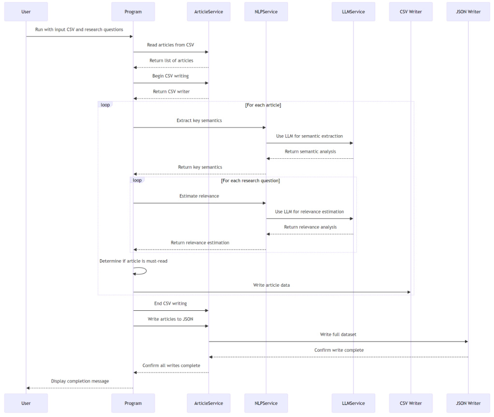
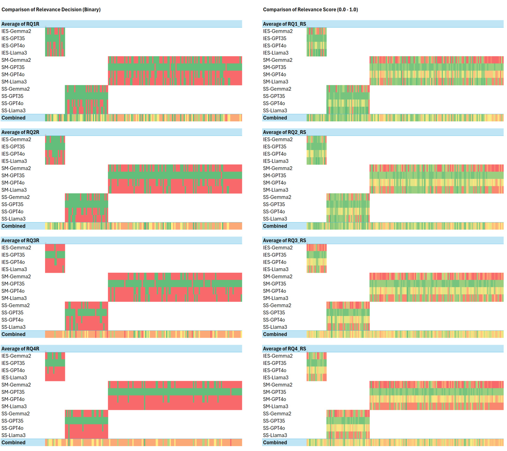
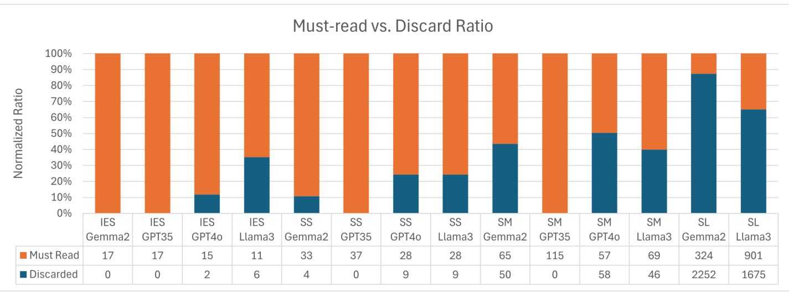
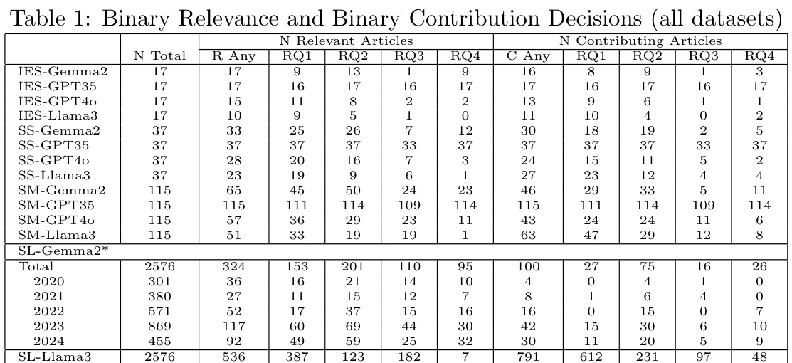

# LLAssist: Simple Tools for Automating Literature Review Using Large Language Models  

Christoforus Yoga Haryanto School of Science, RMIT University, Melbourne, VIC 3000, Australia  

# Abstract  

This paper introduces LLAssist, an open-source tool designed to streamline literature reviews in academic research. In an era of exponential growth in scientific publications, researchers face mounting challenges in efficiently processing vast volumes of literature. LLAssist addresses this issue by leveraging Large Language Models (LLMs) and Natural Language Processing (NLP) techniques to automate key aspects of the review process. Specifically, it extracts important information from research articles and evaluates their relevance to user-defined research questions. The goal of LLAssist is to significantly reduce the time and effort required for comprehensive literature reviews, allowing researchers to focus more on analyzing and synthesizing information rather than on initial screening tasks. By automating parts of the literature review workflow, LLAssist aims to help researchers manage the growing volume of academic publications more efficiently.  

Keywords—  Large Language Models, Artificial Intelligence, Research Tools, Semantic Analysis, Automated Document Processing  

# 1 INTRODUCTION  

The landscape of academic research is undergoing a dramatic transformation, driven by an unprecedented surge in scientific publications. Identifying relevant work, once a manageable task, has evolved into a time-consuming and often overwhelming process [Khan et al., 2003, Davis et al., 2014]. The exponential growth of scientific publications [Silva J´ unior and Dutra, 2021, Ioannidis et al., 2021], the need to screen hundreds or thousands of articles, and pressure for rapid-evidence gathering present significant challenges for researchers, potentially compromising research quality [McDermott et al., 2024, Glasziou et al., 2020, Whiting et al., 2016, Page et al., 2021, Wallace et al., 2010].  

In response to these mounting challenges, the research community has begun exploring automated solutions to assist in the systematic literature review process [Silva J´ unior and Dutra, 2021, Wallace et al., 2010, Tsafnat et al., 2018, Bannach-Brown et al., 2019]. Recently, there has been a growing interest in evaluating the potential of Large Language Models (LLMs) for this purpose [Agarwal et al., 2024, Joos et al., 2024, Susnjak, 2023]. These advanced AI systems, with their ability to understand and generate human-like text, offer promising avenues for automating various aspects of the literature review process. Yet, various consumer LLM interfaces such as ChatGPT encountered significant challenges in ensuring reliability and consistency of outputs, adhering to rigorous systematic review methodologies, and addressing ethical concerns related to academic integrity [CongLem et al., 2024].  

Without transparent, open-source tools for AI-assisted literature review, researchers face potential limitations in research transparency and replicability that potentially perpetuate biases. These challenges include overlooking critical publications due to time constraints, decreased accuracy from cognitive overload during manual screening, and compromised reproducibility from reliance on closed, proprietary AI systems. Current approaches, while promising, have limitations: Agarwal et al. [2024] focused on generating related work sections but not initial screening; Joos et al. [2024] explored computationally intensive multi-agent approaches; and Susnjak [2023] proposed resource-intensive domain-specific fine-tuned LLMs. LLAssist addresses these issues by providing a simple, transparent alternative that researchers can freely modify and adapt.  

A notable contribution to this emerging field comes from Joos et al. [2024], who recently published an extensive evaluation of using LLMs in enhancing the screening process, with results indicating promising potential for reducing human workload. Inspired by these findings, we present LLAssist, a prototype automation tool based on LLM technology. We aim LLAssist to be a building block for an automated knowledge base and research platform, and the open-source nature enables researchers to expand from the idea. This design choice allows adaptation to different research domains with transparent and interpretable results. The simplicity of its design is intentional to allow researchers to understand, modify, and build upon its core functionalities.  

Our key contributions include: 1. introducing LLAssist, an open-source tool leveraging LLMs to automate key aspects of the literature review process; 2. demonstrating a novel approach to relevance estimation using LLMs; 3. providing insights into different LLM backends’ performance for literature review tasks; and 4. promoting transparency and reproducibility in AI-assisted literature reviews through open-source development.  

# 2 METHODOLOGY  

Our methodology addresses the primary research question: How can automation of screening using large language models improve the efficiency and effectiveness of systematic literature reviews in the face of exponentially growing scientific publications? It consists of two main parts: 1. the design and implementation of LLAssist, and 2. the experimental evaluation of its performance.  

# 2.1 LLAssist: An LLM-based Literature Screening Tool  

# 2.1.1 Data Input  

The program accepts two primary inputs: a CSV file containing tabular metadata and abstracts of research articles, and a text file listing the research questions of interest. While the current implementation parses the file programmatically, the progress of LLM may allow it to process tabular data reliably despite the current challenges [Dong and Wang, 2024].  

# 2.1.2 Article Processing  

For each article in the input CSV, LLAssist performs the following steps:  

Key Semantics Extraction The NLPService extracts topics, entities, and keywords from the article’s title and abstract. The implementation sends an extraction prompt with the title and abstract to the LLM.  

Relevance Estimation For each research question provided, LLAssist estimates the article’s relevance using the following criteria:  

1.  Binary Relevance Decision and Score:  A binary TRUE/FALSE and a numerical score (0-1) to indicate how closely the article aligns with the research question,   
2.  Binary Contribution Decision and Score:  A binary TRUE/FALSE and a numerical score (0-1) to assess the article’s potential contribution in answering the research question,   
3.  Relevance Reasoning:  A brief explanation of why the article is considered relevant.   
4.  Contribution Reasoning:  A justification for the estimated contribution of the article.  

The current implementation sends the title, abstract, and key semantics previously extracted. An article is considered relevant or contributing if its score exceeds 0.7. This threshold can be adjusted based on the researcher’s needs.  

Must-Read Determination Based on the relevance and contribution scores across all research questions, LLAssist determines whether an article is a ”must-read.” Currently, this is implemented by using the logical OR operation on all the RQ relevance and contribution thresholds. This binary classification helps researchers prioritize their reading list and conclude the flow.  

Output Generation LLAssist provides two types of output: 1. a JSON file containing detailed information for each processed article, including extracted semantics, relevance scores, and reasoning, and 2. a CSV file presenting the same information in a tabular format, suitable for further analysis or import into other tools. Necessitating other analysis and tools is deliberate to ensure that the human-in-the-loop principle is adhered to by maintaining the visibility of the process [Bu¸ cinca et al., 2021, Vasconcelos et al., 2023, Bansal et al., 2021].  

# 2.2 Experimental Evaluation  

# 2.2.1 Data Collection  

To evaluate the effectiveness of LLAssist in streamlining the literature review process for LLM applications in cybersecurity, we conducted two separate experiments using manual sampling of publications from datasets from different sources:  

1.  IEEE Xplore Database:  using the search query  ”llm AND cyber AND security”  (term a), effectively focusing on recent publications for initial system testing.  

2.  Scopus Database:  using the search queries  “llm AND cyber AND security”  (term b),  “llm OR ( generative AND artificial AND intelligence ) AND cyber AND security”  (term c), and a broad  “artificial AND intelligence AND cyber AND security”  – limited to Conference paper – (term d) to obtain a diverse dataset in a consecutively larger sample size.  

The experiments were designed to assess LLAssist’s performance across different academic databases and to ensure a comprehensive evaluation of its capabilities in the fields already known by the authors. There will be two parts: a small dataset test and a large dataset test. The small dataset test is to help manually verify the functionality of LLAssist and the large dataset test is to confirm its utility in enhancing the screening in structured literature review.  

From the IEEE Xplore dataset, we exported 17 relevant articles (term a). The Scopus dataset provided an additional set of 37 (term b), 115 (term c), and 2,576 (term d) articles, expanding our corpus. Each dataset included metadata such as titles, abstracts, authors, publication venues, and keywords. The data was exported using the CSV export function to ensure consistency and compatibility with LLAssist’s input requirements.  

# 2.2.2 Research Questions  

We formulated four key research questions to guide our automated analysis:  

•  RQ1: How are Large Language Models (LLMs) being utilized to enhance threat detection and analysis in cybersecurity applications?   
•  RQ2: What are the potential risks and vulnerabilities introduced by integrating LLMs into cybersecurity tools and frameworks?   
•  RQ3: How effective are LLM-based approaches in generating and detecting adversarial examples or evasive malware compared to traditional methods?   
•  RQ4: What ethical considerations and privacy concerns arise from using LLMs to analyze and process sensitive cybersecurity data?  

# 2.2.3 Automated Analysis  

We processed each paper through LLAssist, which performed the following tasks: 1. Extract key semantics (topics, entities, and keywords) from the title and abstract. 2. Evaluate the relevance of each paper to our research questions. 3. Provide relevance and contribution scores (0-1 scale) for each research question. 4. Generate reasoning for relevance and contribution assessments. Section 3 details the technical implementation of the automated analysis done by the program.  

# 2.2.4 Evaluation Metrics  

We assessed the performance of LLAssist based on i) consistency of evaluations across papers, ii) accuracy in matching papers to relevant research questions, and iii) ability to provide meaningful insights and reasoning. Additionally, we are using several different LLM backends: Llama 3:8B, Gemma 2:9B, GPT-3.5-turbo-0125, and GPT-4o-2024-05-13 to allow data comparison.  

# 2.2.5 Preliminary Nature of Evaluation  

It is important to note that the assessment of accuracy in matching papers to relevant research questions and the ability to provide meaningful insights and reasoning was conducted in an uncontrolled environment. Knowing that LLM results can be helpful yet inaccurate, we expect the researchers to use LLAssist as a lightweight filtering enhancement tool while following existing methodologies such as PRISMA [Page et al., 2021, Susnjak, 2023].  

# 3 TECHNICAL IMPLEMENTATION  

Chain-of-Thought (CoT) prompting is a technique that enhances the reasoning capabilities of large language models by encouraging step-by-step thinking Wei et al. [2022]. In LLAssist, CoT is simulated through two main steps: 1. Extract Key Semantics: The model helps to generate intermediate reasoning steps, expanding on key concepts in the prompt. 2. Filtering: From the expanded reasoning chains, the most consistent and logical path will be selected as part of the self-consistency in the CoT Wang et al. [2022]. This approach allows LLAssist to break down complex problems into manageable steps, mimicking human-like reasoning.  

LLAssist’s approach to literature review automation shares similarities with recent works but also introduces distinct features. Like the LitLLM system proposed by Agarwal et al. [2024], LLAssist employs a modular pipeline that leverages LLMs for key tasks. However, while LitLLM focuses on generating related work sections, LLAssist prioritizes efficient screening and relevance assessment. Compared to the approach described by Joos et al. [2024], which focuses on employing multiple LLM agents for consensus-based filtering, LLAssist currently utilizes a single LLM for both semantics extraction and relevance assessment. While this may sacrifice some of the robustness gained from multi-agent consensus, it simplifies the implementation and potentially reduces processing time.  

The program is designed to work with various LLM providers, including local models (e.g., Ollama Llama 3, Ollama Gemma 2) and cloud-based models (e.g., OpenAI’s GPT-3.5 and GPT-4). This flexibility allows researchers to choose models based on their specific requirements, such as processing speed, accuracy, or data privacy concerns. LLAssist is developed in C#, a static and strongly typed language [Nanz and Furia, 2015], suitable for further integration into a bigger enterprise system. The sequence diagram can be seen in Figure 1.  

  
Figure 1: Sequence diagram of LLAssist console application  

# 4 EXPERIMENT RESULTS  

There are two parts to this experiments: 1. A small dataset test using search term a: IES, term b: SS, term c: SM. 2. A large dataset test using search term d: SL. The small dataset test uses 4 LLMs: Gemma 2, GPT-3.5, GPT-4o, and Llama 3 and the large dataset test only use 2 LLMs: Gemma 2 and Llama 3, both provisioned locally using Ollama on RTX 3090. Time and cost data are measured indirectly from file time and API usage.  

# 4.1 Small Dataset Test  

The small dataset verified the functionality of the system with the following key results:  

# 4.1.1 Key Semantics Extraction  

LLAssist successfully identified relevant topics, entities, and keywords for each paper, aligning well with the author-provided keywords and terms for all LLM backends. As this data is currently used as the input to the LLM prompt, there is no controlled measurement done in this experiment. Result data can be reviewed in the CSV. Also, note that the metadata for the classifier is generated by the same LLM.  

# 4.1.2 Binary Relevance Decision and Score Distribution  

The binary relevance decision and relevance score distribution obtained from the experiment are shown in Figure 2. Further, the summary of binary relevance and binary contribution decisions is shown in Table 1.  

1.  Gemma 2:9B  shows a reasonable distribution of binary relevance classification and relevance score. It tends to give a strong binary decision and classification score compared to all other LLMs with variation across research questions, indicating sensitivity to different topics.  

2.  GPT-3.5-turbo-0125  consistently shows high relevance scores and classifications across all research questions and datasets. It demonstrates the least discrimination among the models, potentially overestimating relevance. This behavior suggests a very inclusive interpretation of research questions, which could lead to a high false positive rate in article selection.  

3.  GPT-4o-2024-05-13  demonstrates a more balanced distribution between relevant and non-relevant articles. It appears more selective than GPT-3.5 and slightly more selective than Gemma 2, yet more permissive than Llama3 in binary classifications. GPT-4o also tends to return a middle-ground score: while it may imply a sophisticated evaluation, it may also indicate avoiding judgments.  

4.  Llama 3:8B  exhibits a significant discrepancy between its relevance scores and binary classifications. In binary classification, it’s the most conservative and frequently marking articles as not relevant. However, its relevance scores show more diversity, with a range of values that don’t always align with its binary decisions. This inconsistency suggests potential issues in threshold setting or score-to-classification conversion for this model, hence we decided to not use the binary relevance decisions from Llama 3 as the basis for the literature screening performance analysis.  

# 4.1.3 Must-read vs. Discard Ratio  

All small dataset test runs show a relatively low discard ratio, which is expected due to the specificity of the search term, broad research questions, and the low dataset diversity. A comparison between each test run can be seen in Figure 3.  

# 4.1.4 Reasoning Quality  

A manual review of the system provided coherent explanations for its relevance and contribution assessments, offering insights into why each paper was or wasn’t considered relevant to each research question. There is no controlled experiment done to measure quantitatively. The LLMs have to output their reasoning to help the researchers in manually discriminating the articles [Vasconcelos et al., 2023] and can be also part of cognitive forcing functions to be the checkpoint before downstream processing [Bu¸ cinca et al., 2021].  

  
Figure 2: Binary Relevance and Relevance Score Distribution (small datasets)  

# 4.2 Large Dataset Test  

Table 1 shows two types of binary decisions made by LLAssist: the binary relevance and the binary contribution indicator. Referring to the row id: SL-Gemma2 which contains the result of running large dataset test using Gemma 2:9B, the analysis of the larger Scopus dataset (2,576 articles) revealed key insights:  

1.  Trend in Relevance:  There’s a notable increase in potentially relevant articles from 2020 to 2023, with a peak in 2023 (869 articles, 117 must-read). The slight decrease in 2024 reflects the mid-year data collection cut-off rather than a decline in research quality. Additionally, identifying the most relevant articles accurately is more important than finding a large number of potentially relevant articles.  

2.  Research Question Specifics:  RQ2 (risks and vulnerabilities of LLMs in cybersecurity) consistently has the highest number of relevant and contributing articles across years. It indicates it’s likely the most well-defined or central question. RQ1 (LLMs for threat detection) shows a sharp increase in relevance from 2022 to 2023. RQ3 (LLMs for adversarial examples/evasive malware) and RQ4 (ethical considerations) have fewer articles but show an upward trend, indicating more specialized areas of increasing importance.  

3.  Must-Read vs. Contributing Articles:  While 324 articles (12.6%) are identified as must-read, only   
100 articles (3.9%) are classified as potentially contributing. This suggests that LLAssist is more selective  

  
Figure 3: Must-read vs. Discard ratio (all datasets)  

  
\* SL-Gemma2 data is broken down by year  

in identifying articles that directly contribute to answering the research questions, implying reduced time to manually read the abstract.  

4.  Year-over-Year Growth:  The number of potentially relevant articles increased significantly from 2020 to 2023, indicating growing research interest in the field. 2023 stands out as a pivotal year with the highest numbers of potentially high-quality and relevant publications across all categories.  

5.  Research Question Focus:  RQ2 consistently receives the most attention, suggesting that potential risks and vulnerabilities of LLMs in cybersecurity are a primary concern in the field. RQ4, focusing on ethical considerations, shows the least but growing number of relevant articles, particularly from 2022 onward.  

# 5 ANALYSIS AND DISCUSSION  

# 5.1 Overall Performance  

LLAssist effectively identifies relevant papers, works with various LLM backends, and significantly reduces manual screening time. On the other hand, the system did not utilize all available metadata (e.g., publication year, citation counts) in its relevance assessments, which could have provided additional context. Also, different LLMs behave differently, necessitating more precise prompt tuning. The analysis was also limited to titles and abstracts, potentially missing relevant information contained in the full text of the papers.  

# 5.2 Time and Cost Efficiency  

LLAssist’s throughput varies across models and dataset sizes. It processes datasets of 17-37 articles in under 10 minutes, 115 articles in 20-50 minutes, and 2,576 articles in 10-11 hours. Among the models tested, GPT4o emerges as the slowest, processing articles in 24-29 seconds on average. Llama3 is the fastest, consistently quick at 10-11 seconds per article. Gemma2 and GPT35 offer similar speeds, averaging 12-14 seconds for each article processed. The per-article processing times remain consistent across dataset sizes, indicating scalability. This is a significant improvement over human performance [Wallace et al., 2010, Joos et al., 2024].  

Cost-wise, GPT-4o is the most expensive at approximately  \$ 3.16 per 100 articles while GPT-3.5 offers a more budget-friendly option at about  \$ 0.22 per 100 articles. Meanwhile, both Gemma 2 and Llama 3 do not have a set cost due to the ability to run locally without cloud services. Notably, the high discrimination ability of Gemma 2 may help researchers to do the initial screening of many articles without relying on cloud services.  

# 6 FUTURE WORK  

LLAssist’s limitations include dependence on LLM quality and input formatting, focus on titles and abstracts, and potential misalignment with human judgment. Future work should aims to incorporate full-text analysis, implement feedback mechanisms, and develop domain-specific models for improved accuracy.  

# 7 CONCLUSION  

In conclusion, LLAssist demonstrated promising capabilities in automating the initial stages of a literature review. Its ability to quickly process and categorize papers offers valuable support to researchers. However, there is room for improvement in utilizing more of the available metadata and fine-tuning the relevance criteria to better differentiate between highly relevant and marginally relevant papers. By providing a simple, transparent tool for literature review automation, LLAssist not only enhances research efficiency but also promotes open science principles and methodological freedom in the rapidly evolving landscape of AI-assisted research. While not a replacement for human judgment, LLAssist can significantly reduce the time spent on initial screening and help researchers focus their efforts on the most promising and relevant articles for their research questions, allowing researchers to focus on high-quality work, to achieve higher productivity across expertise and industry.  

# 8 AVAILABILITY  

The source code for LLAssist is freely available at  https://github.com/cyharyanto/llassist  and is being actively developed to improve usability. We encourage researchers to use, modify, and contribute to this tool to further advance the efficiency of academic literature reviews across various disciplines.  

# 9 ACKNOWLEDGMENT  

We would like to express our deep gratitude to Dr. Arathi Arakala, Dr. Argho Bandyopadhyay, and Dr. Jessica Helmi from RMIT University for their invaluable guidance in systematic literature review methodologies.  

# References  

Shubham Agarwal, Issam H. Laradji, Laurent Charlin, and Christopher Pal. Litllm: A toolkit for scientific literature review. 2024. doi: 10.48550/ARXIV.2402.01788. URL  https://arxiv.org/abs/2402.01788 . version: 1.  

Alexandra Bannach-Brown, Piotr Przyby  la, James Thomas, Andrew S. C. Rice, Sophia Ananiadou, Jing Liao, and Malcolm Robert Macleod. Machine learning algorithms for systematic review: reducing workload in a preclinical review of animal studies and reducing human screening error. Systematic Reviews , 8(1):23, 12 2019. ISSN 2046-4053. doi: 10.1186/s13643-019-0942-7. URL  https://systematicreviewsjournal. biomedcentral.com/articles/10.1186/s13643-019-0942-7 . [Online; accessed 2024-07-17].  

Gagan Bansal, Tongshuang Wu, Joyce Zhou, Raymond Fok, Besmira Nushi, Ece Kamar, Marco Tulio Ribeiro, and Daniel Weld. Does the whole exceed its parts? the effect of ai explanations on complementary team performance. pages 1–16, Yokohama Japan, 5 2021. ACM. ISBN 978-1-4503-8096-6. doi: 10.1145/3411764. 3445717. URL  https://dl.acm.org/doi/10.1145/3411764.3445717 . [Online; accessed 2024-07-03].  

Zana Bu¸ cinca, Maja Barbara Malaya, and Krzysztof Z. Gajos. To trust or to think: Cognitive forcing functions can reduce overreliance on ai in ai-assisted decision-making.  Proceedings of the ACM on Human-Computer Interaction , 5(CSCW1):1–21, 4 2021. ISSN 2573-0142. doi: 10.1145/3449287. URL  https://dl.acm.org/ doi/10.1145/3449287 . [Online; accessed 2024-07-03].  

Ngo Cong-Lem, Ali Soyoof, and Diki Tsering. A systematic review of the limitations and associated opportunities of chatgpt.  International Journal of Human–Computer Interaction , page 1–16, May 2024. ISSN 1044-7318, 1532-7590. doi: 10.1080/10447318.2024.2344142.  

Jacqueline Davis, Kerrie Mengersen, Sarah Bennett, and Lorraine Mazerolle. Viewing systematic reviews and meta-analysis in social research through different lenses.  SpringerPlus , 3(1):511, 12 2014. ISSN 2193- 1801. doi: 10.1186/2193-1801-3-511. URL  https://springerplus.springeropen.com/articles/10.1186/ 2193-1801-3-511 . [Online; accessed 2024-07-17].  

Haoyu Dong and Zhiruo Wang. Large language models for tabular data: Progresses and future directions. pages 2997–3000, Washington DC USA, 7 2024. ACM. ISBN 9798400704314. doi: 10.1145/3626772.3661384. URL https://dl.acm.org/doi/10.1145/3626772.3661384 . [Online; accessed 2024-07-17].  

Paul P Glasziou, Sharon Sanders, and Tammy Hoffmann. Waste in covid-19 research.  BMJ , page m1847, 5 2020. ISSN 1756-1833. doi: 10.1136/bmj.m1847. URL  https://www.bmj.com/lookup/doi/10.1136/bmj.m1847 . [Online; accessed 2024-07-17].  

John P. A. Ioannidis, Maia Salholz-Hillel, Kevin W. Boyack, and Jeroen Baas. The rapid, massive growth of covid-19 authors in the scientific literature.  Royal Society Open Science , 8(9):210389, 9 2021. ISSN 2054- 5703. doi: 10.1098/rsos.210389. URL  https://royalsocietypublishing.org/doi/10.1098/rsos.210389 . [Online; accessed 2024-07-17].  

Lucas Joos, Daniel A. Keim, and Maximilian T. Fischer. Cutting through the clutter: The potential of llms for efficient filtration in systematic literature reviews. 2024. doi: 10.48550/ARXIV.2407.10652. URL  https: //arxiv.org/abs/2407.10652 . version: 1.  

Khalid S Khan, Regina Kunz, Jos Kleijnen, and Gerd Antes. Five steps to conducting a systematic review. Journal of the Royal Society of Medicine , 96(3):118–121, 3 2003. ISSN 0141-0768, 1758-1095. doi: 10.1177/ 014107680309600304. URL  http://journals.sagepub.com/doi/10.1177/014107680309600304 . [Online; accessed 2024-07-17].  

Kevin T. McDermott, Mark Perry, Willemijn Linden, Rachel Croft, Robert Wolff, and Jos Kleijnen. The quality of covid-19 systematic reviews during the coronavirus 2019 pandemic: an exploratory comparison. Systematic Reviews , 13(1):126, 5 2024. ISSN 2046-4053. doi: 10.1186/s13643-024-02552-x. URL  https:// systematicreviewsjournal.biomedcentral.com/articles/10.1186/s13643-024-02552-x . [Online; accessed 2024-07-17].  

Sebastian Nanz and Carlo A. Furia. A comparative study of programming languages in rosetta code. pages 778–788, Florence, Italy, 5 2015. IEEE. ISBN 978-1-4799-1934-5. doi: 10.1109/ICSE.2015.90. URL  http: //ieeexplore.ieee.org/document/7194625/ . [Online; accessed 2024-07-18].   
Matthew J Page, Joanne E McKenzie, Patrick M Bossuyt, Isabelle Boutron, Tammy C Hoffmann, Cynthia D Mulrow, Larissa Shamseer, Jennifer M Tetzlaff, Elie A Akl, Sue E Brennan, Roger Chou, Julie Glanville, Jeremy M Grimshaw, Asbjørn Hr´ objartsson, Manoj M Lalu, Tianjing Li, Elizabeth W Loder, Evan Mayo- Wilson, Steve McDonald, Luke A McGuinness, Lesley A Stewart, James Thomas, Andrea C Tricco, Vivian A Welch, Penny Whiting, and David Moher. The prisma 2020 statement: an updated guideline for reporting systematic reviews.  BMJ , page n71, 3 2021. ISSN 1756-1833. doi: 10.1136/bmj.n71. URL  https://www. bmj.com/lookup/doi/10.1136/bmj.n71 . [Online; accessed 2024-07-17].   
Eugˆ enio Monteiro Da Silva J´ unior and Mois´ es Lima Dutra. A roadmap toward the automatic composition of systematic literature reviews.  Iberoamerican Journal of Science Measurement and Communication , 1(2): 1–22, 7 2021. ISSN 2709-3158, 2709-7595. doi: 10.47909/ijsmc.52. URL  https://ijsmc.pro-metrics.org/ index.php/i/article/view/25 . [Online; accessed 2024-07-17].   
Teo Susnjak. Prisma-dfllm: An extension of prisma for systematic literature reviews using domain-specific finetuned large language models. 2023. doi: 10.48550/ARXIV.2306.14905. URL  https://arxiv.org/abs/ 2306.14905 . version: 1.   
Guy Tsafnat, Paul Glasziou, George Karystianis, and Enrico Coiera. Automated screening of research studies for systematic reviews using study characteristics.  Systematic Reviews , 7(1):64, 12 2018. ISSN 2046-4053. doi: 10. 1186/s13643-018-0724-7. URL  https://systematicreviewsjournal.biomedcentral.com/articles/10. 1186/s13643-018-0724-7 . [Online; accessed 2024-07-17].   
Helena Vasconcelos, Matthew J¨ orke, Madeleine Grunde-McLaughlin, Tobias Gerstenberg, Michael S. Bernstein, and Ranjay Krishna. Explanations can reduce overreliance on ai systems during decision-making.  Proceedings of the ACM on Human-Computer Interaction , 7(CSCW1):1–38, 4 2023. ISSN 2573-0142. doi: 10.1145/ 3579605. URL  https://dl.acm.org/doi/10.1145/3579605 . [Online; accessed 2024-07-03].   
Byron C Wallace, Thomas A Trikalinos, Joseph Lau, Carla Brodley, and Christopher H Schmid. Semi-automated screening of biomedical citations for systematic reviews.  BMC Bioinformatics , 11(1):55, 12 2010. ISSN 1471- 2105. doi: 10.1186/1471-2105-11-55. URL  https://bmcbioinformatics.biomedcentral.com/articles/ 10.1186/1471-2105-11-55 . [Online; accessed 2024-07-17].   
Xuezhi Wang, Jason Wei, Dale Schuurmans, Quoc Le, Ed Chi, Sharan Narang, Aakanksha Chowdhery, and Denny Zhou. Self-consistency improves chain of thought reasoning in language models. 2022. doi: 10.48550/ ARXIV.2203.11171. URL  https://arxiv.org/abs/2203.11171 .   
Jason Wei, Xuezhi Wang, Dale Schuurmans, Maarten Bosma, Brian Ichter, Fei Xia, Ed Chi, Quoc Le, and Denny Zhou. Chain-of-thought prompting elicits reasoning in large language models. 2022. doi: 10.48550/ ARXIV.2201.11903. URL  https://arxiv.org/abs/2201.11903 .   
Penny Whiting, Jelena Savovi´ c, Julian P.T. Higgins, Deborah M. Caldwell, Barnaby C. Reeves, Beverley Shea, Philippa Davies, Jos Kleijnen, and Rachel Churchill. Robis: A new tool to assess risk of bias in systematic reviews was developed.  Journal of Clinical Epidemiology , 69:225–234, 1 2016. ISSN 08954356. doi: 10. 1016/j.jclinepi.2015.06.005. URL  https://linkinghub.elsevier.com/retrieve/pii/S089543561500308X . [Online; accessed 2024-07-17].  