# S CI L IT : A Platform for Joint Scientific Literature Discovery, Summarization and Citation Generation  

Nianlong Gu   
Institute of Neuroinformatics, University of Zurich and ETH Zurich   
nianlong@ini.ethz.ch  

Richard H.R. Hahnloser Institute of Neuroinformatics, University of Zurich and ETH Zurich rich@ini.ethz.ch  

# Abstract  

Scientific writing involves retrieving, summarizing, and citing relevant papers, which can be time-consuming processes in large and rapidly evolving fields. By making these processes inter-operable, natural language processing (NLP) provides opportunities for creating end-to-end assistive writing tools. We propose S CI L IT , a pipeline that automatically recommends relevant papers, extracts highlights, and suggests a reference sentence as a citation of a paper, taking into consideration the user-provided context and keywords. S CI L IT  efficiently recommends papers from large databases of hundreds of millions of papers using a two-stage pre-fetching and re-ranking literature search system that flexibly deals with addition and removal of a paper database. We provide a convenient user interface that displays the recommended papers as extractive summaries and that offers abstractively-generated citing sentences which are aligned with the provided context and which mention the chosen keyword(s). Our assistive tool for literature discovery and scientific writing is available at  https:// scilit.vercel.app  

# 1 Introduction  

When we compose sentences like “Our experiments show that XXX performs significantly worse than YYY” in a manuscript, we may want to find papers that report similar performance evaluations ( Cohan et al. ,  2019 ) and discuss these in our manuscript. This process is a non-trivial task requiring in-depth human involvement in finding, summarizing, and citing papers, which raises the question whether it is possible to partly automate this process to reduce users’ cognitive load in searching, retrieving, reading, and rephrasing related findings.  

Recent advances in natural language processing (NLP) help answer this question. First, releases of large scientific corpora such as S2ORC ( Lo et al. , 2020 ) and General Index ( Else ,  2021 ) provide opportunities for building large databases of scientific papers. Second, such databases can be linked to systems for text retrieval ( Guo et al. ,  2020 ), citation recommendation ( Färber and Jatowt ,  2020 ;  Gu et al. ,  2022b ;  Medi´ c and Snajder ,  2020 ), extractive summarization ( Zhong et al. ,  2020 ;  Gidiotis and Tsoumakas ,  2020 ;  Gu et al. ,  2022a ), and citation generation ( Xing et al. ,  2020a ;  Ge et al. ,  2021 ; Wang et al. ,  2022 ), all of which can be tailored to meet the requirements of an author’s manuscript.  

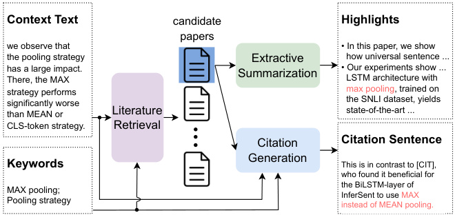  
Figure 1: The main workflow of our platform. The example text for the context was selected from  Reimers and Gurevych  ( 2019 ).  

To build a comprehensive system that helps authors with finding, reading, and summarizing of literature, the following challenges must be overcome: The system must index many papers (e.g., S2ORC has over 136 million papers ( Lo et al. , 2020 )) to achieve good coverage, it must respond quickly to queries, and it must be flexible to handle database additions and deletions. In addition, the overall architecture should be modular so that components can be easily upgraded when better algorithms become available.  

To meet these challenges, we developed S CI L IT , a platform for literature discovery, summarization, and citation generation. We propose a hierarchical architecture for paper retrieval that efficiently retrieves papers from multiple large corpora. On each corpus (e.g., S2ORC and PMCOA ( of Medicine , 2003 )), we build an efficient prefetching system based on a keyword inverted index and a document embedding index. The prefetched documents are then re-ordered (re-ranked) by a fine-tuned SciBERT ( Beltagy et al. ,  2019 ). Such an architecture allows us to dynamically add and remove databases and update one database and its index without significantly affecting the others. From a retrieved document (i.e., target paper), we extract highlights using a light-weight extractive summarization model proposed in  Gu et al.  ( 2022a ). Furthermore, using a fine-tuned T5 model ( Raffel et al. ,  2020 ), we generate a citing sentence based on the abstract of the target paper, the context (the text surrounding the original citation sentence), and the keywords provided by a user. We also develop a microservicebased architecture that allows easy updating of algorithms.  

In summary, our main contributions are:  

•  We demonstrate S CI L IT , a platform for searching, summarizing, and citing scientific papers. •  We evaluate S CI L IT  on scientific literature retrieval, paper summarization, and contextaware citation sentence generation, and showcase the generation of a related-work paragraph.  

•  A live demo website of our system is at https://scilit.vercel.app and our implementation and data are at https://github.com/nianlonggu/ SciLit and a video demonstrating the system can be viewed at https://youtu.be/PKvNaY5Og1Y  

# 2 SciLit  

Figure  1  shows the workflow of our system. A literature discovery module receives a context (a text) and keywords provided by a user and recommends a list of relevant papers that are semantically similar with the context and that match the keywords used as a Boolean filter ( Gökçe et al. ,  2020 ). For each recommended paper, an extractive summarizer selects a short list of sentences from the full text as highlights. From the target paper selected by the user, a citation generation module takes the abstract together with the context and keywords as inputs and generates a citation sentence that references the target paper and that fits the context and keywords.  

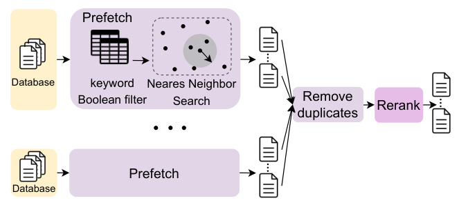  
Figure 2: Schematic of literature discovery (paper retrieval). From each database, candidate documents are prefetched by a cascade of keyword Boolean filter and embedding-based nearest neighbor search. Then, candidate documents are reranked by a fine-tuned SciBERT.  

We define the context as the text before a citation sentence because we focus on the workflow of first finding papers (i.e., the missing citation as in as in Gu et al.  ( 2022b );  Medi´ c and Snajder  ( 2020 )) and then writing citation sentences. The user-provided keywords are optional. When no keywords are explicitly given during training and evaluation of our system, we extract keywords from the context, the cited paper, and the citation sentence as substitutes.  

# 2.1 Literature Discovery  

The literature discovery module takes as inputs the context and keywords and recommends papers that are worth citing in the context. To strike a balance between query accuracy and speed on large scientific corpora, our document discovery module uses a two-stage prefetching-ranking strategy ( Gu et al. , 2022b ) (Figure  2 ): For each scientific corpus, we build a database and create an efficient prefetching model that we use to pre-filter a number  N p  (see the discussion of  N p  in Table  2  and Section  3.2 ) of candidate documents from each corpus based on the provided keywords and context. After removing duplicates, we re-rank all prefetched documents using a trained reranker.  

Databases.  We dump each corpus into a separate SQLite ( Hipp ,  2000 ) database to allow flexibility in deploying and maintaining of independent prefetching servers. We further process documents from different corpora into a unified JSON schema compatible with a single codebase for indexing, querying, summarizing, and displaying documents from different corpora. The JSON schema includes keys “Title”, “Author”, etc., for parsed metadata, and “Content.Abstract_Parsed”, “Content.Fullbody_Parsed” for parsed full text, The details are given in Appendix  B .  

Prefetching.  The prefetching model of a given SQLite database consists of an inverted index and an embedding index. The inverted index stores the paper IDs (unique identifiers for retrieving a paper’s content) of all publications that contain a given keyword, e.g., a unigram such as “computer” or a bigram such as “machine learning”. The embedding index is a table of embeddings of all papers in the database. Embeddings are 256-dimensional vectors computed by Sent2Vec ( Pagliardini et al. , 2018 ) (we simply average the embeddings of all words in a document). We trained Sent2Vec on sentences from the full-text papers contained in S2ORC.  

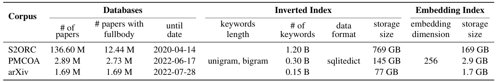  
Table 1: Statistics of our literature discovery system. We indexed S2ORC ( Lo et al. ,  2020 ), PMCOA ( of Medicine , 2003 ), and arXiv ( Kaggle ,  2022 ), which contain large numbers of recent scientific papers in diverse fields.  

Using the keywords and a specific syntax, we first perform Boolean filtering ( Gökçe et al. ,  2020 ) of the inverted index. For example, given “POS tag;2010..2022”, we filter papers published between 2010 and 2022 that mention “POS tag”. The filtered papers are then ranked based on the cosine similarity between the papers’ Sent2Vec embeddings and the context embedding. Such a hybrid of lexical filtering and semantic ranking allows users to find papers that are semantically similar to the context and that flexibly meet a constrained search scope.  

Statistics for the database and indexing system are reported in Table  1 . Details of the indexing implementation are shown in Appendix  C .  

Duplicate Removal.  Since corpora can overlap, the prefetched candidates from multiple corpora can contain duplicate items. To remove duplicated candidates, we check the title and authors and keep only one record per paper for reranking.  

Reranking.  We use SciBERT ( Beltagy et al. ,  2019 ) to rerank prefetched candidate papers, aiming at highly ranking candidates that can be cited given the context and keywords. We follow  Gu et al. ( 2022b ) to compute an affinity score as follows: we pass an input text “[CLS] query [PAD] paper [PAD]” to SciBERT, where the  query  q  is a concatenation of the context and the keywords, and  paper  d  is a concatenation of the title and the abstract of the candidate paper. The encoded output of the “[CLS]” token is passed to a linear layer, which outputs a scalar  s ( q, d )  that we interpret as the affinity score between the query  q  and the paper  d . To train the reranker, we use the cross-entropy loss:  

where  d +   is the paper actually cited in the query, and  d −   is one of  N ( N  = 10)  uncited papers that are randomly sampled from prefetched candidates at each training iteration.  

# 2.2 Extractive Summarization  

The extractive summarization module extracts a short list of sentences from the full text of a paper to highlight the main points to a reader. We choose the summary to be extractive rather than abstractive to prevent readers from being misled by potential hallucinations introduced by abstractive summarization models ( Nan et al. ,  2021 ;  Xu et al. ,  2020 ;  Wang et al. ,  2020 ). The extractive summarization model must efficiently select sentences from a given document so that users do not experience obvious delays.  

In this paper, we employ MemSum, an RNNbased extractive summarizer that models the extraction process as a Markov decision process in a reinforcement learning framework. MemSum has been trained on the PubMed dataset  Gu et al. ( 2022a ) and it can summarize long papers without exhausting GPU memory due to its lightweight model structure. Also, MemSum is computationally efficient, taking only 0.1 sec on average to summarize a paper. These features make it a suitable model for our extractive summarization module.  

# 2.3 Citation Generation Module  

The citation generation module acts as an abstract summarizer that takes as input the context, the keywords, and the target paper to be cited; it then generates a sentence that cites the target paper and narrates it in context.  

By providing keywords as inputs to a sequenceto-sequence model, our input differs from previous works on automatic citation generation ( Ge et al. ,  2021 ;  Xing et al. ,  2020b ), which use only the context as inputs but no keywords. We consider keywords to be an important source of input because we believe that authors usually have a clear intention when citing a paper, and a keyword can sometimes more easily convey this intention than a long text. In the case shown in Figure  1 , for example, after writing the context “MAX pooling performs worse than MEAN pooling”, the author naturally intends to discuss papers about “MAX pooling”. Therefore, the keyword “MAX pooling” should be used as a thematic cue for citation sentence generation. Moreover, making the citation generation model conditional on keywords also allows users to fine-tune the generated citation text by simply adjusting the keywords, thus making the system interactive and conveniently tunable.  

To make the generation conditional on context, keywords, and cited papers, we fine-tuned a T5 ( Raffel et al. ,  2020 ) so that its input is a concatenation of three attributes: keywords, context, and the abstract of a cited paper, each preceded by a special field name to make attributes distinguishable to the model:  keywords: XXX. context: XXX. target abstract: XXX.  The corresponding decoding output is the actual citation sentence that cites the target paper.  

# 2.4 Microservice-based Architecture  

We built our platform as a network of microservices (Figure  3 ). An API gateway routes requests from the frontend to the target microservice on the backend. The microservices run separate modules on their respective Flask servers ( Aggarwal , 2014 ) and communicate with each other by sending HTTP requests and waiting for responses. When a query request arrives, the API gateway forwards the query to the literature discovery service, which calls the prefetching and reranking services to get the reranked IDs. The API gateway then sends the paper IDs to the extractive summarization service to receive the highlights of each recommended paper. The gateway also sends the context, keywords, and recommended paper IDs to the citation generation service to suggest citation sentences. The database interface service manages the databases of multiple scientific corpora and provides a unified interface to access the paper content given its ID. Each microservice runs in an independent environment, which makes it easy to upgrade backend systems online, such as adding or removing a database or updating an algorithm.  

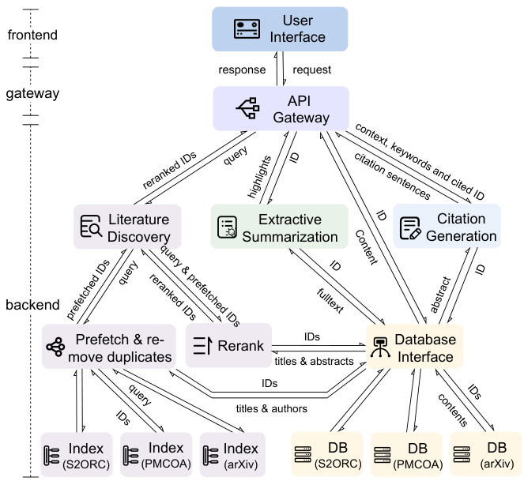  
Figure 3: The architecture of our platform. The direction of an arrow represents the direction of data flow.  

# 3 Evaluation  

In this section, we first show how S CI L IT  works and then we evaluate its performance.  

# 3.1 Demonstration  

Our user interface runs on a web page (Figure  4 ) created with ReactJS 1 . The left sidebar is an input panel where users can enter context and keywords and trigger a query by clicking the  search  button. Retrieved papers are displayed in the search-results panel on the right. Users can scroll up and down or paginate to browse through the recommended papers. Each paper is accompanied by highlights and a suggested citation sentence generated by our extractive summarization and citation generation services, respectively. Users can cite a paper by clicking on the  cite  button and the suggested citation sentence will jump to the editing area on the left where users can tweak the sentence by changing keywords and clicking on the  fine-tune generation  button, or they can edit the sentences manually. Exporting citation information is also supported.  

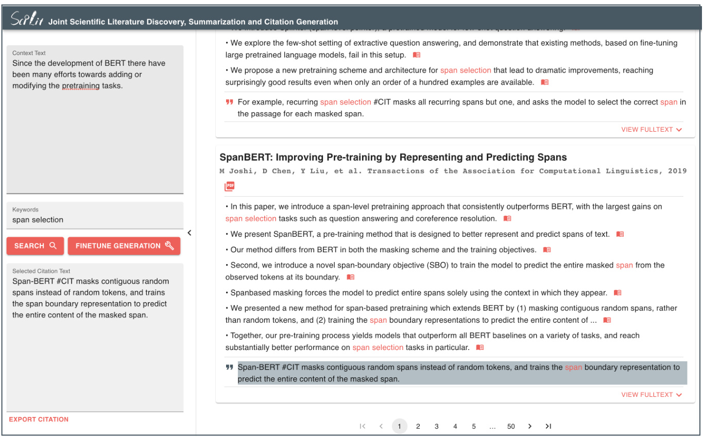  
Figure 4: Overview of the user interface. The context text comes from the related work section in  Glass et al.  ( 2020 ).  

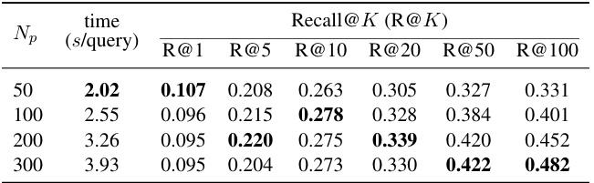  
Table 2: Paper retrieval performance measured as the recall of the top  K  recommendations.  N p  denotes the number of prefetched candidates per corpus.  

# 3.2 Performance  

Evaluation Dataset.  We evaluated S CI L IT  on a test set containing  1530  samples, which are mainly papers published in 2022 in the fields of computer and biomedical sciences. Each sample contains the following information: 1) context, up to  6  sentences preceding the citation sentence and within the same section; 2) keywords, up to  2  uni- or bigrams that occur in all of the context, the citation sentence, and the cited paper; 3) ID of the cited paper; 4) the citation sentence following the context, which is the ground truth for evaluating generated citations. For quality control, we only include citation sentences in the test set that cite one paper.  

Paper Retrieval.  For each sample in the evaluation dataset, we use context and keywords as queries and invoke the literature search service to first prefetch  N p  candidates from each of the three corpora (S2ORC, PMCOA, and arXiv). We remove duplicates and then we rank the prefetched candidates. The top  K  recommendations serve to evaluate the retrieval performance (Table  2 ). We observed that for large  K ( K  = 50 ,  100) , the recall increases as  N p  increases, whereas for small K ( K  = 5 ,  10 ,  20) , the recall first increases and then starts to decrease, indicating that the reranking performance is impacted by increasing number of prefetched candidates. We choose  N p  = 100  as the default value, which gives rise to fast reranking and achieved the best performance at R@10.  

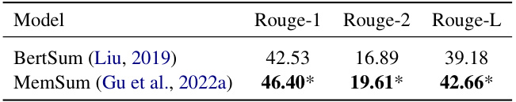  
Table 3: The extractive summarization performance. “\*" indicates statistical significance in comparison to baselines with a 95% bootstrap confidence interval.  

Extractive Summarization.  To evaluate the summaries, following  Zhong et al.  ( 2020 );  Xiao and Carenini  ( 2019 ), we computed the ROUGE F1 scores between the summary sentences extracted from the full body and the corresponding abstract. MemSum significantly outperformed BertSum ( Liu ,  2019 ), a Bert-based summarizer that requires truncation of long documents, indicating the effectiveness of MemSum in extractively summarizing scientific documents.  

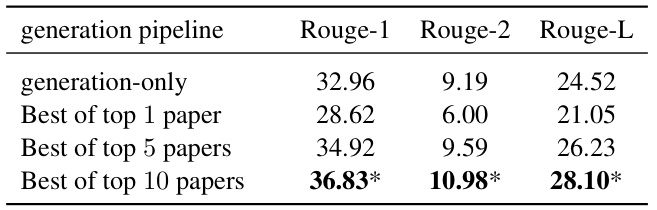  

Table 4: The citation generation performance.   

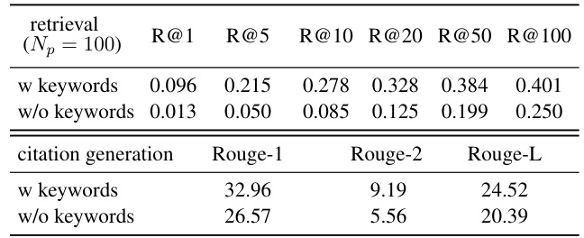  
Table 5: Ablation study on retrieval and citation generation performance.  

Citation Generation.  We assessed our joint retrieval and citation generation system by letting it recommend papers based on context and keywords first, then generate  K  citation sentences corresponding to each of the top  K  suggested papers. Next, we calculate the ROUGE F1 score by comparing each generated citation sentence with the ground-truth citation sentence (the sentence that actually follows the context text in the test example), keeping track of the highest ROUGE F1 score in this set. This method is named the "Best-of-topK " procedure for ease of understanding.  

We hypothesized that generating multiple citation sentences, one for each topK  paper, would increase the chances of crafting a suitable citation sentence. To verify this, we compared the effectiveness of the "Best-of-topK " approach with a "generation-only" system. The latter generates a single citation sentence based on the actual cited paper provided as ground truth.  

We observed that for  K  = 5  and  10 , the “Bestof-topK ” pipeline achieved significantly higher ROUGE scores than the "generation only" pipeline (Table  4 ), indicating that the paper retrieval module contributes positively to the citation generation process and increases the chance of suggesting appropriate citation sentences. We believe that this result further supports our idea of developing an integrated system for joint retrieval and generation.  

# 3.3 Ablation Study  

To analyze the impact of keywords, we evaluated retrieval and generation systems without keywords. For document retrieval, we first prefetched N p  = 100  candidates from each corpus and then ranked them based on context only. For citation generation, we trained a T5 model to learn to generate citation sentences with only the context and the title and abstract of the cited paper and evaluated it on the evaluation set. We observe a significant degradation in the performance of literature retrieval and citation generation (Table  5 ), which demonstrates the utility of keywords for recommending relevant papers and generating accurate citations on our platform.  

# 4 Related Work  

Recently, AI-driven platforms focused on literature recommendation and scientific paper summarization have been proposed. (keywords:  platform , paper: #2)  One such platform is AI Research Navigator ( Fadaee et al. ,  2020 ), which combines classical keyword search with neural retrieval to discover and organize relevant literature. (keywords:  scientific; summarization; platform , paper #3)  Another platform is Anne O’Tate, which supports user-driven summarization, drill-down and mining of search results from PubMed, the leading search engine for biomedical literature ( Smalheiser et al. ,  2021 ). (keywords:  related work generation , paper #9)  Chen and Zhuge  ( 2019 ) automatically generates related work by comparing the main text of the paper being written with the citations of other papers that cite the same references.  

In the previous paragraph, the italicized citation sentences are generated by S CI L IT . For generating a sentence, it used all preceding sentences in the paragraph as contexts and the keywords in parentheses. We browsed the 100 recommended papers by turning pages and reading the corresponding citation sentences (as shown in Figure  4 ). The numbers in parentheses indicate the ranks of the recommended papers.  

# 5 Conclusion and Future Work  

This paper demonstrates S CI L IT , a platform for joint scientific literature retrieval, paper summarization, and citation generation. S CI L IT  can efficiently recommend papers from hundreds of millions of papers and proactively provide highlights and suggested citations to assist authors in reading and discussing the scientific literature. In addition, our prefetching, reranking, and citation generation system can be conditioned on user-provided keywords, which provides flexibility and adjusts the platform’s response to user intention. In the future, we will further improve the performance of each module, especially the citation generation part, and collect feedback from users to improve the overall workflow and the frontend user experience.  

# Acknowledgements  

This project was supported by the Open Research Data Program of the ETH Board (ORD2000103). We thank the anonymous reviewers for their useful comments.  

# References  

Titipat Achakulvisut, Daniel Acuna, and Konrad Kording. 2020.  Pubmed parser: A python parser for pubmed open-access xml subset and medline xml dataset xml dataset .  Journal of Open Source Soft- ware , 5(46):1979.  

Shalabh Aggarwal. 2014.  Flask framework cookbook . Packt Publishing Ltd.  

Iz Beltagy, Kyle Lo, and Arman Cohan. 2019.  SciBERT: A pretrained language model for scientific text . In  Proceedings of the 2019 Conference on Empirical Methods in Natural Language Processing and the 9th International Joint Conference on Natural Language Processing (EMNLP-IJCNLP) , pages 3615– 3620, Hong Kong, China. Association for Computational Linguistics.  

Jingqiang Chen and Hai Zhuge. 2019.  Automatic generation of related work through summarizing citations . Concurrency and Computation: Practice and Experience , 31(3):e4261. E4261 CPE-16-0462.R2.  

Arman Cohan, Waleed Ammar, Madeleine van Zuylen, and Field Cady. 2019.  Structural scaffolds for citation intent classification in scientific publications . In  Proceedings of the 2019 Conference of the North American Chapter of the Association for Computational Linguistics: Human Language Technologies, Volume 1 (Long and Short Papers) , pages 3586–3596, Minneapolis, Minnesota. Association for Computational Linguistics.  

Holly Else. 2021. Giant, free index to world’s research papers released online. available online at https://www. nature. com/articles/d41586-021- 02895-8, accessed 2021-12-15.  Nature (Oct 2021). https://doi. org/10.1038/d41586-021-02895-8 .  

Marzieh Fadaee, Olga Gureenkova, Fernando Rejon Barrera, Carsten Schnober, Wouter Weerkamp, and Jakub Zavrel. 2020.  A new neural search and insights platform for navigating and organizing AI research . In  Proceedings of the First Workshop on Scholarly Document Processing , pages 207–213, Online. Association for Computational Linguistics.  

Michael Färber and Adam Jatowt. 2020. Citation recommendation: approaches and datasets.  International Journal on Digital Libraries , 21(4):375–405.  

Yubin Ge, Ly Dinh, Xiaofeng Liu, Jinsong Su, Ziyao Lu, Ante Wang, and Jana Diesner. 2021.  BACO: A Background Knowledge- and Content-Based Framework for Citing Sentence Generation . In  Proceedings of the 59th Annual Meeting of the Association for Computational Linguistics and the 11th International Joint Conference on Natural Language Processing (Volume 1: Long Papers) , pages 1466–1478, Online. Association for Computational Linguistics.  

Alexios Gidiotis and Grigorios Tsoumakas. 2020.  A divide-and-conquer approach to the summarization of long documents .  IEEE/ACM Transactions on Audio, Speech, and Language Processing , 28:3029–3040.  

Michael Glass, Alfio Gliozzo, Rishav Chakravarti, An- thony Ferritto, Lin Pan, G P Shrivatsa Bhargav, Dinesh Garg, and Avi Sil. 2020.  Span selection pretraining for question answering . In  Proceedings of the 58th Annual Meeting of the Association for Computational Linguistics , pages 2773–2782, Online. Association for Computational Linguistics.  

Onur Gökçe, Jonathan Prada, Nikola I. Nikolov, Ni- anlong Gu, and Richard H.R. Hahnloser. 2020. Embedding-based scientific literature discovery in a text editor application . In  Proceedings of the 58th Annual Meeting of the Association for Computational Linguistics: System Demonstrations , pages 320–326, Online. Association for Computational Linguistics.  

Nianlong Gu, Elliott Ash, and Richard Hahnloser. 2022a.  MemSum: Extractive summarization of long documents using multi-step episodic Markov deci- sion processes . In  Proceedings of the 60th Annual Meeting of the Association for Computational Linguistics (Volume 1: Long Papers) , pages 6507–6522, Dublin, Ireland. Association for Computational Linguistics.  

Nianlong Gu, Yingqiang Gao, and Richard H. R. Hahnloser. 2022b. Local Citation Recommendation with Hierarchical-Attention Text Encoder and SciBERTBased Reranking. In  Advances in Information Retrieval , pages 274–288, Cham. Springer International Publishing.  

Jiafeng Guo, Yixing Fan, Liang Pang, Liu Yang, Qingyao Ai, Hamed Zamani, Chen Wu, W Bruce Croft, and Xueqi Cheng. 2020. A deep look into neural ranking models for information retrieval.  Information Processing & Management , 57(6):102067.  

Richard D Hipp. 2000. Sqlite. https://www. sqlite.org/index.html . Version: 3.39.2, Accesses: 2022-07-31.  

Kaggle. 2022. arXiv Dataset. https: //www.kaggle.com/datasets/ Cornell-University/arxiv . Accesses: 2022-08-01.  

Yang Liu. 2019.  Fine-tune bert for extractive summarization .  

Kyle Lo, Lucy Lu Wang, Mark Neumann, Rodney Kinney, and Daniel Weld. 2020.  S2ORC: The semantic scholar open research corpus . In  Proceedings of the 58th Annual Meeting of the Association for Computational Linguistics , pages 4969–4983, Online. Association for Computational Linguistics.  

Zoran Medi´ c and Jan Snajder. 2020.  Improved local citation recommendation based on context enhanced with global information . In  Proceedings of the First Workshop on Scholarly Document Processing , pages 97–103, Online. Association for Computational Linguistics.  

Feng Nan, Ramesh Nallapati, Zhiguo Wang, Cicero Nogueira dos Santos, Henghui Zhu, Dejiao Zhang, Kathleen McKeown, and Bing Xiang. 2021.  Entitylevel factual consistency of abstractive text summarization . In  Proceedings of the 16th Conference of the European Chapter of the Association for Computational Linguistics: Main Volume , pages 2727–2733, Online. Association for Computational Linguistics.  

Bethesda (MD): National Library of Medicine. 2003. Pmc open access subset [internet]. https://www.ncbi.nlm.nih.gov/pmc/ tools/openftlist/ . Accesses: 2022-07-30.  

Matteo Pagliardini, Prakhar Gupta, and Martin Jaggi. 2018.  Unsupervised Learning of Sentence Embeddings using Compositional n-Gram Features .  Proceedings of the 2018 Conference of the North American Chapter of the Association for Computational Linguistics: Human Language Technologies, Volume 1 (Long Papers) , pages 528–540. ArXiv: 1703.02507.  

Colin Raffel, Noam Shazeer, Adam Roberts, Katherine Lee, Sharan Narang, Michael Matena, Yanqi Zhou, Wei Li, and Peter J. Liu. 2020.  Exploring the limits of transfer learning with a unified text-to-text transformer .  Journal of Machine Learning Research , 21(140):1–67.  

Nils Reimers and Iryna Gurevych. 2019. Sentence-bert: Sentence embeddings using siamese bert-networks. arXiv preprint arXiv:1908.10084 .  

Neil R Smalheiser, Dean P Fragnito, and Eric E Tirk. 2021. Anne o’tate: Value-added pubmed search engine for analysis and text mining. PloS one , 16(3):e0248335.  

Alex Wang, Kyunghyun Cho, and Mike Lewis. 2020. Asking and Answering Questions to Evaluate the Factual Consistency of Summaries .  arXiv:2004.04228 [cs] . ArXiv: 2004.04228.  

Yifan Wang, Yiping Song, Shuai Li, Chaoran Cheng, Wei Ju, Ming Zhang, and Sheng Wang. 2022.  DisenCite: Graph-Based Disentangled Representation Learning for Context-Specific Citation Generation . Proceedings of the AAAI Conference on Artificial Intelligence , 36(10):11449–11458.  

Wen Xiao and Giuseppe Carenini. 2019.  Extractive summarization of long documents by combining global and local context . In  Proceedings of the 2019 Conference on Empirical Methods in Natural Language Processing and the 9th International Joint Conference on Natural Language Processing (EMNLP-IJCNLP) , pages 3011–3021, Hong Kong, China. Association for Computational Linguistics.  

Xinyu Xing, Xiaosheng Fan, and Xiaojun Wan. 2020a. Automatic Generation of Citation Texts in Scholarly Papers: A Pilot Study . In  Proceedings of the 58th Annual Meeting of the Association for Computational Linguistics , pages 6181–6190, Online. Association for Computational Linguistics.  

Xinyu Xing, Xiaosheng Fan, and Xiaojun Wan. 2020b. Automatic generation of citation texts in scholarly papers: A pilot study . In  Proceedings of the 58th Annual Meeting of the Association for Computational Linguistics , pages 6181–6190, Online. Association for Computational Linguistics.  

Xinnuo Xu, Ondˇ rej Dušek, Jingyi Li, Verena Rieser, and Ioannis Konstas. 2020.  Fact-based content weighting for evaluating abstractive summarisation . In  Proceedings of the 58th Annual Meeting of the Association for Computational Linguistics , pages 5071–5081, Online. Association for Computational Linguistics.  

Ming Zhong, Pengfei Liu, Yiran Chen, Danqing Wang, Xipeng Qiu, and Xuanjing Huang. 2020.  Extractive Summarization as Text Matching .  arXiv:2004.08795 [cs] . ArXiv: 2004.08795.  

# A Hardware Information  

We run the backend of S CI L IT  on a server with dual 64-Core AMD EPYC 7742 2.25GHz Processors, 2TB DDR4 3200MHz ECC Server Memory, The server is also equipped with two nVidia RTX and 4 × 7.68TB NVME GEN4 PM9A3 for storage. A6000 48GB GPU. The frontend is hosted on Vercel 2 .  

# B JSON Schema for Database  

The details of our unified JSON schema is shown in Listing  1 . As metadata, we define the keys “Author”, “Title”, “Abstract”, “Venue”, “DOI”, “URL”, and as parsed full text we define the keys “PublicationDate”, "Content.Abstract_Parsed", and “Content.Fullbody_Parsed”. The parsed abstract or full body contains a list of parsed sections. Each section contains a list of parsed paragraphs, each including a list of parsed sentences. If a sentence cites a paper, we create a “cite span” that records the citation marker such as “[1]”, the position of the citation marker in the sentence, and the cited paper’s index in the “Reference” list.  

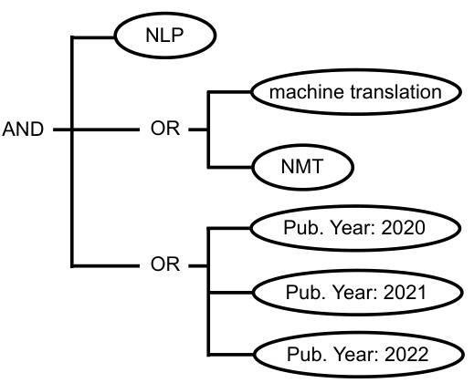  
Figure 5: The parsed tree structure of the given keywords string: NLP; machine learning|NMT; 2020..2022” .  

We implemented a S2ORC parser to convert documents in the S2ORC corpus to our JSON format. For PDFs in the arXiv corpus, we first used the s2orc-doc2json ( Lo et al. ,  2020 ) to convert them into S2ORC format and then we applied our S2ORC parser. For XML files in the PMCOA corpus, we implemented an XML parser based on  Achakulvisut et al.  ( 2020 ) to convert XML to S2ORC format and then we applied again the S2ORC parser to convert it into our JSON format.  

# C Prefetching Indexing Implementation  

# C.1 Inverted Index  

The inverted index is a mapping table from keywords (unigrams and bigrams) to paper IDs. We extracted keywords from the full text of each document and kept a bigram only if neither word is a stopword. We use sqlitedict 3   to store the inverted index for each corpus, which is an on-disk hashmap based on an SQLite database that allows us to efficiently obtain the paper ID for a given keyword without loading the entire inverted index into RAM. Syntax Parsing. Our platform allows users to filter documents using syntax-rich keyword strings. For example, to filter papers that contain the keywords ’NLP’ and either ’machine translation’ or ’NMT’ and that have been published between 2020 and 2022, one can compose a keyword string  NLP; machine learning|NMT; 2020..2022” . We transform this keyword string into a tree of logical operations (Figure  5 ), wherein each node defines the logical operation applied to the sub-nodes, and each leaf node contains a keyword. We implemented the tree using a Python dictionary (Listing  2 ). We recursively traversed all nodes in the tree in a depth-first search, obtaining the paper IDs with the keyword in each leaf node, and applying the logical operations indicated in each node to obtain the final paper IDs at the root node.  

# C.2 Embedding Index  

Structure of the Embedding Index.  The embedding index consists of three main components:  

where The first component is a matrix  N  is the number of documents and  M ∈R  D  is the N × D , dimensionality of document embeddings. Each document embedding is L2-normalized so that given an L2-normalized query embedding  e q  ∈ R D × 1 , the matrix multiplication  M e q  ∈R N × represents the cosine similarity between the query embedding and all document embeddings. We use M e q  to rank documents and to obtain the indices of the topK  nearest neighbor (kNN) documents.  

The second component is a mapping table from the index of a paper embedding in the matrix the corresponding paper ID in our databases. Using  M  to this mapping table, we retrieve a paper’s content.  

The last component is a reversed mapping table from the paper ID to the corresponding index in the embedding matrix. In our prefetching system, we first use the inverted index to pre-filter a subset of paper IDs based on given keywords. Then we use this reversed mapping table to obtain the corresponding paper embeddings and to perform KNN search among them.  

Multi-Processing Speedup for Brute-Force Nearest Neighbor Search. For a large corpus like S2ORC, the embedding matrix contains up to 136.6 million vectors and so to perform matrix multiplication in a single thread is very time consuming. To take full advantage of the multiple CPU cores in our server, we sliced the embedding matrix into 137 shards, each containing about 1 million embeddings. On each document search, we first ran parallel brute-force nearest neighbor searches on each shard to obtain  N p  candidates each, and then we ranked the  137  ×  N p  candidates again to ob  

1  { ’Author’ : [{ ’GivenName’ :  ’Daisuke’ ,  ’FamilyName’ :  ’Ida’ }, ...],   
2 ’Title’ :  ’Topology Change of Black Holes’ ,   
3 ’Abstract’ :  ’The topological structure of the event horizon has been investigated   
...’ ,   
4 ’Venue’ :  ’’ ,   
5 ’DOI’ :  ’’ ,   
6 ’URL’ :  ’’ ,   
7 ’PublicationDate’ : { ’Year’ :  ’2007’ ,  ’Month’ :  ’3’ },   
8 ’Content’ : {   
9 ’Abstract’ :  ’’ ,   
10 ’Abstract_Parsed’ : [{   
11’section_id’: ’0’,  
12 ’section_title’ :  ’Abstract’ ,   
13 ’section_text’ : [{   
14 ’paragraph_id’ :  ’0’ ,   
15 ’paragraph_text’ : [{   
16 ’sentence_id’ :  ’0’ ,   
17 ’sentence_text’ :  ’The topological structure of the event horizon   
has been investigated in terms of the Morse theory.’ ,   
18 ’cite_spans’ : []},   
19 # ...   
20 ]},   
21 # ...   
22 ]   
23 }],   
24 ’Fullbody’ :  ’’ ,   
25 ’Fullbody_Parsed’ : [{   
26 ’section_id’ :  ’0’ ,   
27 ’section_title’ :  ’Introduction’ ,   
28 ’section_text’ : [{   
29 ’paragraph_id’ :  ’0’ ,   
30 ’paragraph_text’ : [   
31 # ...,   
32 {   
33 ’sentence_id’ :  ’2’ ,   
34 ’sentence_text’ :  ’[1, 2] This follows from the fact that the total   
curvature, which is the integral of the intrinsic scalar curvature over the   
horizon, is positive under the dominant energy condition and from the Gauss  
Bonnet theorem.’ ,   
35 ’cite_spans’ : [{ ’start’ :  ’4’ ,  ’end’ :  ’6’ ,  ’text’ :  ’2]’ , ’ref_id’ :  ’0   
’ }]   
36 },   
37 # ...   
38 ]   
39 }]   
40 }]},   
41 ’Reference’ : [{   
42 ’Title’ :  ’The large scale structure of space-times’ ,   
43 ’Author’ : [{ ’GivenName’ :  ’S’ ,  ’FamilyName’ :  ’Hawking’ },   
44 { ’GivenName’ :  ’G’ ,  ’FamilyName’ :  ’Ellis’ }],   
45 ’Venue’ :  ’’ ,   
46 ’PublicationDate’ : { ’Year’ :  ’1973’ },   
47 ’ReferenceText’ :  ’2. Hawking, S, and G Ellis. "The large scale structure of   
space-times." (1973).’ },   
48 # ...   
49 ]   
50  }  

Listing 1: An example of the JSON schema that we used for parsing and storing scientific papers.  

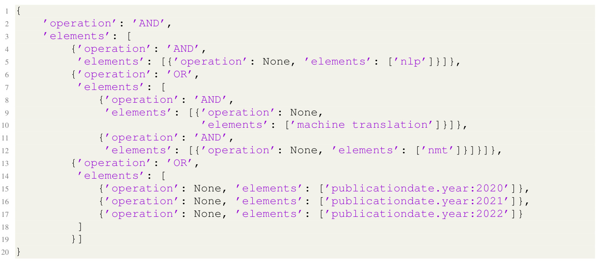  

tain the final  N p  candidates. Given that our server has 128 cores, we achieved a nearly linear speedup using such multithread KNN, which is mathematically equivalent to performing a single KNN over the entire embedding matrix.  

# D Joint Retrieval and Citation Generation Examples  

We show some specific results of joint paper retrieval and automatic citation sentences generation. We used contexts and keywords that we obtained from papers in arXiv (Figure  6 ) and PMCOA (Figure  7 ), respectively. In each example, the actual cited paper occurs in the top 5 paper recommendations, which we have highlighted with an underline.  

# Context:  

#OTHERCIT apply a multi-stream CNN model to extract and fuse deep features from the designed complementary shape-mot ion representations. Zhu et al. #OTHERCIT organize the pairwise displacements between all body  joints  to obtain a cu boid action representation and use attention-based deep CNN models to focus analysis on actions. Inspired by the fac t that the  skeleton  data is naturally a topological graph, where the  joints  and bones are regarded as the nodes and  edges, Graph Convolutional Network (GCN) is adopted to boost the performance of  skeleton  based action recognition #O THERCITS .  

# Keywords:  

skeleton  

# Recommended Papers and Generated Citations:  

UNIK: A Unified Framework for Real-world Skeleton-based Action Recognition Generated Citation:   UNIK #CIT is a generic skeleton-based action recognition model pre-trained on Posetics, a large -scale human  skeleton  video dataset. ANUBIS: Skeleton Action Recognition Dataset, Review, and Benchmark Generated Citation:   The ANUBIS dataset #CIT is a large-scale 3D  skeleton  dataset, which mainly consists of 3D joint s, bones, and limbs. SkeletonNet: Mining Deep Part Features for 3-D Action Recognition Generated Citation:   SkeletonNet #CIT is proposed to extract body-part-based features from each frame of the  skeleto n  sequence, which are translation, rotation, and scale invariant. Spatial Temporal Graph Convolutional Networks for Skeleton-Based Action Recognition Generated Citation:   ST-GCN  #CIT learns both the  spatial  and  temporal   patterns  from the  skeleton  data, which leads t o greater expressive power and stronger generalization capability. Real Citation:   ST-GCN #CIT firstly constructs the skeleton as a graph and uses GCN to automatically capture the pat terns embedded in the spatial configuration of the joints as well as their temporal dynamics. View Run Kernel Tabs Settings Help SKELETON-BASED ACTION RECOGNITION WITH CONVOLUTIONAL NEURAL NETWORKS Generated Citation:   Untitled.ipynb In #CIT, a novel  skeleton Documentation on NLP Microservice.ipynb  transformer module is designed to rearrange and select important  scieditor@zulit: \~/science-editor/evaluation eton   joints  automatically. Code  

Figure 6: Example of joint paper retrieval and citation generation. The context text was obtained from arXiv.  

# Context: hello  

Quadricuspid aortic valve (QAV) is a rare congenital heart disease that is less common than bicuspid and unicuspid a ortic valve [#OTHERCITS]. Coronary artery and coronary ostium anomalies are  This is our message present  in 2–10% of patients with  QAV   [#OTHERCIT, #OTHERCIT, #OTHERCITS]. The  functional   status  of  QAV  is predominantly pure aortic regurgitation (AR) [#O THERCIT, #OTHERCIT].  

# Keywords:  

functional   status  

# Recommended Papers and Generated Citations:  

ESC Guidelines for the management of grown-up congenital heart disease (new version 2010): The Task Force on the Man agement of Grown-up Congenital Heart Disease of the European Society of Cardiology (ESC) Generated Citation:   The  functional   status  of  QAV  is characterized by the presence of aortic regurgitation (AR), aor tic stenosis (AR), and aortic stenosis (AR) [ #CIT ].  

Quadricuspid Aortic Valve: A Comprehensive Review   
Generated Citation:   The  clinical   manifestations  of  QAV   depend  on the  functional   status  of the  QAV  and the associate d disorders [ #CIT ].   
Real Citation:   Clinical manifestations, such as palpitations, dyspnea, fatigue, and chest pain, depend on the funct ional status of QAV and usually present in the fifth or sixth decade of life [#CIT].  

A classification system for the bicuspid aortic valve from 304 surgical specimens. Generated Citation:   The  functional   status  of  QAV  is characterized by the presence of a number of raphes, spatial po sition of cusps or raphes, and number of raphes [ #CIT ].  

Functional status of the quadricuspid aortic valve/an uncommon coincidence of congenital quadricuspid aortic valve a ccompanied by hypertrophic obstructive cardiomyopathy.   
Generated Citation:   The  functional   status  of  QAV  is characterized by hypertrophic obstructive cardiomyopathy (HOMC)  and hypertrophic obstructive cardiomyopathy (HOCM) [ #CIT ]. Congenital coronary artery fistulae: a rare cause of heart failure in adults   
Generated Citation:   The  functional   status  of  QAV  can be improved by epicardial fistula ligation and coronary artery  bypass grafting with marked improvement in  functional   status  [ #CIT ].  

Figure 7: Example of joint paper retrieval and citation generation. The context text was obtained from PMCOA.  