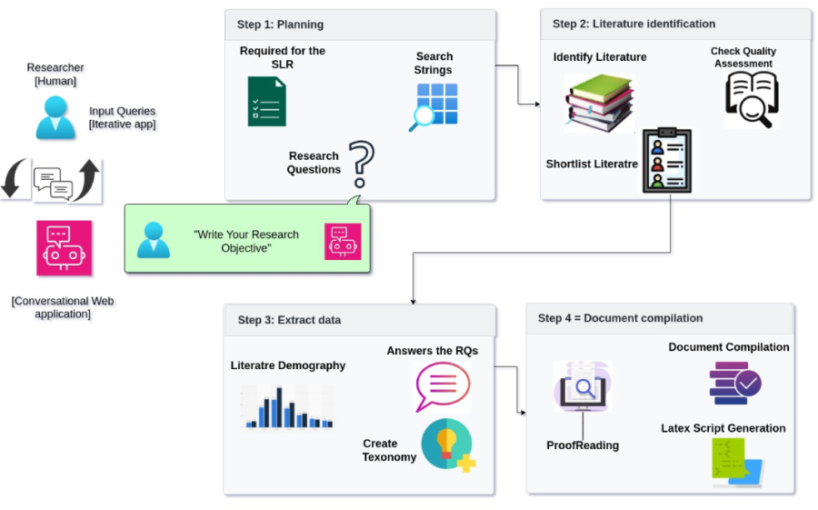
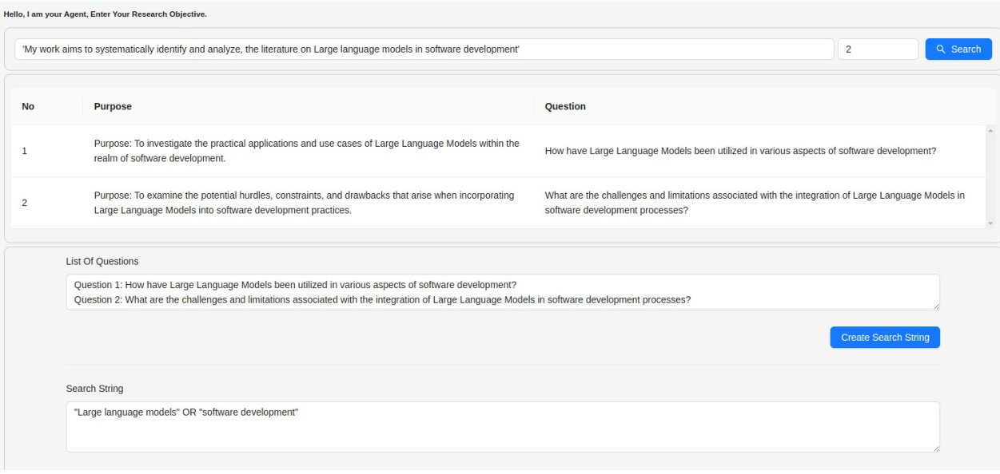
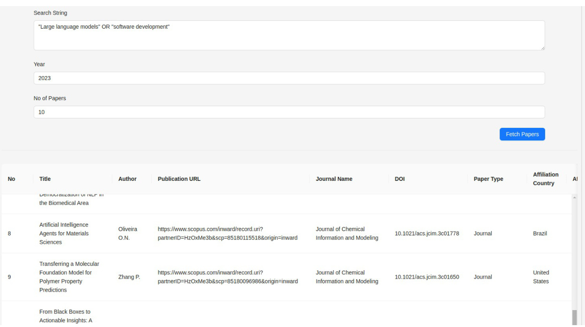
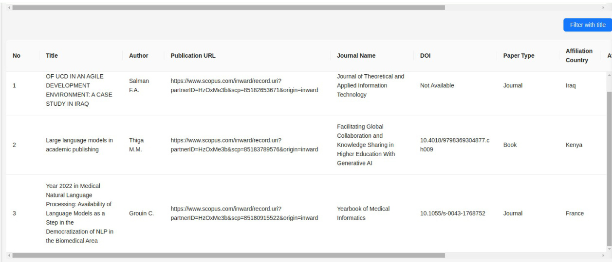
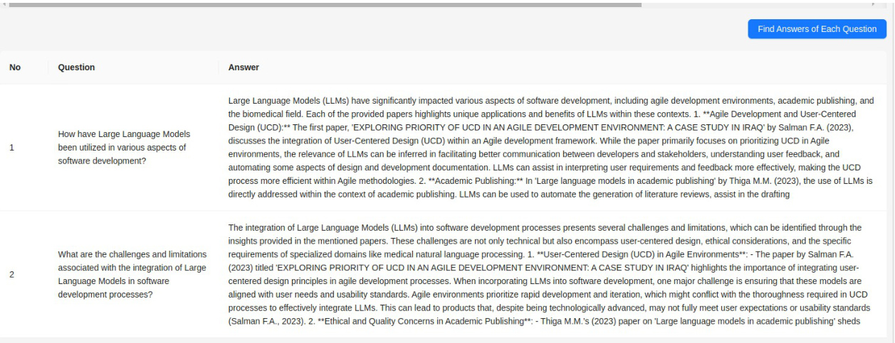
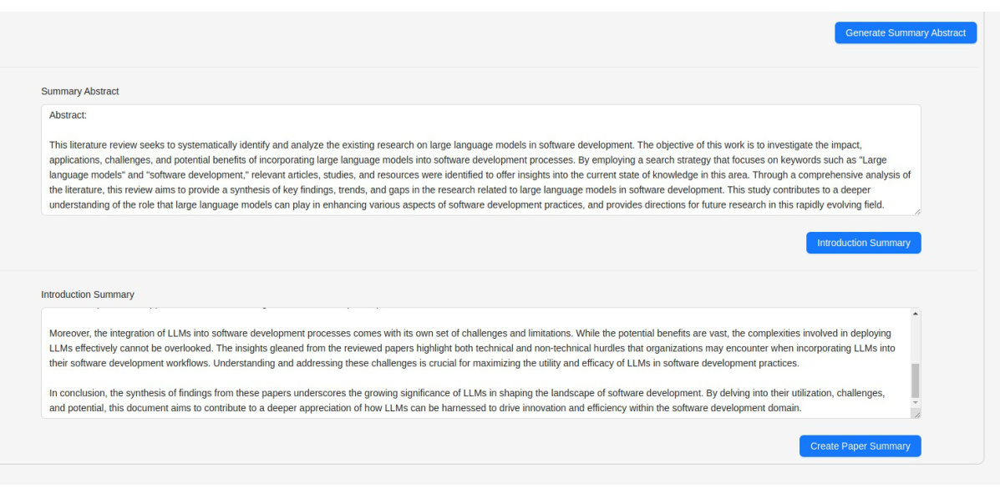
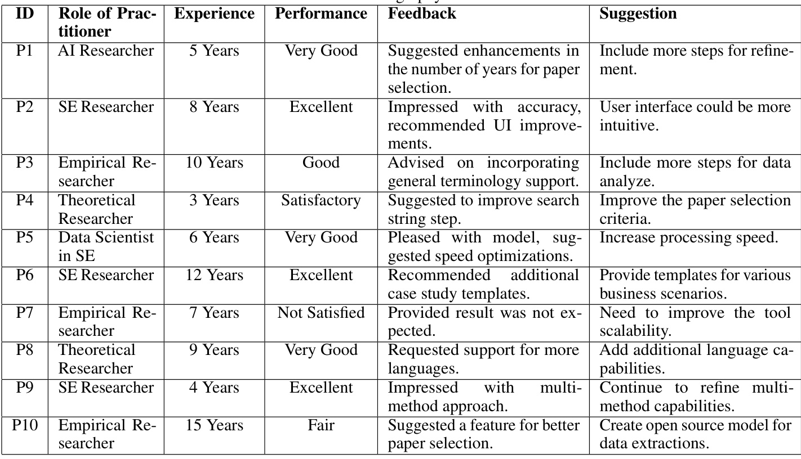

# S YSTEM FOR  S YSTEMATIC  L ITERATURE  R EVIEW  U SING M ULTIPLE  AI  AGENTS : C ONCEPT AND AN  E MPIRICAL E VALUATION  

A P REPRINT  

# Abdul Malik Sami  

# Zeeshan Rasheed  

Tampere University malik.sami@tuni.fi  

Tampere University zeeshan.rasheed@tuni.fi  

# Kai-Kristian Kemell  

# Muhammad Waseem  

# Terhi Kilamo  

University of Helsinki kai-kristian.kemell@helsinki.fi  

Jyväskylä University muhammad.m.waseem@jyu.fi  

Tampere University terhi.kilamo@tuni.fi  

# Mika Saari  

# Kari Systä  

# Anh Nguyen Duc  

Tampere University mika.saari@tuni.fi  

Tampere University kari.systa@tuni.fi  

University of South Eastern Norway Anh.Nguyen.duc@usn.no  

Pekka Abrahamsson Tampere University pekka.abrahamsson@tuni.fi  

March 14, 2024  

# A BSTRACT  

Systematic Literature Reviews (SLRs) have become the foundation of evidence-based studies, enabling researchers to identify, classify, and combine existing studies based on specific research questions. Conducting an SLR is largely a manual process. Over the previous years, researchers have made significant progress in automating certain phases of the SLR process, aiming to reduce the effort and time needed to carry out high-quality SLRs. However, there is still a lack of AI agent based models that automate the entire SLR process. To this end, we introduce a novel multi-AI agent model designed to fully automate the process of conducting an SLR. By utilizing the capabilities of Large Language Models (LLMs), our proposed model streamlines the review process, enhancing efficiency and accuracy. The model operates through a user-friendly interface where researchers input their topic, and in response, the model generates a search string used to retrieve relevant academic papers. Subsequently, an inclusive and exclusive filtering process is applied, focusing on titles relevant to the specific research area. The model then autonomously summarizes the abstracts of these papers, retaining only those directly related to the field of study. In the final phase, the model conducts a thorough analysis of the selected papers in relation to predefined research questions. This paper details the development of the model, and its operational framework, and demonstrates how it significantly reduces the time and effort traditionally required for SLR while ensuring a high level of comprehensiveness and precision. We also conducted an evaluation of the proposed model by sharing it with ten competent software engineering researchers for testing and analysis. The researchers expressed strong satisfaction with the proposed model and provided feedback for further improvement. In the future, we plan to engage 50 practitioners and researchers to evaluate our model. Additionally, we aim to present our model to the audience at the SANER 2024 conference in Rovaniemi (Finland) for further testing, analysis, and feedback collection. The code for this project can be found on the GitHub repository at https://github.com/GPT-Laboratory/SLR-automation.  

Keywords  Systematic Literature Review, Large Language Model, AI Agent, Software Engineering  

# 1 Introduction  

The Systematic Literature Review (SLR) is a fundamental component of academic research, offering a comprehensive and unbiased overview of existing literature on a specific topic Keele et al. [2007]. It involves a structured methodology for identifying, evaluating, and synthesizing all relevant research to address clearly defined research questions Kitchenham et al. [2009]. This process is critical for establishing the context and foundation of new research, identifying gaps in current knowledge, and informing future research directions van Dinter et al. [2021]. However, conducting an SLR is inherently time-consuming and labor-intensive. It requires meticulous planning, extensive searching, and rigorous screening of large volumes of literature. The complexity and scale of this task, especially in fields with vast and rapidly expanding bodies of work, can be daunting and resource-intensive. The challenge lies not only in the collection of relevant literature but also in the accurate synthesis and interpretation of the gathered data.  

The emergence of Large Language Models (LLMs) in Artificial Intelligence (AI) presents new opportunities for automating and streamlining the SLR process Rasheed et al. [2024a], Rasheed et al. [2023]. LLMs, trained on extensive datasets of text, are adept at understanding and generating human-like language Carlini et al. [2021]. They can process and analyze large volumes of text rapidly, offering insights and summaries that would take humans significantly longer to compile. Their ability to understand context and nuances in language makes them particularly useful for tasks like identifying relevant literature, extracting key information, and summarizing research findings Hou et al. [2023]. By automating the more tedious and repetitive aspects of the SLR process, LLMs can significantly reduce the time and effort required, allowing researchers to focus on the more nuanced aspects of their research Rasheed et al. [2024b].  

In this context, our proposed model utilizes the capabilities of LLMs to automate the whole SLR process. We developed a multi-AI agent model that automates each step of the SLR, from the initial literature search to the final analysis. The model begins with a simple user input–researchers enter their topic into a designated text box. This input is then processed by the LLM, which generates a precise search string tailored to retrieve the most relevant academic papers. The model’s next phase involves an intelligent filtering mechanism. It applies an inclusive and exclusive theory, screening titles and abstracts to retain only those studies that are directly relevant to the specified research area.  

The final stage of our model autonomously summarizes the abstracts of the selected papers, ensuring that only content pertinent to the research questions is retained. It introduces a level of precision and consistency in data analysis that is challenging to achieve manually. Finally, the model conducts an in-depth analysis of the selected papers, aligning its findings directly with the research questions. This comprehensive approach ensures that the final output is not only a reflection of the vast array of literature available but also a focused and relevant resource tailored to the specific needs of the researcher. Our model, therefore, stands as a testament to the potential of integrating advanced AI technologies in academic research methodologies.  

We also evaluated the efficiency and accuracy of our proposed model by sharing it with ten proficient software engineering researchers for a comprehensive test and analysis. The feedback received was overwhelmingly positive, highlighting the model’s effectiveness and paving the way for further enhancements. Looking ahead, we aim to expand our evaluation by involving 50 additional practitioners and researchers. Furthermore, we intend to showcase our model at the upcoming SANER 2024 conference in Rovaniemi (Finland), seeking to broaden its testing and analysis while gathering valuable feedback from a wider audience. This step is crucial in refining our model and ensuring its applicability and robustness in diverse real-world scenarios.  

Our contribution can be summarized as follows:  

•  We propose a novel multi-AI agent model that utilizes LLMs to automate the SLR process, significantly enhancing efficiency and accuracy.   
•  Our model was evaluated by ten experienced software engineering researchers and practitioners, confirming its effectiveness and gathering insights for further refinement.   
•  We plan to extend the evaluation to 30 additional practitioners and researchers and present the model at the SANER 2024 conference in Rovaniemi (Finland) for wider testing and feedback.  

# 2 Related Work  

Bartholomew [2002] conducted the first SLR to carried out systematic clinical trials to identify effective treatments for scurvy. His trials, which rigorously evaluated various potential remedies, notably highlighted the effectiveness of oranges and lemons as the most successful treatments Bartholomew [2002]. In the domain of SE research, the SLR approach was introduced by Kitchenham [2004]. This framework was instrumental in adapting the principles of systematic reviews, already prevalent in fields like healthcare and social sciences, to the specific challenges and needs of SE research. Following this development, SLRs have become an extensively used practice to support evidence-based material in SE. The success of SLRs in facilitating evidence-based studies has motivated other researchers to adopt this approach in their work Kitchenham et al. [2009]. However, Undertaking SLRs is often a challenging endeavor, encompassing various activities such as gathering, assessing, and recording evidence. These tasks within SLRs are typically done manually, without the aid of automation or decision support tools, making the process not only timeintensive but also susceptible to errors van Dinter et al. [2021]. Many researchers make progress to automate the process of SLR van Dinter et al. [2021].  

Current research efforts are primarily focused on refining the SLR process to optimize precision while ensuring high recall, addressing the precision shortcomings often found in existing methods O’Mara-Eves et al. [2015]. Additionally, there’s a significant push towards reducing human errors, especially since many steps in the review process are highly repetitive Marshall et al. [2016]. In this context, the works of K.R. Felizardo and J.C. Maldonado are notable. They have explored the shift from traditional, repetitive, and error-prone SLR methods towards the application of visual text mining. This approach, as outlined in their articles Felizardo et al. [2012], Felizardo et al. [2014], Felizardo et al. [2011], Malheiros et al. [2007] leverages unsupervised learning to assist users in identifying relevant articles, though it does require users to have a background in machine learning and statistics.  

Olorisade et al. [2016] presented an innovative ML model designed to automate the primary study selection process in SLRs, potentially streamlining this critical step and significantly reducing the manual effort involved in sifting through vast quantities of academic literature. Shakeel et al. [2018] provided valuable insights into potential threats that could arise when automating the SLR process. Feng et al. [2017] highlighted various text mining techniques currently employed in SLRs, a foundation upon which our tool builds. Significantly, Paynter et al. [2016] presented a comprehensive report delineating the application of text mining (TM) techniques in automating various stages of the SLR process, including selection, extraction, and updates. This aligns closely with our tool’s objectives. Clark et al. [2020] demonstrated the feasibility of completing an SLR in a markedly reduced time frame using multiple tools, a precedent for the efficiency our tool aims to achieve.  

Michelson and Reuter [2019] provided an economic analysis and time estimates for SLRs, underscoring the need for automated solutions – a call that our tool directly responds to. In a similar vein, Beller et al. [2018] not only listed tools useful for automating SLRs but also established eight guidelines that have informed our tool’s development.  

Jonnalagadda et al. [2015] detailed methods for data extraction from published reports, which has been instrumental in shaping our tool’s data handling capabilities. Moreover, Marshall and Wallace [2019] and O’Connor et al. [2019] have respectively listed useful tools for systematic reviews and articulated barriers to the adoption of such tools, providing a comprehensive understanding of the current landscape and user hesitance in this domain. Further contributions include O’Mara-Eves et al. [2015] and O’Mara-Eves et al. [2015], who respectively conducted an SLR on text mining in the automation of SLRs and described the automation potential across different steps in the SLR process. These works have been pivotal in identifying areas where our tool can be most impactful. Additionally, Jaspers et al. [2018] and Thomas et al. [2011] have explored machine learning techniques and the application of TM techniques in automating the SLR process, which have been key influences in our tool’s design. Lastly, the survey by Van Altena et al. [2019], highlighting the limited use of SLR tools among researchers, emphasizes the need for more user-friendly and efficient solutions like the one our tool aims to provide.  

Despite these advancements in automating the SLR process, there remains a notable gap in the complete automation of SLRs using LLMs. Addressing this gap, we have developed a novel approach: a multi-agent model based on LLMs. This innovative model is designed to fully automate the SLR process, utilizing the advanced capabilities of LLMs to efficiently manage and synthesize vast amounts of data, which is a significant step forward in the field of automated literature reviews.  

# 3 Research Method  

This research aims to investigate how an LLM-based multi-agent model can be utilized to automate the entire process of SLRs. We also outline the methodology for testing and analyzing the capabilities of the proposed model. Below, we discuss how our LLM-based multi-agent model collaborates and performs such tasks. We have formulated the following research questions (RQs):  

RQ1.  How does a LLM-based multi-agent system transform traditional methodologies to automate the systematic literature review process in SE?  

Motivation : The motivation for the research question arises from the need to enhance the efficiency and effectiveness of literature review processes in the rapidly evolving field of SE. Traditional methods of conducting literature reviews are often time-consuming and labor-intensive, potentially leading to delays in research progress and the dissemination of new knowledge. The integration of LLMs promises a paradigm shift, potentially automating and streamlining these processes. By exploring the transformation brought about by an LLM-based multi-agent system, this research seeks to reduce the time and effort required for comprehensive literature reviews and also to increase the accuracy and scope of these reviews. This could result in more timely and informed research outcomes in SE, a field where staying abreast of current trends, methodologies, and discoveries are crucial for technological advancement and innovation.  

RQ2.  How can the efficiency and accuracy of the proposed LLM-based multi-agent model be evaluated?  

Motivation : The motivation behind this research question is based on the critical need to validate and quantify the performance of the proposed model, specifically in conducting SLRs. With the introduction of sophisticated models like LLM-based multi-agent systems, establishing rigorous evaluation criteria to assess their real-world applicability and reliability becomes imperative. This question addresses the necessity of a proposed model that can systematically measure its efficiency and accuracy in selecting and interpreting relevant literature. Evaluating the proposed model is crucial to ensure that integrating such models into academic workflows enhances, rather than compromises, the quality of research outputs.  

# 3.1 LLM-Based Assisted Systematic Literature Review  

The section focuses on research methodology for developing an LLM-based multi-agent model. This model is specifically engineered to automate the entire process of conducting SLRs. The innovation lies in its ability to transform a given research topic into a comprehensive review through a series of automated, interconnected steps. Each step is managed by a specialized agent within the model, working collaboratively to ensure a seamless and efficient literature review process. In Figure  ?? , we illustrate how agents collaborate with each other to generate a response. Below, we also provide the detailed functionality of each agent within this multi-agent system.  

# 3.1.1 Planner agent  

The first agent in our model is dedicated to generating research questions and purpose and search strings. Upon receiving a research objective from the end-user, For the search string we provide research questions and objective to the agent, it generates a search string. this agent employs advanced language understanding algorithms to interpret the topic’s key elements. The LLM-based algorithm, designed for deep semantic understanding, analyzes the topic to extract key concepts, themes, and terminologies. It then utilizes its extensive training on diverse textual data to construct a precise and comprehensive search string. This string is formulated by combining relevant keywords, synonyms, and technical terms that capture the essence of the research question. Furthermore, the algorithm is adept at understanding context and varying semantic structures, enabling it to refine the search string to match specific research domains. The generated search string is crucial in accurately retrieving relevant literature from various academic databases. By ensuring that the initial search is both thorough and focused, the agent significantly enhances the efficiency and quality of the literature collection process. This sets a solid foundation for the subsequent stages of the SLR, where the depth and breadth of the collected literature play a crucial role.  

# 3.1.2 Literature identification agent  

Following the generation of the search string, research questions, and the purpose of each question, the next agent takes over the task of literature retrieval. This agent is responsible for using the search string to query academic databases and retrieving initial sets of papers that are potentially relevant to the research topic. It employs sophisticated filtering algorithms to manage the vast amount of available data, selecting papers by their title which are most closely align with the predefined parameters of the search string. This step is crucial in narrowing down the pool of literature to a manageable size for in-depth review.  

  
Figure 1: Process of Systematic Literature Review Automation Tool  

# 3.1.3 Data extraction agent  

The third agent in our model is tasked with refining the literature using inclusion and exclusion criteria based on the research objectives. Initially, it employs our LLM algorithm to analyze the titles of retrieved papers, discerning their relevance to the research topic. This step involves text analysis, where the LLM algorithm identifies key terms and concepts that align with the research objectives. By applying these predefined rules, the agent effectively filters out irrelevant material, ensuring the literature review remains focused and pertinent to the research questions.  

Following the title analysis, the agent proceeds to analyze the abstracts of selected papers. LLM algorithm conducts a more in-depth text analysis, evaluating the context, methodologies, and findings in the abstracts to assess their relevance. The final and most comprehensive step involves analyzing the full content of each paper. This thorough examination encompasses the whole paper, allowing the agent to evaluate how each paper’s content and findings relate to the specific research question. This agent extracts key information, Answers each question of the filtered papers, and shows its data in tabular form, a. It then synthesizes this information to provide a comprehensive overview of the current state of research on the topic. This synthesis is crucial in understanding the broader context and implications of the findings within the selected literature.  

# 3.1.4 Data compilation agent  

The final agent in our multi-agent model is responsible for analyzing the synthesized data in relation to the research questions and objectives. It assesses trends, identifies gaps in the literature, and draws conclusions based on the aggregated information. This agent also prepares a report that summarizes the findings of the literature review, providing a clear and concise overview of the research landscape for the given topic.  

Each agent in the LLM-based multi-agent model plays a vital role in automating the systematic literature review process. From generating search strings to reporting findings, the agents work in a coordinated manner to ensure a thorough, efficient, and accurate review. This methodology represents a significant advancement in the way SLRs are conducted, offering a more streamlined and effective approach to academic research.  

# 3.2 Performance Validation  

In this project, we engaged the expertise of 10 researchers to evaluate the efficiency and performance of our proposed model. These professionals were approached from various industries and research groups to ensure a diverse range of perspectives. Our evaluation methodology was anchored in a practice-oriented framework, focusing on rigorous scrutiny of the model’s utility and efficacy by seasoned industry professionals. This approach guaranteed a detailed and perceptive evaluation, factoring in the real-world applications and needs of experts in the corresponding fields.  

The inclusion of insights from a diverse group of experienced contributors was instrumental in our aim to deliver a comprehensive overview of the model’s functionality and its possible influence in the industry.  

# 3.2.1 Professional-based evaluation  

In the validation stage of our research, we collaborated with ten experts from diverse sectors, including academia and industry, to evaluate the efficacy of our LLM-based model. This selection was strategic, and aimed at capturing a wide range of perspectives and insights on the model’s performance across various professional contexts. To facilitate a thorough evaluation, each expert was provided with access to the model, accompanied by comprehensive instructions on its intended use and capabilities. This approach ensured that they were adequately equipped to conduct an in-depth assessment of the model within their respective domains.  

Participant’s selection : Initially, we conducted a search for suitable researchers from various research groups and expanded our outreach to individuals through social networks. We reached out to researchers via their ResearchGate and Google Scholar profiles. From these platforms, we recruited five participants, and the remaining five were identified through social networking sites and professional contacts. Consequently, we assembled a group of ten participants, referred to as P1 to P10 in Table 1, for the evaluation of our proposed model. Table 1 demonstrates that these participants come from a variety of fields, such as Software Engineering, and Machine Learning/Deep Learning Development.  

Data collection : The methodology employed a systematic approach to gather feedback data. Participants were tasked with integrating the model into their research and providing a topic relevant to their expertise. They then compared the results generated by our model with those obtained manually. To collect their feedback, we implemented a comprehensive feedback mechanism that enabled them to document their experiences, observations, and critiques systematically. This mechanism was geared towards obtaining detailed responses about the model’s efficiency, userfriendliness, and accuracy in data analysis. The format of the feedback was meticulously crafted to extract in-depth qualitative insights, thereby facilitating the assessment of quantifiable elements of the model’s performance.  

Data analysis : In the final phase of our validation process, analyzing participant feedback was essential for ongoing model improvement. Participants were allowed to choose any data source for input. We gathered and scrutinized their feedback to understand how the model performed in various scenarios. To evaluate the model’s performance, we used an extensive Likert scale ranging from ’Not Satisfied’ to ’Excellent,’ with intermediate options like ’Fair,’ ’Satisfactory,’ ’Good,’ and ’Very Good.’ This scale provided a nuanced spectrum for evaluation, enabling precise and comprehensive grading of the model’s effectiveness. Our iterative approach was driven by a focus on enhancing the model’s functionality, user experience, and overall efficacy, aiming to fulfill the varied needs and expectations of professionals in qualitative data analysis.  

# 4 Results  

This section presents the results obtained from implementing an AI-agent-based model aimed at automating the SLR process in SE. The findings are detailed in accordance with two primary research questions (RQs) that steered the creation and evaluation of the model.  

# 4.1 LLM Based Multi-Agent Model (RQ1)  

Our research introduces an LLM-based multi-agent model that redefines the conventional approach to SLRs in SE. The multi-agent model developed for automating the SLR process has demonstrated its efficacy through a structured and sequential workflow. The process begins with the input of a research topic, as depicted in Figure 2.  

  
Figure 2: Results of Search String and RQs  

  
Figure 3: Results of Paper Identification  

Upon receiving the topic, the model systematically generates a pertinent set of research questions. As illustrated in Figure 2, it formulated questions like ’How have large language models been utilized in various aspects of the software development process?’ and ’What challenges and limitations exist in the adoption and implementation of large language models in software development?’ These questions play a crucial role in guiding the literature search and analysis process. Subsequent to the research question formulation, the model proceeds to generate a search string. In this case, the search string “large language models OR software development” was created, coupled with a specified year to narrow down the search scope, thereby enhancing the relevance and precision of the search results.  

  
Figure 4: Paper Filtering  

The subsequent phase involves retrieving papers that match the generated search string. This feature of the model is specifically designed to fetch research papers from various databases, as demonstrated by the list of papers shown in Figure 3. For this demonstration, we focused solely on papers published in the year 2023, setting the model to retrieve only 10 papers from that year, all relevant to this field. The tool efficiently compiles relevant information such as the title, author, publication URL, journal name, DOI, paper type, affiliation country, and the affiliation institution. Moreover, the model is equipped with the capability to apply inclusive and exclusive criteria based on titles, which further refines the search results to ensure only the most pertinent literature is considered for review. As shown in Figure 4, only three papers were selected for an in-depth analysis.  

Finally, the model extracts data based on the formulated RQs. This advanced feature is exemplified in the demo where detailed answers are provided for the previously generated RQs. For instance, the answer to the first RQ discusses the varied applications of large language models in the software development lifecycle and highlights specific instances of their use, like the inference from the paper “InferLink End-to-End Program Repair with Large Language Models.”  

  
Figure 5: Data Extraction  

In conclusion, the automated SLR tool has showcased its ability to streamline the laborious process of literature review, from defining the scope of the research to extracting and synthesizing data pertinent to the research questions. The demonstration affirms the model’s potential in significantly reducing the time and effort conventionally required for conducting systematic literature reviews.  

  
Figure 6: Summary of Abstract and Introduction  

# 4.2 Evaluation Result (RQ2)  

The empirical evaluation of our tool was conducted by involving ten researchers and practitioners from diverse backgrounds within the SE community. Their engagement with the model provided a comprehensive perspective on its practical utility and user experience. The feedback was overwhelmingly positive, with 80% of the participants approving the tool’s functionality and recognizing its contribution to simplifying the SLR process.  

Despite the general consensus on the model’s efficacy, 20% of the participants recommended improvements. Specific suggestions highlighted the need for a more nuanced interpretation of complex research queries and the generation of more refined search strings. This constructive feedback is invaluable as it directs the focus toward enhancing the model’s interpretative algorithms and its ability to handle ambiguous or multifaceted research questions.  

In pursuit of continuous improvement, the model is scheduled for further exposure and evaluation. The SANER 2024 conference in Rovaniemi (Finland) presents an opportunity for a wide array of feedback from the SE research community, which will be instrumental in the model’s iterative development. Furthermore, a large-scale testing initiative is planned, where the model will be disseminated to a group of 50 researchers and practitioners for extensive evaluation.  

This forthcoming phase is expected to yield deeper insights into the model’s generalizability and performance across various domains within SE. It will also help to pinpoint any subtle nuances in SLR processes that the model needs to accommodate. The comprehensive feedback will be integral to refining the model, ensuring that the final version is not only effective and efficient but also versatile and user-friendly. The ultimate objective is to deliver a robust, universally applicable tool that standardizes and automates SLRs, contributing to the advancement of research methodologies in SE.  

# 5 Discussions  

The results derived from the implementation of our multi-AI agent model for SLR have been both encouraging and insightful. The model successfully automated key components of the SLR process, including the generation of search strings, the selection and filtering of relevant literature, and the summarization of key findings. This automation significantly reduced the time and effort typically required in conducting SLRs, while maintaining, and in some aspects enhancing, the accuracy and comprehensiveness of the review. The model’s ability to process and analyze large volumes of text rapidly, and its precision in identifying relevant studies, demonstrated the substantial potential of integrating LLMs in academic research.  

The implications of these results are far-reaching. Firstly, the model presents a valuable tool for researchers across various fields, reducing the barriers to conducting comprehensive literature reviews. This efficiency can accelerate the pace of research and discovery, enabling scholars to focus on more complex and creative aspects of their work. Additionally, the model’s standardization of the SLR process can potentially lead to more consistent and replicable research outcomes, a cornerstone in scientific research. The reduction in manual effort also opens up opportunities for researchers with limited resources or those facing constraints such as time pressures, broadening the scope of who can conduct thorough literature reviews.  

Table 1: Researcher’s demography and their assessment   

  

Looking ahead, the future impact of our model is poised to be significant. A key milestone will be our attendance at the Sanner Conference on March 12th, where we will showcase our developed tool to a diverse audience. This event will not only serve as a platform to demonstrate the capabilities of our model but also as a critical opportunity to gather feedback from a wide range of users. This feedback will be invaluable in refining and enhancing the model further. Understanding how the model performs in real-world scenarios and gathering diverse perspectives will enable us to tailor it more closely to the needs of the research community. Following this, we plan to implement updates and improvements based on this feedback, ensuring that our tool remains at the forefront of innovation in SLR automation. The continued development and adaptation of our model in response to user input will ensure its relevance and utility in the ever-evolving landscape of academic research.  

In addition, the long-term impact of our work on researchers and the broader academic community is expected to be substantial. Our model represents a paradigm shift in how SLRs are conducted, offering a tool that is not only efficient but also adaptable to the evolving needs of researchers. One significant future impact is the democratization of research. By simplifying the SLR process, our tool makes high-quality literature reviews accessible to a wider range of researchers, including those from institutions with fewer resources or those new to the field. This accessibility could lead to a more diverse range of voices and perspectives in academic research, enriching the field as a whole.  

Furthermore, the model’s efficiency in handling large volumes of data makes it an invaluable asset in fields where literature is vast and rapidly growing, such as biomedical research, environmental studies, and technology. Researchers in these fields can stay abreast of the latest developments more effectively, ensuring their work is informed by the most current and comprehensive data available.  

In the domain of interdisciplinary research, our model can facilitate the synthesis of information across different fields, potentially leading to novel insights and innovations. By efficiently collating and analyzing diverse sets of literature, the tool can help uncover connections between disciplines that might otherwise be overlooked.  

The long-term adaptation of our model based on user feedback and technological advancements will also ensure its ongoing relevance. Continuous updates will allow the model to incorporate the latest AI advancements, further enhancing its capabilities and ensuring it remains a cutting-edge tool for SLR. Moreover, the model’s potential for customization will allow it to cater to the specific needs of different research domains. This customized approach means that the tool can be fine-tuned to deliver more targeted and relevant results, depending on the specific requirements of the research question or field.  

# 6 Limitation  

This study, while contributing valuable insights into the SE field. However, there is several limitations that necessitate attention in future iterations of the research. Primarily, the initial search strategy employed for identifying relevant literature was sub optimal. The absence of a comprehensive use of Boolean operators, notably the lack of "AND" in the search strings, potentially compromised the specificity and thoroughness of the literature search, leading to an incomplete representation of the available evidence. This issue underscores the need for a more rigorously defined search strategy to enhance the precision and relevance of retrieved documents.  

Furthermore, the methodology exhibited a significant gap in its approach to literature selection, characterized by an absence of clearly defined criteria for primary and secondary exclusion. This oversight likely resulted in a less rigorous filtering process, diminishing the study’s ability to exclude irrelevant or low-quality studies systematically. Implementing explicit inclusion and exclusion criteria will be crucial for improving the reliability and validity of the literature review in subsequent versions of the paper.  

Another critical limitation observed was in the data extraction phase. Although data were extracted based on predefined research questions, the reliability of the extracted information is questionable due to the lack of a robust analytical algorithm. The current methodology does not adequately ensure the accuracy and relevance of the extracted data, which is a cornerstone for drawing reliable conclusions. Future iterations of this research will benefit substantially from the integration of advanced analytical algorithms capable of more advanced data analysis. Such algorithms should not only extract data more efficiently but also evaluate the quality and applicability of the information in relation to the research objectives.  

Addressing these limitations is essential for advancing the research’s contribution to the field. Enhancements in search strategy, literature screening, and data analysis will not only refine the methodological approach but also improve the study’s overall credibility and impact. Future work will focus on fixing these issues to establish a more reliable and comprehensive research framework.  

# 7 Future Work  

Addressing the identified limitations presents a pathway for enhancing the comprehensiveness of our research in future iterations. The upcoming version of this paper will aim to implement several key improvements.  

Refinement of search strategy:  To overcome the limitations posed by an inadequate search string, future work will involve the development of a more sophisticated search strategy. This will include the comprehensive use of Boolean operators, particularly the incorporation of "AND" to ensure the specificity and thoroughness of the literature search. A systematic approach to defining search strings will be adopted to enhance the precision and relevance of retrieved documents.  

Implementation of explicit exclusion and inclusion criteria:  Recognizing the absence of clearly defined criteria for primary and secondary literature exclusion as a significant gap, future efforts will focus on establishing explicit inclusion and exclusion criteria. This refinement will facilitate a more rigorous and systematic screening process, thereby improving the study’s ability to exclude irrelevant or low-quality studies systematically and ensuring a more reliable and valid literature review.  

Advancement of data extraction methods:  The preliminary phase highlighted the need for a more reliable data extraction mechanism. To address this, future work will incorporate advanced analytical algorithms designed to ensure the accuracy and relevance of the extracted data. These algorithms will not only facilitate more efficient data extraction but will also provide a means to critically evaluate the quality and applicability of the information in relation to the research objectives. The integration of machine learning and natural language processing techniques will be explored to automate and enhance the data extraction and analysis process.  

Enhancement of analytical framework:  Acknowledging the limitations in the initial data analysis, future research will aim to develop and implement a more robust analytical framework. This framework will be designed to analyze the extracted data comprehensively, incorporating both qualitative and quantitative methodologies as appropriate. Emphasis will be placed on ensuring the reliability and validity of the findings through rigorous statistical testing and sensitivity analyses.  

Broadening of literature scope:  To counteract any potential biases or gaps in the literature review caused by the initial search limitations, future research will broaden its scope to include a wider range of databases and grey literature. This expansion will ensure a more comprehensive coverage of the subject matter, encompassing diverse perspectives and emerging research trends.  

Stakeholder engagement:  Recognizing the value of stakeholder insights in refining research methodologies, future iterations will involve engaging with domain experts, researchers, and practitioners. This engagement will provide critical feedback on the research design, methodologies, and findings, contributing to a more nuanced and impactful research outcome.  

By systematically addressing these limitations, future work will significantly enhance the study’s contribution to the field, providing a more robust, comprehensive, and reliable foundation for understanding the research topic. These improvements will not only address the current study’s shortcomings but also set a precedent for methodological rigor in similar research endeavors.  

# 8 Conclusions  

The development and implementation of our multi-AI agent model represent a significant advancement in the field of SLR. By integrating the capabilities of LLMs, this research demonstrates a novel approach to automating and optimizing the SLR process. Our model addresses the primary challenges associated with traditional SLR methods: the time-consuming nature of the process and the potential for human error or bias in literature selection and analysis. By automating the initial search, screening, summarization, and analysis phases, the model significantly reduces the manual effort and time required, while also enhancing the accuracy and consistency of the results.  

The use of a simple user interface for topic input and subsequent generation of tailored search strings illustrates the model’s user-friendly approach, making complex SLR processes accessible to a broader range of researchers. The inclusive and exclusive filtering mechanism ensures that the literature review remains focused and relevant, directly aligning with the specified research questions. The autonomous summarization of abstracts and the final analytical phase underscore the model’s ability to extract vast amounts of data into clear, relevant information, a task that would be challenging without the aid of advanced AI.  

This research contributes to the growing field of AI application in academic research, showcasing how LLMs can be effectively employed to enhance research methodologies. While the model significantly improves efficiency and accuracy, it is important to acknowledge the role of human oversight in guiding and interpreting the results, ensuring that the final output maintains the depth required in scholarly research.  

# References  

Staffs Keele et al. Guidelines for performing systematic literature reviews in software engineering, 2007.  

Barbara Kitchenham, O Pearl Brereton, David Budgen, Mark Turner, John Bailey, and Stephen Linkman. Systematic literature reviews in software engineering–a systematic literature review.  Information and software technology , 51(1): 7–15, 2009.   
Raymon van Dinter, Bedir Tekinerdogan, and Cagatay Catal. Automation of systematic literature reviews: A systematic literature review.  Information and Software Technology , 136:106589, 2021.   
Zeeshan Rasheed, Muhammad Waseem, Mika Saari, Kari Systä, and Pekka Abrahamsson. Codepori: Large scale model for autonomous software development by using multi-agents.  arXiv preprint arXiv:2402.01411 , 2024a.   
Zeeshan Rasheed, Muhammad Waseem, Kai-Kristian Kemell, Wang Xiaofeng, Anh Nguyen Duc, Kari Systä, and Pekka Abrahamsson. Autonomous agents in software development: A vision paper.  arXiv preprint arXiv:2311.18440 , 2023.   
Nicholas Carlini, Florian Tramer, Eric Wallace, Matthew Jagielski, Ariel Herbert-Voss, Katherine Lee, Adam Roberts, Tom Brown, Dawn Song, Ulfar Erlingsson, et al. Extracting training data from large language models. In  30th USENIX Security Symposium (USENIX Security 21) , pages 2633–2650, 2021.   
Xinyi Hou, Yanjie Zhao, Yue Liu, Zhou Yang, Kailong Wang, Li Li, Xiapu Luo, David Lo, John Grundy, and Haoyu Wang. Large language models for software engineering: A systematic literature review.  arXiv preprint arXiv:2308.10620 , 2023.   
Zeeshan Rasheed, Muhammad Waseem, Aakash Ahmad, Kai-Kristian Kemell, Wang Xiaofeng, Anh Nguyen Duc, and Pekka Abrahamsson. Can large language models serve as data analysts? a multi-agent assisted approach for qualitative data analysis.  arXiv preprint arXiv:2402.01386 , 2024b.   
Mary Bartholomew. James lind’s treatise of the scurvy (1753).  Postgraduate Medical Journal , 78(925):695–696, 2002.   
Barbara Kitchenham. Procedures for performing systematic reviews.  Keele, UK, Keele University , 33(2004):1–26, 2004.   
Alison O’Mara-Eves, James Thomas, John McNaught, Makoto Miwa, and Sophia Ananiadou. Using text mining for study identification in systematic reviews: a systematic review of current approaches.  Systematic reviews , 4(1):1–22, 2015.   
Christopher Marshall et al.  Tool support for systematic reviews in software engineering . PhD thesis, Keele University, 2016.   
Katia R Felizardo, Gabriel F Andery, Fernando V Paulovich, Rosane Minghim, and José C Maldonado. A visual analysis approach to validate the selection review of primary studies in systematic reviews.  Information and Software Technology , 54(10):1079–1091, 2012.   
Katia Romero Felizardo, Elisa Yumi Nakagawa, Stephen G MacDonell, and José Carlos Maldonado. A visual analysis approach to update systematic reviews. In  Proceedings of the 18th International Conference on Evaluation and Assessment in Software Engineering , pages 1–10, 2014.   
Katia Romero Felizardo, Mehwish Riaz, Muhammad Sulayman, Emilia Mendes, Stephen G MacDonell, and José Carlos Maldonado. Analysing the use of graphs to represent the results of systematic reviews in software engineering. In 2011 25th Brazilian Symposium on Software Engineering , pages 174–183. IEEE, 2011.   
Viviane Malheiros, Erika Hohn, Roberto Pinho, Manoel Mendonca, and Jose Carlos Maldonado. A visual text mining approach for systematic reviews. In  First international symposium on empirical software engineering and measurement (ESEM 2007) , pages 245–254. IEEE, 2007.   
Babatunde K Olorisade, Ed de Quincey, Pearl Brereton, and Peter Andras. A critical analysis of studies that address the use of text mining for citation screening in systematic reviews. In  Proceedings of the 20th international conference on evaluation and assessment in software engineering , pages 1–11, 2016.   
Yusra Shakeel, Jacob Krüger, Ivonne von Nostitz-Wallwitz, Christian Lausberger, Gabriel Campero Durand, Gunter Saake, and Thomas Leich. (automated) literature analysis: threats and experiences. In  Proceedings of the International Workshop on Software Engineering for Science , pages 20–27, 2018.   
L Feng, YK Chiam, and SK Lo. Text-mining techniques and tools for systematic literature reviews: A systematic literature review. in 2017 24th asia-pacific software engineering conference (apsec)(pp. 41–50).  IEEE. https://doi. org/10.1109/apsec , 2017.   
Robin Paynter, Lionel L Bañez, Elise Berliner, Eileen Erinoff, Jennifer Lege-Matsuura, Shannon Potter, and Stacey Uhl. Epc methods: an exploration of the use of text-mining software in systematic reviews. 2016.   
Justin Clark, Paul Glasziou, Chris Del Mar, Alexandra Bannach-Brown, Paulina Stehlik, and Anna Mae Scott. A full systematic review was completed in 2 weeks using automation tools: a case study.  Journal of clinical epidemiology , 121:81–90, 2020.   
Matthew Michelson and Katja Reuter. The significant cost of systematic reviews and meta-analyses: a call for greater involvement of machine learning to assess the promise of clinical trials.  Contemporary clinical trials communications , 16:100443, 2019.   
Elaine Beller, Justin Clark, Guy Tsafnat, Clive Adams, Heinz Diehl, Hans Lund, Mourad Ouzzani, Kristina Thayer, James Thomas, Tari Turner, et al. Making progress with the automation of systematic reviews: principles of the international collaboration for the automation of systematic reviews (icasr).  Systematic reviews , 7:1–7, 2018.   
Siddhartha R Jonnalagadda, Pawan Goyal, and Mark D Huffman. Automating data extraction in systematic reviews: a systematic review.  Systematic reviews , 4(1):1–16, 2015.   
Iain J Marshall and Byron C Wallace. Toward systematic review automation: a practical guide to using machine learning tools in research synthesis.  Systematic reviews , 8:1–10, 2019.   
Annette M O’Connor, Guy Tsafnat, James Thomas, Paul Glasziou, Stephen B Gilbert, and Brian Hutton. A question of trust: can we build an evidence base to gain trust in systematic review automation technologies?  Systematic reviews , 8(1):1–8, 2019.   
Stijn Jaspers, Ewoud De Troyer, and Marc Aerts. Machine learning techniques for the automation of literature reviews and systematic reviews in efsa.  EFSA Supporting Publications , 15(6):1427E, 2018.   
James Thomas, John McNaught, and Sophia Ananiadou. Applications of text mining within systematic reviews. Research synthesis methods , 2(1):1–14, 2011.   
AJ Van Altena, R Spijker, and SD Olabarriaga. Usage of automation tools in systematic reviews.  Research synthesis methods, 10(1):72–82, 2019.  